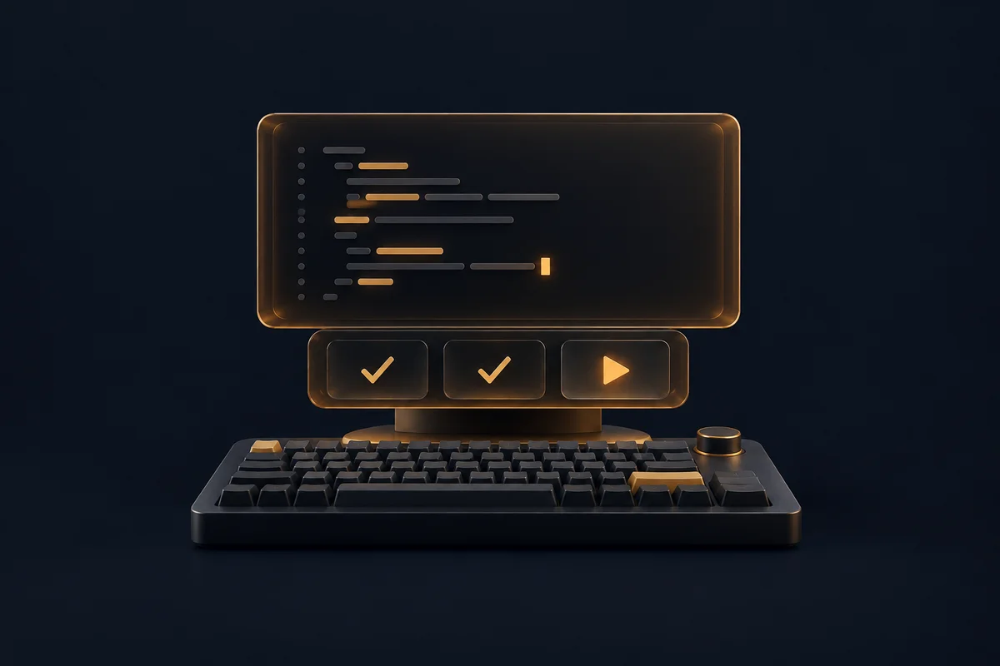
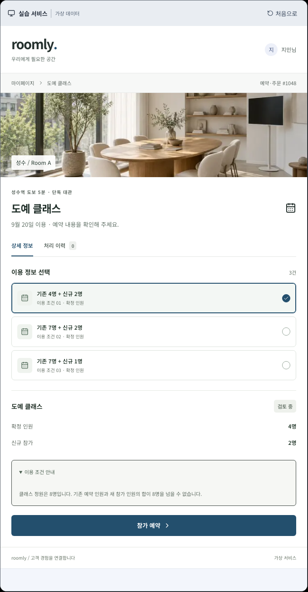

<div align="center">


# CODE:FIT_

### AI를 배우고, 코드를 이해하고, 서비스를 검증하다

내 프로젝트의 빈틈을 확인하고, AI 도구를 업무에 활용하고, 직접 코드를 작성하며 연습합니다.
지금 하려는 일에 맞춰 세 가지 작업 공간에서 시작하세요.

**[로그인 없이 시작하기 →](https://codefit-five.vercel.app)**

[내 프로젝트 점검](https://codefit-five.vercel.app/project-check)　
[AI 실무 배우기](https://codefit-five.vercel.app/learn/ai)　
[분야별 코딩 연습](https://codefit-five.vercel.app/?view=browse)

</div>

## 지금 필요한 작업 공간부터

| 서비스 점검실                                                 | AI 워크숍                                            | 코딩 트레이닝                                              |
| ------------------------------------------------------------- | ---------------------------------------------------- | ---------------------------------------------------------- |
|  |  |  |
| 내 서비스의 설계와 보안을 확인해요.                           | AI 도구를 언제, 어떻게 쓰는지 배워요.                | 분야를 골라 직접 코드를 작성해요.                          |
| 프로젝트 질문 → 답변 피드백 → 직접 확인 과제                  | 개념 이해 → 선택형 모의 실습 → 확인 문제             | 문제 선택 → 구현과 수정 → 풀이 검토                        |

각 공간은 홈의 구성과 사이드바 순서가 다릅니다. **서비스 점검실**은 프로젝트 점검과 보안 확인, **AI 워크숍**은 학습 진도와 목적별 수업, **코딩 트레이닝**은 분야 선택과 문제 목록을 먼저 보여줍니다.

처음 방문하면 공간을 선택하고, 이후에는 헤더의 **작업 공간 변경**에서 바꿀 수 있습니다. 선택은 현재 브라우저에 저장되며 학습 기록, 작성 중인 코드와 이용 권한은 유지됩니다. 서비스 원리 배우기는 필요한 개념을 보충하는 학습으로 제공합니다.

무엇부터 할지 모르겠다면 오른쪽 아래 **시작 가이드**를 열어보세요.
안내 친구 **핏**이 개발 경험, 목표와 가능한 시간에 맞는 첫 미션을 추천합니다.

## 내가 만든 프로젝트로 질문을 받아요

공개 서비스 링크를 입력하면 AI가 화면에서 확인한 기능을 바탕으로 질문 5개를 만듭니다.
사용 흐름, 데이터 저장, 접근 권한, 오류 대응, 설계 선택을 한 질문씩 내 말로 설명해 보세요.
답변을 제출하면 설명이 충분한 부분과 더 확인할 부분을 알려 줍니다.
새 평가에서는 **내 답변의 어느 부분을 근거로 판단했는지** 펼쳐 볼 수 있습니다.
인용문은 제출한 답변과 대조하지만, 설명을 해석하는 AI의 판단에는 오류가 있을 수 있습니다.

**피드백에서 자기 프로젝트의 확인 과제로 이어집니다.** 새 평가에는 준비 조건, 실행 순서와 단계별 기대 결과가 포함됩니다. 가장 부족한 설명부터 확인하고,
직접 확인한 조건과 결과 또는 확인하지 못한 이유를 계정에 저장할 수 있습니다. 빈 기록에는 확인 양식을 채울 수 있고, 계획과 실제 기록을 AI 수정 요청 파일로 내려받을 수 있습니다.
기존 답변은 보관하면서 같은 질문에 보완 답변을 추가하고, 이전 점수와 설명을 비교할 수 있습니다.
같은 질문은 최대 3번 보완할 수 있으며 재평가는 답변 평가 한도를 사용합니다.

기초 개념을 익히고 싶다면 공통 예제 실습을 선택할 수 있습니다. 해당 프로젝트에 맞춰 생성한
실습은 아니며, 최초 답변과 실습 후 확인 문제의 기록을 보관합니다.
[학습 흐름과 한계](docs/project-learning.md)를 확인해 주세요.

- 분석과 질문 생성은 **GPT-5.6 Sol**, 답변 평가는 **GPT-5.6 Luna**를 사용합니다.
- 질문과 평가 기록은 본인만 볼 수 있습니다. 제출 전 답변도 현재 탭에 보관합니다.
- 자바스크립트 실행 후 공개 본문과 스크린샷을 최대 3곳에서 수집해 작성한 설명과 함께 사용합니다. 수집 실패 시 HTML과 사이트 소개 정보로 전환하고 한계를 표시합니다. 서비스 링크로는 로그인 뒤의 화면이나 서버 내부를 검사하지 않습니다. GitHub 공개 저장소와 PR 주소는 선택한 소스 파일을 읽어 코드 줄에 근거한 질문을 만듭니다. 코드 구조 탐색, 답변과 코드 비교 대화, 후속 확인 과제를 지원하며 실제 코드 실행이나 취약점 확정을 뜻하지 않습니다.

점수는 이번 답변에서 설명한 이해도를 나타냅니다. 제품의 안전성이나 보안을 인증하는 점수는 아닙니다.

## 배포 전에 공개 보안 설정을 확인해요

본인이 관리하거나 점검 허락을 받은 공개 HTTPS 링크를 넣으면 CSP, HSTS, 프레임 제한, 콘텐츠 유형과 쿠키의 보안 설정을 확인합니다. 결과를 **설정 관찰, 보완 검토, 추가 확인 필요**로 나눠 근거와 다음 행동을 보여 줍니다. AI 호출 없이 규칙으로 판정합니다.

기본 검사는 공개 응답을 읽는 사전 점검입니다. 로그인 후 소유권 파일을 배포하면 같은 주소에 세 가지 Origin 조건으로 GET 요청을 보내 CORS 응답을 비교할 수 있습니다. 직접 실행한 OWASP ZAP의 Traditional JSON 보고서를 가져와 위험도별 알림과 수정 방향도 정리합니다. 코드핏이 ZAP을 대신 실행하거나 로그인 뒤의 화면을 검사하는 것은 아닙니다. 실제 접근 권한과 데이터베이스 취약점, 취약점 부재를 자동 검증하지 않습니다. 소유자와 다른 계정의 접근, 권한 회수와 중복 요청은 자신의 테스트 환경에서 확인하고 메모할 수 있습니다.

기본 검사의 주소, 결과와 메모는 현재 탭에 계정별로 임시 보관합니다. CORS 결과와 ZAP 가져오기 결과는 현재 화면에만 남습니다. 다른 탭이나 기기에 동기화되지 않으므로 보관하려면 텍스트 파일로 내려받으세요. 전체 학습 기록 JSON 백업에는 포함되지 않습니다. [점검 범위와 기록 보관](docs/security-check.md)을 확인해 주세요.

## AI 도구를 내 업무에 연결해요

**15개 분야, 32개 수업**에서 에이전트 워크플로우, 문서 검색, 업무 자동화, 로컬 AI, 모델 운영과 결과 검증을 배웁니다. LangChain, LangGraph, MCP 등 도구와 개념을 용도별로 찾고, 검색과 난이도 필터로 필요한 수업을 고를 수 있습니다.

**개념 이해 → 선택하며 실습 → 확인 문제 → 다음 수업**으로 이어집니다. 선택에 따른 모의 결과와 해설을 비교하며, 실제 외부 도구를 설치하거나 AI API를 호출하지 않습니다.

수업별 진행 단계와 완료 기록은 현재 브라우저에 저장됩니다. AI 워크숍 홈에서 진도를 확인하고 최근 미완료 수업을 이어갈 수 있습니다. 이 기록은 계정이나 다른 기기와 동기화되지 않습니다. [콘텐츠와 보관 범위](docs/ai-learning.md)를 참고하세요.

## AI 코드를 읽고, 실행하고, 고쳐요

프론트엔드와 백엔드의 **기본 과제 6개, 응용 과제 6개**를 준비했습니다.
원본 코드와 실행할 입력을 읽고 결과를 예상합니다. 실제 반환값을 비교한 뒤, 수정 목표와 편집기로 이동해 제공된 테스트를 실행합니다. AI 질문과 추가 실험은 원할 때 펼칠 수 있습니다.

테스트 통과에서 끝내지 않고 **무엇을 바꿨는지, 왜 바꿨는지, 어떻게 확인했는지** 설명해 보세요.
다른 상황의 문제로 다시 연습하며 이해한 내용을 적용할 수 있습니다.


이 훈련의 JavaScript는 브라우저 안의 분리된 실행 환경에서 동작합니다.
실행 테스트와 AI의 코드 검토는 구분해서 보여 줍니다.
[실행 범위와 평가 방식](https://codefit-five.vercel.app/quality)을 확인하세요.

## 직접 코딩하는 감각도 놓치지 않도록

프론트엔드, 백엔드, 게임, 네트워크, DB, 인프라, 모바일, 데이터/AI, 보안, 시스템까지.
**10개 분야, 26개 언어·기술**에서 나에게 맞는 상·중·하 난이도로 연습하세요.

원하는 문제가 없다면 **GPT-5.6 Sol**로 새 문제를 만들 수 있습니다.
생성된 문제는 공개 보관함에 쌓여 누구나 풀 수 있습니다.
단계별 힌트와 참고 정답을 확인하고, **GPT-5.6 Luna**의 풀이 검토로 다시 고쳐 보세요.
일반 문제의 AI 검토는 코드를 읽는 정적 리뷰이며 실행 채점과 다릅니다.

작성한 코드는 자동 저장됩니다. 오프라인 초안과 다른 탭의 수정이 충돌하면
두 내용을 비교하고 이어갈 수 있습니다. 이전 제출본 복원, 변경 취소와 코딩 기록 백업도 지원합니다.

## 익숙한 서비스 화면에서 개발 원리를 배워요

쇼핑몰의 할인 계산, 예약 중복, 다른 사람에게 보이는 비공개 글.
**5개 서비스 분야의 21개 실습**에서 이런 상황을 직접 다룹니다.

- **쇼핑과 주문** — 쿠폰 적용 조건, 재고 확보와 포인트 검증
- **예약과 시설** — 정원 초과, 시간 겹침과 중복 요청
- **업무와 협업** — 읽기와 쓰기 권한, 문서 버전 확인
- **콘텐츠와 구독** — 데이터 저장, 이용권 만료, 수신 동의와 예약 시각
- **고객지원** — 환불 잔액, 첨부 파일 제한과 팀별 정보 접근

**예상하기 → 직접 확인하기 → 수정하고 검사하기 → 다른 상황에 적용하기**

코딩 경험이 없어도 시작할 수 있습니다. 왜 확인할 상황인지와 지켜야 할 조건을 먼저 읽고, 예상 결과를 고른 뒤 화면을 조작합니다.
이유는 원할 때만 적으며, 지원하는 브라우저에서는 마이크로 말할 수도 있습니다.
분야와 기술 개념으로 실습을 찾고, 강조된 버튼을 따라 실험 목적과 확인할 결과를 살펴봅니다.
수정 후 같은 실험을 반복하고, 내 서비스에서 이어서 확인할 과제도 남길 수 있습니다.



실습은 조건을 빠뜨린 구현과 수정안을 비교하는 교육용 모델입니다. 특정 AI의 실제 오류 사례를 수집한 자료가 아닙니다. 화면의 성공 안내와 이용 조건 준수를 따로 비교하며, 실제 결제나 업무 처리는 일어나지 않습니다.
AI 질문을 사용하지 않아도 모든 실습을 마칠 수 있습니다.

## 연습은 누구나, AI 기능은 정해진 한도 안에서

| 기능                                         |          로그인 없이          |    Google / GitHub 로그인     |
| -------------------------------------------- | :---------------------------: | :---------------------------: |
| 실습과 코딩 문제, 힌트, 정답, 코드 실행 훈련 |               ✓               |               ✓               |
| AI 풀이 검토, 코드 AI 질문, 실습 AI 코치     |        각각 24시간 2회        |       각각 24시간 30회        |
| 핏의 AI 시작 가이드                          |          24시간 2회           |          24시간 20회          |
| AI 코딩 문제 생성                            |           하루 2회            |           하루 6회            |
| 내 프로젝트 분석                             |          24시간 2회           |          24시간 5회           |
| 프로젝트 답변 평가                           |          24시간 2회           |          24시간 12회          |
| 공개 페이지 보안 점검                        |        시간당 최대 5회        |        시간당 최대 5회        |
| 서버 학습 기록 저장                          | 현재 브라우저의 게스트 연습실 | 계정으로 다른 기기에서 이어서 |
| 프로필과 로그인 계정 연결                    |               —               |               ✓               |

코딩 문제 생성은 **한국 시간 자정**에 초기화되고 실패한 생성의 개인 한도는 반환됩니다.
프로젝트 평가는 실패 재시도와 이전 분석의 평가를 포함해 **비로그인 2회, 로그인 12회/24시간**입니다.
프로젝트 AI 호출은 시작 후 실패해도 횟수에 포함됩니다. 비로그인 체험은 쿠키 재발급으로 한도를 우회하지 못하도록 기능별 접속망 2회/24시간 한도도 적용됩니다. 같은 접속망에서는 다른 방문자와 이 한도를 공유할 수 있습니다. 로그인한 이용자도 접속망과 서비스 전체의 공용 한도를 적용받습니다.

기본 모델은 환경 변수로 변경할 수 있습니다. 보안 점검에는 AI 한도와 별도로 접속망, 대상 호스트와 서비스 공용 요청 한도를 적용하며 실패한 수집 시도도 포함합니다.

게스트 기록은 서버에 저장하고 현재 브라우저의 쿠키로 찾습니다. 쿠키를 지우면 기존 게스트 기록을 다시 찾지 못할 수 있습니다. 로그인 후 자동으로 합쳐지지 않습니다. 환경 설정에서 코딩, 입문 실습과 프로젝트 평가·학습 기록을 함께 백업하고 다른 계정에서 가져올 수 있습니다. 기존 기록은 덮어쓰지 않으며 이전 v2 백업도 읽습니다. [복원 범위와 한도](docs/workspace-backup.md)를 확인해 주세요.

## 구현과 로컬 실행

Next.js 16과 React 19, TypeScript를 사용합니다. 로컬 데이터는 SQLite, 운영 데이터는 PostgreSQL에 저장합니다. 코드 이해 훈련은 브라우저의 QuickJS에서 실행하고, 프로젝트 공개 화면은 Vercel Sandbox에서 수집합니다. AI 요청은 서버의 OpenAI API 연동을 사용합니다.

Node.js 22.x(22.13 이상)에서 시작할 수 있습니다.

```bash
npm ci
test -f .env.local || cp .env.example .env.local
npm run dev
```

API 키가 없어도 내장 문제와 원리 실습을 이용할 수 있습니다. AI, OAuth와 브라우저 수집의 설정은 [로컬 실행과 운영](docs/development.md)을 참고하세요.

---

<div align="center">

**배우고, 이해하고, 검증하는 나만의 작업 공간.**

[오늘의 연습 시작하기 →](https://codefit-five.vercel.app)

</div>

[문서 안내](docs/README.md) · [설계와 구현](docs/engineering.md) · [검증 기록](docs/VERIFICATION.md) ·
[로컬 실행과 운영](docs/development.md) · [로그인 설정](docs/authentication.md) ·
[개인정보 안내](https://codefit-five.vercel.app/privacy)
