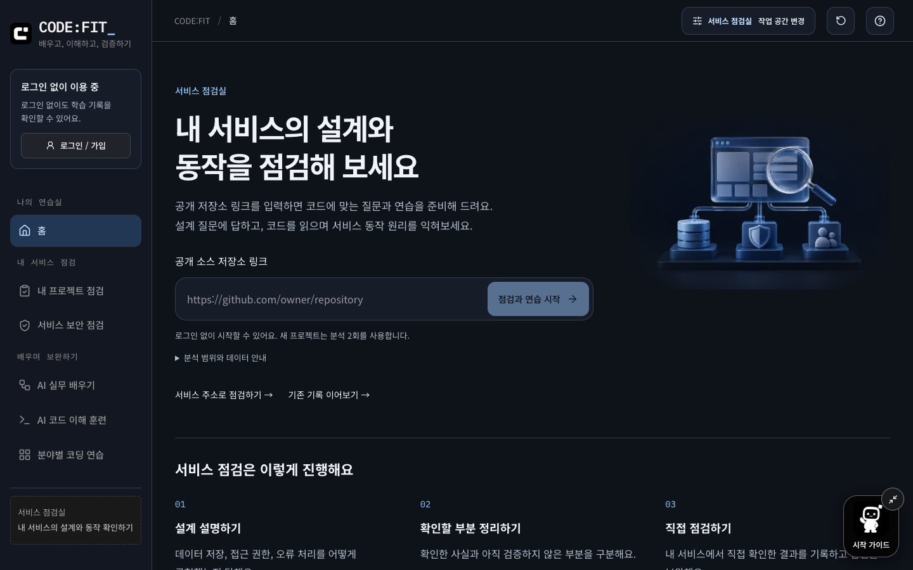
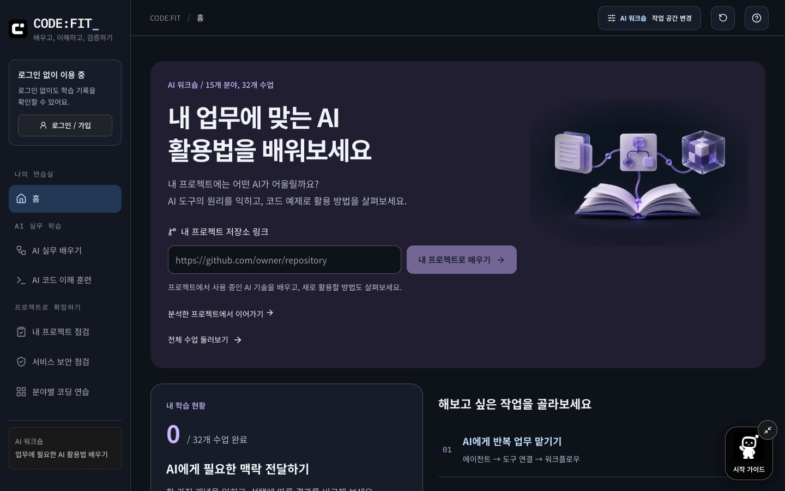
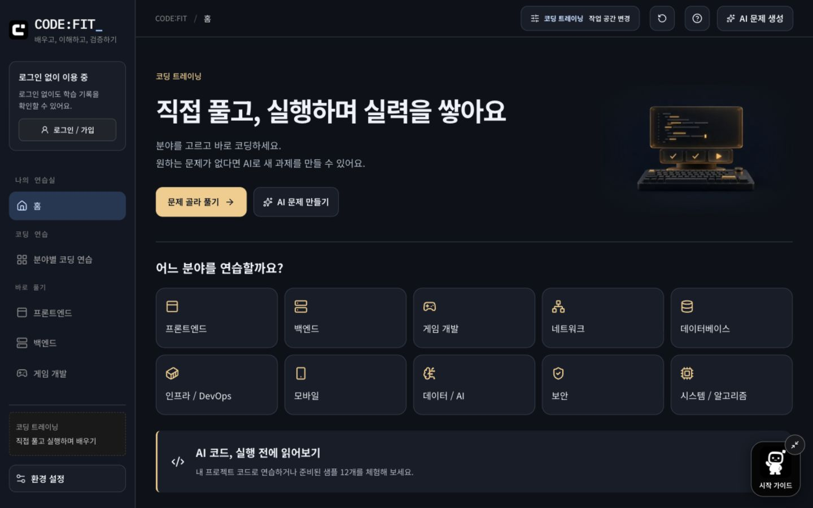

# CODE:FIT_

### AI를 배우고, 코드를 이해하고, 서비스를 검증하다

AI로 만든 서비스의 동작을 설명하고 싶을 때, 업무에 쓸 AI 도구를 배우고 싶을 때,
직접 코드를 작성하며 연습하고 싶을 때 시작하는 학습 공간입니다.

**[로그인 없이 시작하기 →](https://codefit-five.vercel.app)**

[내 프로젝트 점검](https://codefit-five.vercel.app/project-check)　
[AI 실무 배우기](https://codefit-five.vercel.app/learn/ai)　
[분야별 코딩 연습](https://codefit-five.vercel.app/?view=browse)

## 저장소 링크 하나로 점검부터 실습까지

서비스 점검실 홈에 **공개 저장소 링크**를 입력하세요.
내 프로젝트의 코드를 바탕으로 세 가지 학습을 함께 준비합니다.

GitHub뿐 아니라 GitLab, Bitbucket, Codeberg와 자체 호스팅 공개 Git 저장소의 HTTPS 주소를 입력할 수 있습니다. GitHub PR 링크도 지원합니다.

| 프로젝트 점검                             | 코드 이해 훈련                              | 서비스 원리 실습                                       |
| ----------------------------------------- | ------------------------------------------- | ------------------------------------------------------ |
| 설계 질문 5개                             | 코드 읽기 문제 3개                          | 서비스 동작 문제 3개                                   |
| 구현 이유와 확인 방법을 내 말로 설명해요. | 실제 코드와 줄 번호를 보고 동작을 예상해요. | 정상 상황과 실패 상황을 비교하고 확인할 일을 정리해요. |

질문과 연습은 같은 분석 기록에 연결됩니다. 다른 화면을 다녀와도 저장된 결과에서 이어갈 수 있고, 실습에서 남긴 예상과 확인 기록도 보관합니다.

분석은 특정 커밋에서 선택한 코드 일부를 읽는 방식입니다. 생성된 실습의 모의 과정은 실제 저장소를 실행한 결과가 아닙니다. 해설과 함께 **내 테스트 환경에서 확인할 방법**을 제공합니다.

분석한 프로젝트는 **[내 프로젝트](https://codefit-five.vercel.app/projects)**에 학습 클래스로 자동 저장됩니다.

- **찾고 이어가기:** 이름, 학습 목표와 주소로 전체 프로젝트를 검색하고 저장된 학습을 이어갑니다.
- **수정과 복습:** 클래스 이름과 목표를 수정하고, 기존 답변을 유지하면서 다시 풀어봅니다.
- **분석 이력:** 최신 코드로 다시 분석하면 별도 클래스가 만들어집니다. 같은 저장소 주소의 이전 분석도 찾아볼 수 있습니다.
- **삭제:** 필요 없는 클래스와 관련 학습 기록을 함께 삭제합니다. 원본 저장소는 바뀌지 않습니다.

복습 위치와 메모는 이 브라우저에 보관되며 다른 기기 동기화와 학습 기록 백업에는 포함되지 않습니다. 여러 탭에서 동시에 쓴 메모가 충돌하면 함께 보관합니다. 저장에 실패하면 미저장 안내를 표시하고 다음 저장 때 재시도합니다. 저장에 성공하기 전에 화면을 닫으면 미저장 내용은 사라질 수 있습니다.

실습과 AI 학습은 단계별로 저장합니다. 연결이 끊기면 남은 단계부터 이어서 만들며, 이미 저장된 결과 복구에는 AI 횟수를 사용하지 않습니다.

저장소를 연결하지 않아도 공개 서비스 주소로 프로젝트를 점검하거나 준비된 샘플로 체험할 수 있습니다.

## 내 서비스에서 놓친 설명을 찾아요

**내 프로젝트 점검**은 사용 흐름, 데이터 저장, 접근 권한, 오류 대응과 설계 선택을 질문합니다.
공개 서비스 주소는 자바스크립트 실행 후 화면과 본문을, 저장소 주소는 수집한 코드를 근거로 사용합니다. 읽은 범위와 확인하지 못한 내용도 함께 표시합니다.

- **질문별 피드백:** 설명한 부분, 빠진 부분과 다음에 확인할 방법을 구분합니다.
- **코드 근거 확인:** 분석한 파일과 줄을 살펴보고, 내 설명을 코드와 비교하며 질문할 수 있습니다.
- **내 프로젝트 확인 과제:** 준비 조건, 실행 순서와 기대 결과를 따라 직접 확인하고 기록합니다.
- **보완 답변:** 최초 답변을 보관하면서 같은 질문에 다시 답하고 이전 피드백과 비교합니다.

점수는 제출한 답변의 설명 수준을 나타냅니다. 서비스의 안전성이나 보안을 인증하는 점수는 아닙니다.

## 지금 필요한 작업 공간을 골라요

| 서비스 점검실                                                 | AI 워크숍                                            | 코딩 트레이닝                                              |
| ------------------------------------------------------------- | ---------------------------------------------------- | ---------------------------------------------------------- |
|  |  |  |
| 내 서비스의 설계와 보안을 확인해요.                           | AI 도구를 언제, 어떻게 쓰는지 배워요.                | 분야를 골라 직접 코드를 작성해요.                          |
| 프로젝트 점검과 최근 기록 중심                                | 내 프로젝트 AI 활용 학습과 목적별 수업 중심          | 작성 중인 코드와 문제 탐색 중심                            |

서비스 점검실과 AI 워크숍은 홈에서 저장소 링크를 바로 입력하고, 코딩 트레이닝은 문제 선택과 코드 작성으로 시작합니다. 공간을 고르면 홈 구성과 사이드바 순서가 달라집니다. 헤더의 **작업 공간 변경**에서 언제든 바꿀 수 있으며, 학습 기록과 작성 중인 코드는 유지됩니다.

무엇부터 할지 모르겠다면 오른쪽 아래 **시작 가이드**를 열어보세요. 안내 친구 **핏**이 경험, 목표와 가능한 시간에 맞는 첫 학습을 추천합니다.

## AI 도구를 내 업무에 연결해요

**내 프로젝트로 배우기**는 공개 저장소 코드를 바탕으로 이미 사용 중인 AI 기술과 새로 적용해 볼 아이디어를 구분합니다. 코드 근거를 읽고 관련 수업을 배운 뒤, 내 프로젝트에서 해볼 실험과 확인 기준을 정리합니다. 확인 문제의 답변과 적용 기록은 서버에 저장해 이어갈 수 있습니다.

AI 워크숍 홈과 AI 실무 배우기 상단에서 저장소를 연결하거나 기존 분석 기록을 선택하세요. 수집한 코드에 AI 사용 근거가 없다면 억지로 사용 중인 도구를 만들어 설명하지 않습니다.

**AI 실무 배우기**는 15개 분야, 32개 수업으로 구성되어 있습니다.
에이전트 워크플로우, 문서 검색, 업무 자동화, 로컬 AI, 모델 운영과 결과 검증을 다룹니다. LangChain, LangGraph, MCP 등 필요한 도구와 개념을 검색하고 난이도별로 고를 수 있습니다.

**개념 이해 → 선택형 모의 실습 → 확인 문제 → 다음 수업**으로 이어집니다.
선택에 따른 결과와 해설을 비교하며 배우는 방식으로, 외부 도구 설치나 API 키가 필요하지 않습니다.
진도는 현재 브라우저에 저장되며 최근 미완료 수업부터 이어갈 수 있습니다.

## 직접 코드를 작성하고 고쳐요

프론트엔드, 백엔드, 게임, 네트워크, DB, 인프라, 모바일, 데이터/AI, 보안, 시스템까지.
**10개 분야, 26개 언어와 기술**에서 난이도에 맞는 문제를 고르세요.

원하는 문제가 없으면 AI로 새 문제를 만들 수 있습니다. 힌트와 참고 정답을 살펴보고, 풀이 검토를 받아 코드를 보완합니다. 작성한 코드는 자동 저장되며 이전 제출본 복원과 백업도 지원합니다.

**샘플 코드 이해 훈련 12개**에서는 결과 예상, 원본 실행, 코드 수정과 테스트, 수정 이유 설명을 차례로 연습합니다. 샘플의 JavaScript 실행 결과와 AI의 정적 코드 검토는 구분해 보여 줍니다.

## 필요한 원리는 샘플 서비스로 체험해요

저장소 연결 없이 시작하려면 코드 이해 훈련이나 서비스 원리 배우기에서 **샘플로 체험**을 선택하세요.

서비스 원리 실습은 **5개 서비스 분야, 21개 사례**를 제공합니다. 접근 권한, 저장 실패, 예약 중복, 재고와 환불 조건 등을 화면에서 직접 조작하며 확인합니다.

**예상하기 → 직접 확인하기 → 수정하고 검사하기 → 다른 상황에 적용하기**

실험 목적과 지켜야 할 조건을 읽고 강조된 버튼을 따라 진행합니다. 관찰을 마치면 무엇을 확인했는지 정리하고 다음 단계로 이동합니다. AI 질문 없이도 끝까지 이용할 수 있습니다.

샘플은 조건을 빠뜨린 구현과 수정안을 비교하는 교육용 모델이며, 특정 AI의 실제 오류 사례를 모은 자료는 아닙니다.

## 배포 전에 공개 보안 설정을 확인해요

관리하거나 점검 허락을 받은 서비스의 HTTPS 주소를 입력하면 보안 헤더와 쿠키 설정을 확인하고 근거와 다음 행동을 보여 줍니다.

소유권을 확인한 서비스는 서로 다른 Origin에 대한 CORS 응답을 비교할 수 있습니다. 직접 실행한 OWASP ZAP의 JSON 보고서를 가져와 위험도별 알림과 수정 방향도 살펴볼 수 있습니다.

공개 응답과 제공한 보고서를 확인하는 기능입니다. 코드핏이 침투 테스트를 대신 실행하거나 서비스에 취약점이 없다고 보증하지 않습니다. 결과를 보관하려면 화면에서 텍스트 파일로 내려받으세요.

## 로그인 없이 체험하고, 기록에서 이어가세요

샘플 실습과 코딩 문제는 로그인 없이 이용할 수 있습니다. AI 기능은 정해진 한도 안에서 체험하고, 로그인하면 더 많이 사용할 수 있습니다.

| AI 기능                                                  | 로그인 없이 | 로그인 후   |
| -------------------------------------------------------- | ----------- | ----------- |
| 프로젝트 분석, 맞춤 실습과 AI 활용 학습 생성의 공유 한도 | 24시간 3회  | 24시간 5회  |
| 프로젝트 답변 평가와 코드 대화가 공유하는 한도           | 24시간 2회  | 24시간 12회 |
| AI 코딩 문제 생성                                        | 하루 2회    | 하루 6회    |

새 저장소로 점검과 두 종류의 연습을 함께 준비하면 분석 한도 2회를 사용합니다. 이미 생성된 실습을 풀거나 기록을 조회할 때는 추가 AI 호출이 없습니다. 프로젝트 AI 활용 학습은 기존 분석에서 만들면 분석 한도 1회, 새 저장소 분석부터 시작하면 총 2회를 사용합니다. 접속망과 서비스 공용 한도로 이용이 제한될 수도 있습니다.

게스트의 서버 기록은 현재 브라우저 쿠키로 찾고, 로그인한 기록은 같은 계정으로 다른 기기에서 이어갑니다. 게스트 기록이 로그인 계정에 자동 합쳐지지는 않으며 환경 설정에서 백업하고 가져올 수 있습니다. 기본 32개 AI 실무 수업 진도는 현재 브라우저에만 저장됩니다. 프로젝트 AI 활용 학습의 저장된 답변과 기록은 서버 백업에 포함됩니다.

---

**[CODE:FIT 시작하기 →](https://codefit-five.vercel.app)**

[기능별 상세 문서](docs/README.md) · [AI 검토 방식과 검증 범위](https://codefit-five.vercel.app/quality) · [개인정보 안내](https://codefit-five.vercel.app/privacy)

프로젝트 클래스의 저장 범위와 복습 방식은 [내 프로젝트 관리 문서](docs/project-classes.md)에서 확인할 수 있습니다.
