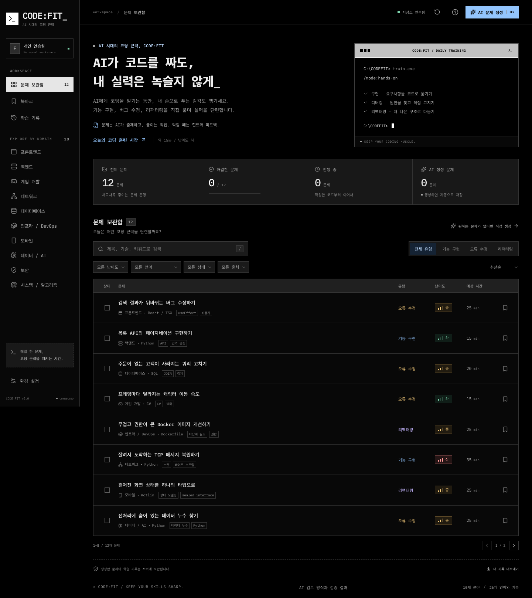
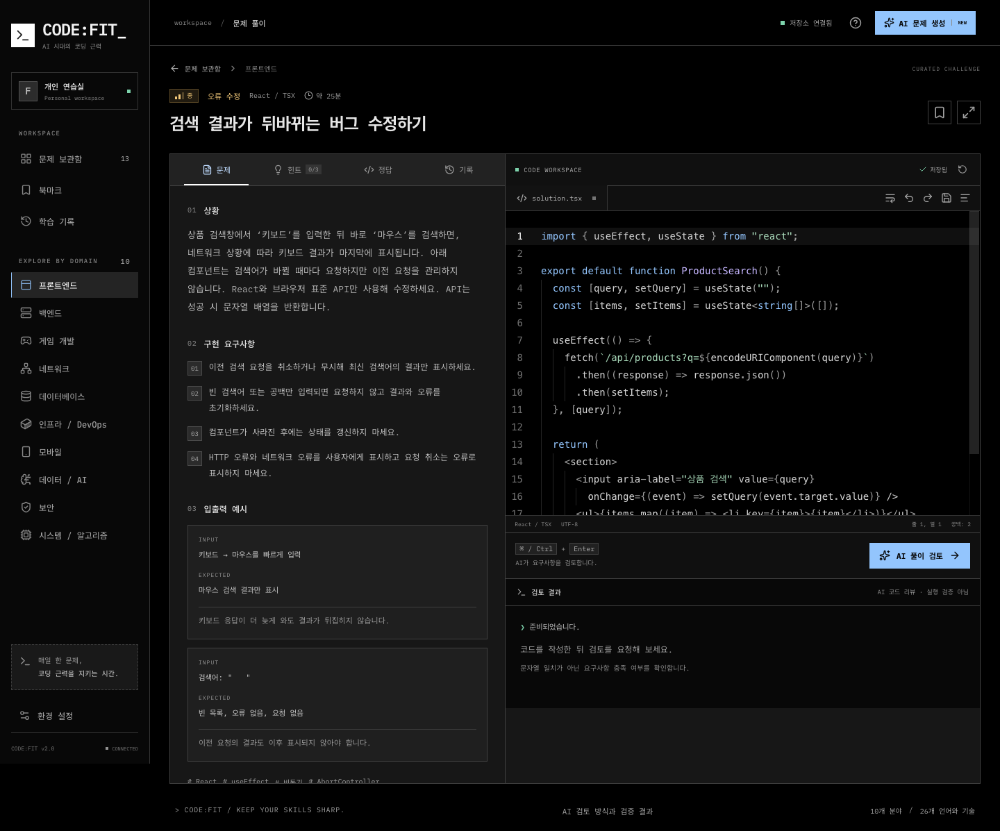

# CODE:FIT_

### AI가 코드를 짜도, 내 실력은 녹슬지 않게.

AI에게 구현을 맡기는 날에도, 스스로 문제를 풀 수 있는 개발자로.
하루 한 문제씩 직접 구현하고, 고치고, 다시 생각하는 코딩 연습실입니다.

**[지금 연습하기 →](https://codefit-five.vercel.app)**

로그인 없이 문제를 골라 바로 시작하세요.

## “이 코드, AI 없이도 고칠 수 있을까?”

코드를 읽으면 이해되는데 막상 직접 쓰려면 손이 멈추는 순간이 있습니다.
CODE:FIT은 그런 감각을 다시 깨우기 위해 만들었습니다.
정답을 따라 적는 대신 실제 개발에서 만날 법한 상황을 풀어 봅니다.

- **직접 구현하기** — 요구사항을 읽고, 비어 있는 기능을 완성하세요.
- **오류 고치기** — 예상과 다른 결과의 원인을 찾아 수정하세요.
- **리팩터링하기** — 동작은 지키면서 더 읽기 쉽고 안전한 코드로 바꾸세요.

## 오늘 필요한 만큼, 나에게 맞는 난이도로

프론트엔드, 백엔드, 게임, 네트워크, 데이터베이스, 인프라, 모바일, 데이터/AI,
보안, 시스템까지 **10개 분야와 26개 언어·기술**을 연습할 수 있습니다.

| 하                        | 중                         | 상                          |
| ------------------------- | -------------------------- | --------------------------- |
| 기본 문법과 작은 기능부터 | 실무에서 마주치는 요구사항 | 복잡한 조건과 설계 판단까지 |

분야와 언어, 유형으로 검색하고 북마크해 두세요.
원하는 문제가 없다면 **GPT-5.6 Sol**에 상황을 설명해 새로 만들 수 있습니다.
생성한 문제는 공개 보관함에 계속 쌓여 다른 개발자의 다음 연습이 됩니다.

## 막히더라도, 한 걸음씩 풀어갈 수 있도록

1. **문제를 고르고 직접 작성하세요.** 코드가 자동 저장되어 다음 연습에서도 이어집니다.
2. **필요한 만큼만 도움받으세요.** 단계별 힌트 3개와 참고 정답, 해설을 확인할 수 있습니다.
3. **피드백으로 다시 고쳐 보세요.** AI가 요구사항별 충족 여부와 개선점을 알려 줍니다.
4. **어제의 풀이와 비교하세요.** 이전 제출본을 다시 열고, 도움 없이 해결한 문제와 연속 연습일을 확인하세요.

검정 터미널 테마, 집중 모드, 글자 크기 조절과 키보드 단축키로 코드에 집중하세요.
[모바일에서도 보관함과 풀이를 확인할 수 있습니다.](docs/images/mobile.png)
연결이 잠시 끊겨도 미저장 코드를 브라우저에 보관하고, 연결이 돌아오면 다시 저장합니다.
다른 탭이나 기기에서도 코드를 고쳤다면 내 초안을 보존한 채 서버 저장본과 비교하고 이어갈 수 있습니다.

## 문제 풀이는 누구나. 새 문제는 하루 3개.

| 이용 기능                              |   로그인 없이   | Google / GitHub 로그인 |
| -------------------------------------- | :-------------: | :--------------------: |
| 모든 문제 풀기, 힌트, 참고 정답과 해설 |        ✓        |           ✓            |
| AI 풀이 검토                           |        ✓        |           ✓            |
| 자동 저장, 북마크, 학습 기록과 백업    | 이 브라우저에서 |    계정으로 이어서     |
| AI 문제 생성                           |        —        |      **하루 3회**      |
| 개인 프로필과 로그인 계정 연결         |        —        |           ✓            |

생성 횟수는 **한국 시간 자정**에 갱신됩니다. 생성에 실패하면 횟수를 돌려드립니다.
로그인 전 기록은 브라우저의 게스트 연습실에 남습니다. 백업을 내보낸 뒤 로그인하고 가져오면
계정으로 이어갈 수 있습니다. 이미 작성한 계정의 코드는 덮어쓰지 않습니다.

AI 풀이 검토는 코드를 실행하는 채점이 아니라 코드와 요구사항을 읽는 리뷰입니다.
정확하지 않은 피드백이 있을 수 있어 [검토 방식과 실제 검증 결과](https://codefit-five.vercel.app/quality)를 공개합니다.
무료 AI에는 접속망과 서비스 전체의 공용 한도도 적용됩니다.

---

**매일 한 문제, 코딩 근력을 지키는 시간.**

[로그인 없이 연습 시작하기 →](https://codefit-five.vercel.app)　
[내 문제 만들기 →](https://codefit-five.vercel.app/?generate=1)

[설계와 검증 근거](docs/engineering.md) · [로컬 실행과 배포](docs/development.md) ·
[로그인 설정](docs/authentication.md) · [개인정보 안내](https://codefit-five.vercel.app/privacy)
