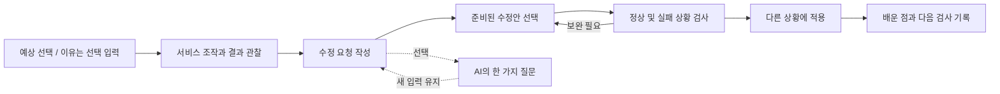
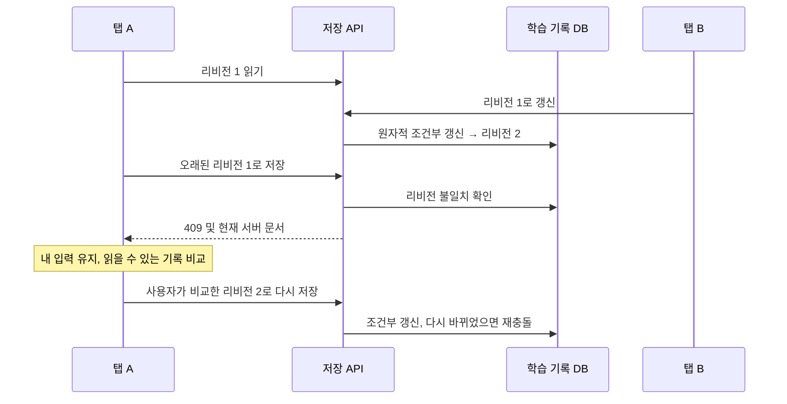
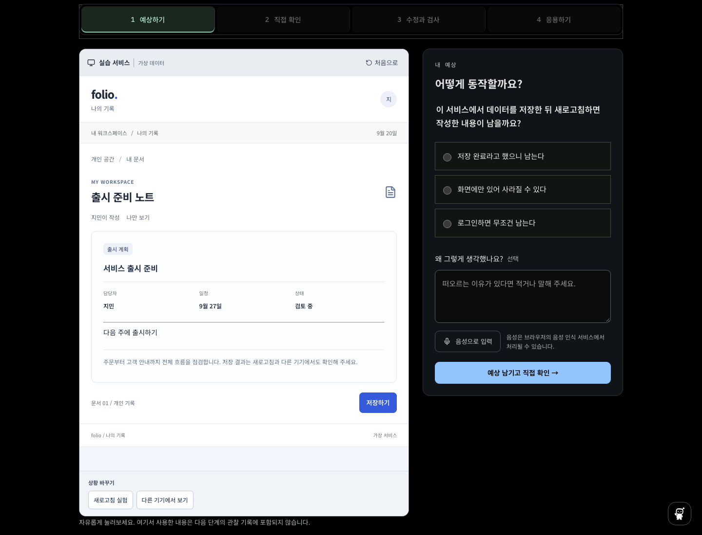

# 서비스 원리 배우기와 기능 소개 배너

현재 기능 설명과 날짜별 구현 이력을 함께 보관한다. 현재 공개 목록은 21개이며, 과거 표와 캡처는 당시 상태다. 최신 홈 구성은 [화면별 이미지와 탐색 UI](design/experience-ui.md)를 참고한다.

## 현재 실습의 조건과 결과 표시

시작 단계는 사용 상황, 확인 이유, 지켜야 할 조건과 고정 입력을 보여 준다. 시작 화면에서 별도 미리보기를 조작하던 흐름은 제거했다. 조작은 예상 저장 이후에만 시작하며 모든 실행은 관찰 기록에 포함한다.

실행 화면은 ‘수정 전 구현’과 ‘선택한 수정안 적용 중’을 구분한다. 서비스 사례의 성공/거절 안내와 이용 조건 준수는 별개다. `allowed`와 `amount`를 기대값과 비교하므로 정원 초과 예약을 성공 처리하면 불일치, 같은 예약을 올바르게 거절하면 일치로 표시한다. 조건을 바꾸면 이전 결과를 지우고 다시 실행하도록 한다. 완료 요약은 실제 동작, 지켜야 할 동작, 다음 단계 버튼과 원리를 함께 보여 준다.

실제 제품의 확인 상황을 단순화한 교육용 모델이며 특정 AI의 실제 오류 발생 빈도나 학습 효과를 증명하는 자료는 아니다. 각 실습의 사용 이유는 `src/lib/learn/context.ts`에 있다. 기존의 중복 사례 제외 목록은 유지한다. 실제 저장소의 동시성이나 운영 보안은 이 처리 규칙 실습으로 검증하지 않는다.

## 사용자와 범위

AI로 서비스를 만들지만 코드나 서버를 읽기 어려운 사용자가 서비스의 결과를 예상하고, 문제를 재현하고, 수정 결과를 확인하는 연습을 한다. 코드 입력을 진입 조건으로 두지 않는다. 현재는 서비스 원리 18개와 오류 해결 실습 3개, 총 21개를 제공한다. 아래 표는 최초 기초 과정 9개의 구성이다. 분야별 사례와 분류 근거는 [서비스 도메인 확장](design/service-domain-curriculum.md)을 참고한다. 이 트랙에서는 운영 환경 검사, 보안 인증, 장기 학습 효과 측정을 하지 않는다. 공개 서비스 링크를 활용하는 별도 기능은 [내 프로젝트 점검](project-check.md)에 정리했다.

| 미션             | 직접 조작                  | 확인할 개념                           |
| ---------------- | -------------------------- | ------------------------------------- |
| 데이터 저장 위치 | 저장, 새로고침, 다른 기기  | 화면 상태, 브라우저 저장, 공용 저장소 |
| 요청의 흐름      | 연결 끊기, 저장, 연결 복구 | 요청과 응답, 실패 안내와 재시도       |
| 비공개 글 접근   | 사용자 전환, 직접 열기     | 로그인과 서버 접근 권한               |
| 가격 계산        | 수량 3과 -1                | 변수, 경계 조건과 입력 검증           |
| 할 일 목록       | 완료 필터, 전체 보기       | 원본 보존과 표시 목록                 |
| 검색 순서        | 두 요청, 역순 응답         | 현재 요청 식별                        |
| 데이터 저장 오류 | 성공 안내와 실제 저장 비교 | 수정 요청 작성과 실패 복구            |
| 회원 게시판      | 다른 사용자의 직접 접근    | 화면 숨김과 서버 권한의 차이          |
| 중복 예약        | 동일/새 요청과 연결 실패   | 중복 처리, 새 작업과 재시도 구분      |

실습은 미리 정한 입력으로 동작하는 모의 서비스이다. ‘다른 기기’는 실제 다른 기기에 접속하지 않으며, ‘연결 끊기’도 브라우저 네트워크를 변경하지 않는다. 임의 코드를 실행하거나 실제 API를 공격하는 기능이 없다. 이는 기존 QuickJS의 DOM/네트워크 제한을 넓히지 않고 제품 동작을 연습하기 위한 선택이다.

## 학습 흐름과 UI

- 첫 예상은 잠근 뒤 관찰과 나란히 보여 준다. 틀린 예상도 보존한다. 이유는 선택 입력이며 비워도 저장, 코치 요청과 완료가 가능하다.
- 완료 여부는 정해진 동작 검사, 응용 선택과 기록 유무로 계산한다. 수정 요청과 마지막 배운 점의 문장 길이 조건은 빈 입력을 막으며 이해도 판정이나 글쓰기 점수가 아니다. 첫 예상의 이유에는 최소 길이를 요구하지 않는다.
- 기초 미션에서 수정 요청 폼은 선택적으로 펼친다. 세 실습에서는 어디서/재현/실제/기대/유지할 동작의 다섯 항목을 작성한다.
- 모든 검사 결과는 현재 선택한 수정안에 해당한다. 수정안을 바꾸면 이전 검사 완료 표시를 지운다.
- 관찰은 최대 80개, 화면에는 최근 12개를 표시한다. 전체 조작 결과는 내려받을 수 있다. 관찰을 다시 시작할 때 기록을 내려받고, 현재 화면에서 이전 관찰을 복구할 수 있다.
- 단계 이동 후 제목으로 포커스를 옮기며, 입력 누락 시 해당 입력으로 안내한다. 모션은 `prefers-reduced-motion`을 따른다.

아래 세 이미지는 2026-09-17 구현 당시 캡처다. 현재 배너와 메뉴 배치는 [README의 홈 화면](../README.md)과 다르다.

## 기능 소개 배너

메인 상단에 서비스 원리, 서비스 오류 해결, AI 코드 이해, 문제 생성, 프로젝트 점검과 보안 점검의 6개 배너를 항상 표시한다. 선택한 사용자 타입에 따라 순서를 바꾸고 기능 이름으로 직접 선택할 수 있다. 자동 전환은 기본으로 정지하며 사용자가 시작하면 8초마다 전환한다. 짧은 진입 애니메이션, 이전/다음, 직접 선택, 시작/멈춤을 제공한다. 마우스를 올리거나 문서가 숨겨지면 일시 중단하며, 키보드 포커스가 들어오면 명시적으로 다시 시작하기 전까지 정지한다. 동작 줄이기 설정에서는 자동 전환과 애니메이션을 끈다. 자동 전환 때 스크린 리더 라이브 알림을 반복하지 않는다.

배너 아래에는 타입별 이어하기와 이미지 추천 경로를 제공한다. 타입 변경은 헤더에서 하며 첫 방문에만 홈 선택 카드를 표시한다.

기능별로 제작한 그림과 HTML 설명을 함께 표시한다. 현재 공통 이미지와 이전 오류 해결·문제 생성 이미지를 사용한다. [현재 이미지 프롬프트](design/experience-visuals.json)와 [이전 배너 이미지 프롬프트](design/feature-banner-prompts.json)를 구분해 보관한다.

## 코드와 저장 책임

| 위치                                                                        | 책임                                           |
| --------------------------------------------------------------------------- | ---------------------------------------------- |
| `src/lib/learn/catalog.ts`                                                  | 현재 공개 21개 미션과 이전 주소 호환 구성      |
| `src/lib/learn/simulation.ts`                                               | 순수 상태 전이와 초기 상태별 동작 검사         |
| `src/lib/learn/progress.ts`                                                 | 기록 스키마, 완료 조건, 읽을 수 있는 내보내기  |
| `src/hooks/use-beginner-mission.ts`                                         | 초안 연결, AI 재시도, 늦은 응답과 새 입력 보존 |
| `src/components/learn/`                                                     | 목록, 미션 단계, 모의 서비스과 요청 폼         |
| `src/components/learn/mission-session.tsx`                                  | 단계/포커스/충돌 조율과 화면 간 임시 상태 보존 |
| `src/components/learn/mission-{prediction,observation,repair,transfer}.tsx` | 각 단계의 입력과 표시                          |
| `src/lib/learn/session.ts`                                                  | API와 로더가 공유하는 개인 세션 응답 타입      |
| `src/lib/server/learning-store.ts`                                          | 계정별 학습 기록의 조건부 저장과 AI 작업 완료  |
| `src/app/api/learn/`                                                        | 세션, 입력 검증, 조회/저장 및 선택적 코칭      |
| `src/components/library/feature-banner.tsx`                                 | 자동 전환과 사용자의 조작 우선권               |

코딩 문제 목록/통계와 입문 진도를 섞지 않도록 `learning_progress` 테이블을 별도로 사용한다. `(owner, lesson_id)`별 문서를 보관하고, 기존 `DraftController`와 브라우저 초안 저장을 재사용한다. 코드 초안 훅에는 저장 엔드포인트를 지정하는 선택 옵션만 추가했다. 기존 코딩 API의 기본 동작은 유지한다.

같은 내용의 응답 유실 재시도는 리비전을 늘리지 않고 확인해 준다. 신규 문서는 리비전 0에서만 생성한다. SQLite/PostgreSQL 모두 같은 `INSERT ... ON CONFLICT ... WHERE ... RETURNING` 계약을 쓴다. 개인 API는 `no-store`, 소유자는 서버 세션에서 정하며 클라이언트가 보낸 계정 ID를 신뢰하지 않는다. 기존 연습실 헤더가 현재 계정과 다르면 거절한다.

입문 진도는 자기 학습 기록이지 변조 방지 성적표가 아니다. 기본 기록 유효성과 완료 조건은 서버에서도 검사하지만, 사용자가 도구 밖에서 도움을 받았는지 판정하지 않는다. 게스트 기록과 로그인 기록은 자동 병합하지 않는다. 미션별 텍스트 내보내기는 읽기와 보관용이다. 환경 설정의 v3 JSON 백업은 입문 기록을 포함하며 다른 계정으로 가져올 수 있다. 기존 기록을 덮어쓰지 않는 [복원 계약](workspace-backup.md)을 따른다.

운영자의 전체 SQLite 파일 백업과 SQLite→PostgreSQL 이관에는 `learning_progress`가 포함된다. 사용자용 백업과 운영용 데이터 보관의 범위는 [개발 안내](development.md#백업과-구조)에서 구분한다.

## AI의 역할과 비용

입문 코치는 기존 리뷰 모델 설정(기본 `gpt-5.6-luna`)과 실습 코치 별도 한도(비로그인 2회, 로그인 30회/24시간)와 접속망/서비스 공용 제한을 사용한다. 입력은 미션, 첫 예상, 이유, 조작 순서와 수정 요청이다. 서버가 조작 순서를 시뮬레이터로 다시 계산해 AI 근거를 만든다. 고정된 수정안이나 통과 판정 자체는 AI가 생성하지 않는다.

AI 호출 동안 DB 트랜잭션을 유지하지 않는다. 작업 ID와 입력 지문, 소유 실행 토큰을 사용하고, 현재 토큰과 만료 상태가 맞는 실행만 응답을 확정한다. 실패 재시도는 같은 스냅샷이면 같은 ID를 쓰며, 내용이 바뀌면 새 ID를 쓴다. 늦게 도착한 질문은 원래 스냅샷과 함께 보관하고 지금 작성한 내용을 바꾸지 않는다. 내용이 달라졌으면 이전 내용에 대한 질문이라고 표시한다. 외부 호출 응답이 유실된 경우 과금 중복까지 보장하는 구조는 아니다.

API 요청은 `store:false`이며, 사용자 입력은 지침과 분리된 데이터로 전송한다. 실제 사용자의 비밀값이나 개인 프로젝트를 보내지 않도록 화면과 개인정보 안내에서 범위를 설명한다. 이번 검증은 모의 AI 응답을 사용했으며 새 유료 호출은 하지 않았다. 기존 모델 평가 결과를 입문 코치의 품질 평가로 재사용하지 않는다.

## 검증

최종 실행 결과는 [검증 기록](VERIFICATION.md)과 [기계 판독 요약](../reports/beginner-validation.json)에 기록한다.

- `src/lib/learn/learning.test.ts`: 아홉 미션의 실패 재현, 불완전한 수정안 구분, 응용, 상태 불변성과 잘못된 기록 거절.
- `src/lib/server/query-contract.test-helper.ts`: 학습 기록 동시 갱신, 같은 내용 재시도, 계정 격리와 AI 완료 토큰 계약. PostgreSQL도 같은 계약을 사용한다.
- `src/lib/server/ai-learning-coach.test.ts`: Luna 설정, 근거 재현, 지침/데이터 분리와 잘못된 AI 응답 거절. 외부 호출은 모의 처리한다.
- `e2e/beginner.spec.ts`: 아홉 미션의 처음부터 완료/복원까지, 모바일, 키보드와 axe 검사, 오프라인, 다중 탭 충돌과 재충돌, 늦은 AI 응답, 재시도 ID와 배너의 자동 전환/동작 줄이기.

학습자 대상 사용성 실험, 실제 스크린 리더 청취와 장기 학습 효과는 아직 측정하지 않았다. 통과율이나 완료율을 제품 안전성 또는 개발 실력으로 표현하지 않는다.

## 서비스형 실습 화면과 음성 입력 — 2026-09-18

실습 서비스과 학습 안내가 같은 다크 테마여서 무엇을 조작할 수 있는지 구분하기 어려웠다. 실습 서비스만 화이트 테마로 바꾸고 상단에 ‘실습 서비스 / 가상 데이터’를 표시했다. ‘개념 그림 · 실행 결과는 실습에서 확인하세요.’ 문구는 공통 그림 컴포넌트에서 제거했다.

- 개인 문서, 팀 문서, 문구 쇼핑몰, 프로젝트 할 일, 반려동물 검색, 스튜디오 예약의 여섯 서비스 외형을 제공한다. 저장과 요청/응답 미션은 같은 문서 서비스을 사용하므로 미션의 앱 유형은 일곱 가지다.
- 헤더, 사용자 표시, 경로, 문서 메타데이터, 상품/예약 카드와 결과 영역을 구성했다. 저장, 문서 열기, 수량 선택, 필터, 검색과 예약은 서비스 안의 버튼에서 동작한다. 연결 끊기나 응답 도착 등 환경 제어는 서비스 아래 ‘상황 바꾸기’로 구분했다.
- 처음 화면에서도 고정된 더미 데이터로 조작할 수 있다. 이때의 조작은 컴포넌트 메모리에만 있고, 정식 관찰 기록에 합쳐지지 않는다. ‘처음으로’로 다시 사용할 수 있으며 다음 단계에서는 초기 상태부터 기록한다. 서비스 UI는 기존 순수 상태 전이 함수를 사용하므로 의도된 결함과 수정안의 동작 계약을 유지한다.
- 데스크톱의 예상 선택지와 이유 입력은 예제 서비스 우측, 1,000px 이하에서는 서비스 아래에 배치한다. 내부 상태는 접힌 보조 정보로 옮겨 서비스 화면과 분리했다.
- ‘왜 그렇게 생각했나요?’는 입문 미션과 코드 이해 훈련 모두 선택 입력이다. UI 단계 이동뿐 아니라 서버의 유효성/완료 조건과 코치 요청 조건에서도 최소 길이를 제거했다. 기존 이유와 잠긴 첫 예상, 계정별 초안, 충돌 비교, 복원은 유지한다. 수정 요청과 인수인계 메모 등 다른 필수 학습 조건은 그대로다.

### 음성 답변

`VoiceInput`은 한국어 Web Speech API(`SpeechRecognition` 또는 `webkitSpeechRecognition`)를 사용한다. 예상 이유, 입문 수정 요청과 마지막 배운 점, 코드 이해 훈련 및 인수인계 메모에 적용했다. 별도 유료 전사 API나 오디오 저장소를 도입하지 않았다.

- 직접 버튼을 눌러 시작하고 최대 1분 후 종료한다. 브라우저가 마이크 권한을 요청한다. 권한 정책은 같은 출처의 마이크만 허용하고 카메라와 위치 차단은 유지한다.
- 중간 인식은 상태 안내에만 표시한다. 확정된 문장만 현재 입력 뒤에 추가하며, 동일 확정 결과를 중복 반영하지 않는다. 직접 타이핑한 글을 덮어쓰지 않고 각 필드의 최대 길이를 유지한다.
- 종료 후 입력란으로 포커스를 돌려 수정할 수 있다. 다른 입력란에서 녹음을 시작하거나 탭을 숨기거나 해당 화면을 떠나면 기존 인식을 중단한다. 종료 후 늦게 도착한 결과는 버린다. 확정되지 않은 발화는 저장되지 않을 수 있다.
- 권한 거절, 마이크 없음, 무음, 연결 실패를 구분해 안내하고 기존 글을 보존한다. 기능이 없는 브라우저에는 비활성 버튼과 직접 입력 안내를 제공한다.
- 음성 인식 지원과 처리는 브라우저/OS에 따라 다르다. 음성이 브라우저 제공자의 서버로 전달될 수 있음을 버튼 옆과 개인정보 안내에 명시했다. 코드핏 서버는 오디오를 수집하지 않지만 인식된 텍스트는 기존 학습 기록과 동일하게 저장한다. [MDN SpeechRecognition](https://developer.mozilla.org/en-US/docs/Web/API/SpeechRecognition), [Web Speech API 사용 안내](https://developer.mozilla.org/en-US/docs/Web/API/Web_Speech_API/Using_the_Web_Speech_API)를 확인했다.

### 구현과 검증 근거

- `src/components/learn/simulation-view.tsx`: 자유 조작/관찰 상태 분리와 환경 제어.
- `src/components/learn/simulation/app-surface.tsx`: 서비스 화면과 실제 동작 버튼.
- `src/components/learn/simulation/simulation-inspector.tsx`: 접힌 내부 상태 안내.
- `src/components/ui/voice-input.tsx`: 음성 인식 수명, 결과 추가, 종료와 오류 처리.
- `src/styles/simulation.css`: 화이트 테마, 반응형 우측 답안, 음성 입력 UI. 교체된 기존 실습 CSS는 삭제했다.
- `src/lib/learn/learning.test.ts`: 모든 미션에서 이유가 없어도 정상 완료되고 예상 선택 자체는 필요한지 확인.
- `e2e/simulation-voice.spec.ts`: 전 미션 자유 조작/초기화/빈 이유 저장, 관찰 기록 분리, 우측 배치, 모바일 접근성, 음성 중 타이핑/중복 확정/권한 거절/늦은 결과 무시/미지원 환경, 코드 이해 훈련의 빈 이유 실행.

[쇼핑몰](images/sample-price-desktop.png), [예약 서비스](images/sample-booking-desktop.png), [모바일 쇼핑몰](images/sample-shop-mobile.png). 화면은 실제 로컬 브라우저에서 캡처했으며 서비스 데이터와 네트워크 제어는 교육용 시뮬레이션이다. 검증 수치와 남은 한계는 [검증 기록](VERIFICATION.md)에 정리한다. 실제 마이크/인식 제공자의 정확도, 스크린 리더 수동 청취와 실제 휴대폰 키보드는 자동화 검증에 포함하지 않는다.

## 서비스 분야별 확장 — 2026-09-18

공통 명칭을 ‘서비스 원리 배우기’와 ‘실습 서비스’로 바꿨다. 쇼핑·주문, 예약·시설, 업무·협업, 콘텐츠·구독, 고객지원에 새 사례를 4개씩 추가해 당시 총 29개를 제공했다. 현재 목록은 아래 조작 안내 절에 정리한 21개다. 분야별 화면과 고정 데이터를 선택해 처리하고 이력을 확인할 수 있다. 주 분류는 서비스 분야, 보조 필터는 기술 개념이다.

[조사 출처, 분류 대안, 전체 사례와 화면 증거](design/service-domain-curriculum.md)에 선택 이유와 확장 구조, 검증 범위를 정리했다. 기존 기록의 버전, 미션 ID와 URL을 유지했다. 새 실습은 사례를 골랐다가 다른 사례로 바꿔 실행한 것을 원래 사례의 재현으로 인정하지 않는다.

기존 개념 그림 중 `total.webp`가 최적화 이미지 경로에서 요청/표시되지 않는 현상을 로컬 브라우저에서 관찰했다. 같은 원본의 직접 경로는 정상 로드됐다. 이미 WebP로 생성된 개념 그림은 재최적화를 거치지 않고 제공하도록 바꿨다. 구체적인 브라우저/최적화 내부 원인을 확정하지는 않았으며, 더 큰 원본을 전달하는 비용을 감수한다. 새 상품·공간 사진은 기존 이미지 최적화를 유지한다.

## 조작 안내와 현재 학습 목록

모든 현재 실습의 관찰 화면과 수정 후 재실험에 스포트라이트 안내를 제공한다. 실제 버튼을 누른 기록으로 안내가 진행되며, 실험 목적과 확인할 결과를 함께 표시한다. 필수 관찰 이후의 실험은 선택 사항이다. Escape 또는 닫기로 안내를 숨기고 다시 켤 수 있다. 키보드 탐색과 동작 줄이기를 지원하며, 예제 서비스의 화면은 다크 테마다. 예상 단계에서는 답을 먼저 관찰하도록 유도하지 않는다.

목록에서 제외한 이전 실습은 `lists-and-filters`, `shop-shipping`, `booking-cancel`, `booking-guests`, `work-budget`, `work-dependency`, `content-segment`, `support-close`다. 계산, 단일 조건 또는 다른 실습과 중복되는 확인에 비중이 높아 현재 학습 목록과 추천에서는 제외한다. 기존 URL과 학습 기록, 백업의 정의는 보존한다. 응용 단계에는 각 실습과 연결된 실제 프로젝트 확인 과제를 제공한다.

권한 검사는 [Lovable의 보안 안내](https://lovable.dev/blog/secure-vibe-coding), 중복 요청은 [Stripe의 멱등 요청 문서](https://docs.stripe.com/api/idempotent_requests), 늦게 도착한 응답은 [React의 Effect 문서](https://react.dev/reference/react/useEffect)에 기술된 실제 구현 문제와 연결된다. 이 자료가 모든 모델에서 각 예제의 오류가 발생하는 빈도나 코드핏 실습의 학습 효과를 입증하는 것은 아니다. 예제는 실패 조건을 단순화한 시뮬레이션이며, 서버의 원자적 처리나 실제 접근 제어의 안전성을 검증하지 않는다.

## 직접 확인 단계의 결과 요약

필수 실험을 마치면 스포트라이트를 멈추고 `실험 결과 요약`으로 포커스와 화면을 이동한다. 미션별 원리와 사용자가 실제로 수행한 필수 실험의 결과를 표시하고, `3. 수정과 검사로 이동` 버튼으로 바로 이어간다. 추가 실험은 사용자가 `선택 실험 이어하기`를 눌렀을 때만 안내한다. 최초 예상과 전체 실행 기록은 펼쳐 볼 수 있으며, 기존 기록 내려받기와 관찰 복구는 유지한다. 요약은 정답이나 학습 완료를 자동으로 판정하지 않는다.

미션 안의 `그림으로 원리 살펴보기`는 제거했다. 코드 이해 훈련의 상황 그림과 목록의 기능 이미지는 유지한다. 실행 결과와 무관한 그림 대신 실제 실험 결과를 학습 근거로 사용한다.
