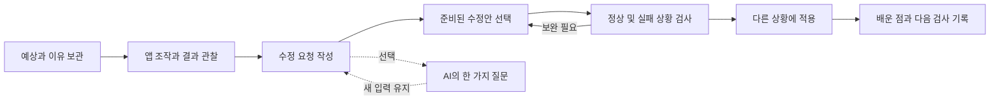
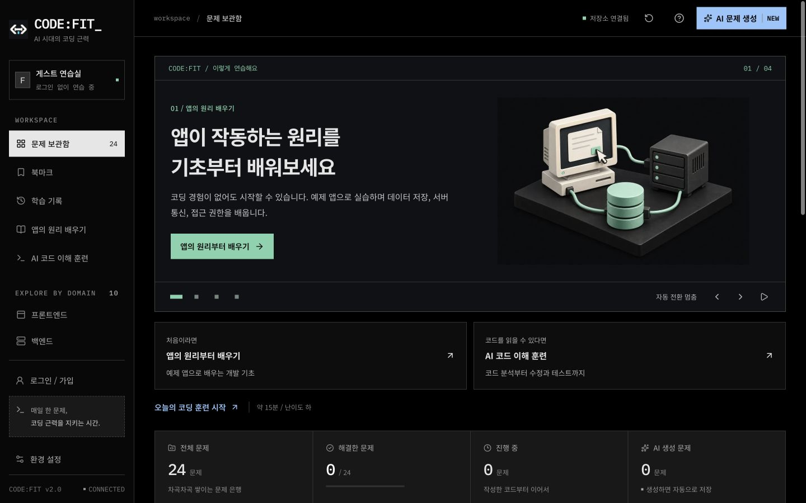
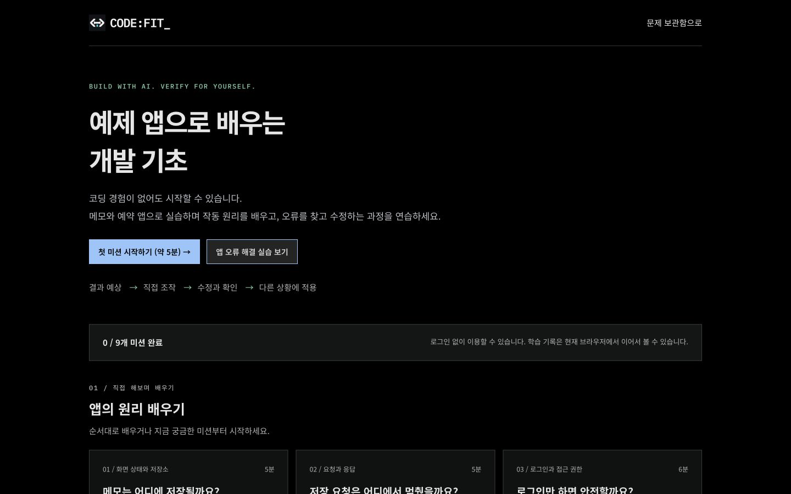
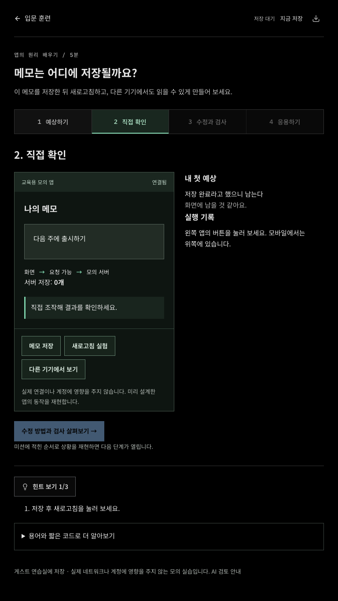
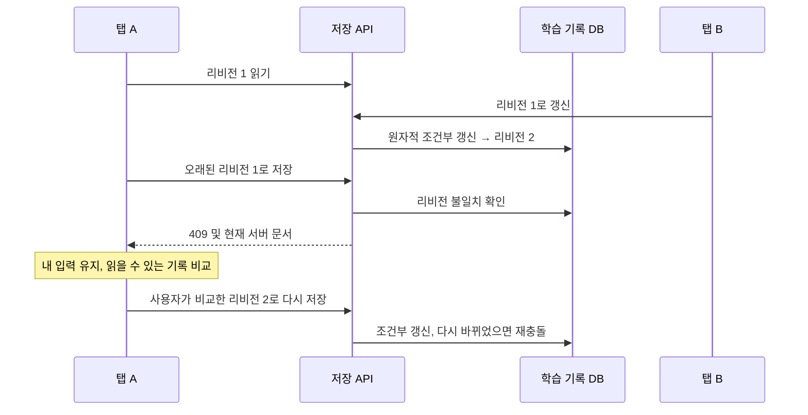

# 앱의 원리 배우기와 기능 소개 배너

2026-09-17. 기존 코드 이해 훈련과 가독성 수정은 `43eb771e1cf3aa7e40dd6c9e626e7c07364f60b8`로 먼저 커밋하고 GitHub main에 푸시했다. 이 문서는 그다음 구현한 입문 트랙을 설명한다.

## 사용자와 범위

AI로 앱을 만들지만 코드나 서버를 읽기 어려운 사용자가 앱의 결과를 예상하고, 문제를 재현하고, 수정 결과를 확인하는 연습을 한다. 코드 입력을 진입 조건으로 두지 않는다. 기초 미션 6개와 적용 실습 3개를 제공한다. 실제 프로젝트 가져오기, 운영 환경 검사, 보안 인증, 장기 학습 효과 측정은 이번 구현 범위가 아니다.

| 미션           | 직접 조작                  | 확인할 개념                           |
| -------------- | -------------------------- | ------------------------------------- |
| 메모 저장 위치 | 저장, 새로고침, 다른 기기  | 화면 상태, 브라우저 저장, 공용 저장소 |
| 요청의 흐름    | 연결 끊기, 저장, 연결 복구 | 요청과 응답, 실패 안내와 재시도       |
| 비공개 글 접근 | 사용자 전환, 직접 열기     | 로그인과 서버 접근 권한               |
| 가격 계산      | 수량 3과 -1                | 변수, 경계 조건과 입력 검증           |
| 할 일 목록     | 완료 필터, 전체 보기       | 원본 보존과 표시 목록                 |
| 검색 순서      | 두 요청, 역순 응답         | 현재 요청 식별                        |
| 메모 저장 오류 | 성공 안내와 실제 저장 비교 | 수정 요청 작성과 실패 복구            |
| 회원 게시판    | 다른 사용자의 직접 접근    | 화면 숨김과 서버 권한의 차이          |
| 중복 예약      | 동일/새 요청과 연결 실패   | 중복 처리, 새 작업과 재시도 구분      |

실습은 미리 정한 입력으로 동작하는 모의 앱이다. ‘다른 기기’는 실제 다른 기기에 접속하지 않으며, ‘연결 끊기’도 브라우저 네트워크를 변경하지 않는다. 임의 코드를 실행하거나 실제 API를 공격하는 기능이 없다. 이는 기존 QuickJS의 DOM/네트워크 제한을 넓히지 않고 제품 동작을 연습하기 위한 선택이다.

## 학습 흐름과 UI

- 첫 예상은 잠근 뒤 관찰과 나란히 보여 준다. 틀린 예상도 보존한다.
- 완료 여부는 정해진 동작 검사, 응용 선택과 기록 유무로 계산한다. 문장 길이 조건은 빈 입력을 막으며 이해도 판정이나 글쓰기 점수가 아니다.
- 기초 미션에서 수정 요청 폼은 선택적으로 펼친다. 세 실습에서는 어디서/재현/실제/기대/유지할 동작의 다섯 항목을 작성한다.
- 모든 검사 결과는 현재 선택한 수정안에 해당한다. 수정안을 바꾸면 이전 검사 완료 표시를 지운다.
- 관찰은 최대 80개, 화면에는 최근 12개를 표시한다. 전체 조작 결과는 내려받을 수 있다. 관찰을 다시 시작할 때 기록을 내려받고, 현재 화면에서 이전 관찰을 복구할 수 있다.
- 단계 이동 후 제목으로 포커스를 옮기며, 입력 누락 시 해당 입력으로 안내한다. 모션은 `prefers-reduced-motion`을 따른다.

## 기능 소개 배너

메인 상단에서 입문 기초, 앱 오류 해결, AI 코드 이해, 문제 생성을 한 장씩 소개한다. 8초 자동 전환과 짧은 진입 애니메이션, 이전/다음, 직접 선택, 시작/멈춤을 제공한다. 마우스를 올리거나 문서가 숨겨지면 일시 중단하며, 키보드 포커스가 들어오면 명시적으로 다시 시작하기 전까지 정지한다. 동작 줄이기 설정에서는 자동 전환과 애니메이션을 끈다. 자동 전환 때 스크린 리더 라이브 알림을 반복하지 않는다.

배너에 가려지지 않도록 아래에 입문/코드 이해 훈련 링크를 고정한다. 기존 정적인 터미널 소개를 교체하며 관련 미사용 CSS 규칙 92개도 제거했다.

각 기능에는 별도로 제작한 레트로 컴퓨터 일러스트를 적용했다. 제목과 설명은 실제 교육 서비스의 안내 방식을 조사한 뒤, 코드핏의 실습 상황과 사용자가 할 행동을 중심으로 다시 작성했다. [문구 조사, 이미지 파일과 제작 프롬프트](design/feature-banner.md)를 함께 보관한다.

## 코드와 저장 책임

| 위치                                        | 책임                                           |
| ------------------------------------------- | ---------------------------------------------- |
| `src/lib/learn/catalog.ts`                  | 아홉 미션의 상황, 선택지, 수정안과 해설        |
| `src/lib/learn/simulation.ts`               | 순수 상태 전이와 초기 상태별 동작 검사         |
| `src/lib/learn/progress.ts`                 | 기록 스키마, 완료 조건, 읽을 수 있는 내보내기  |
| `src/hooks/use-beginner-mission.ts`         | 초안 연결, AI 재시도, 늦은 응답과 새 입력 보존 |
| `src/components/learn/`                     | 목록, 미션 단계, 모의 앱과 요청 폼             |
| `src/lib/server/learning-store.ts`          | 계정별 학습 기록의 조건부 저장과 AI 작업 완료  |
| `src/app/api/learn/`                        | 세션, 입력 검증, 조회/저장 및 선택적 코칭      |
| `src/components/library/feature-banner.tsx` | 자동 전환과 사용자의 조작 우선권               |

코딩 문제 목록/통계와 입문 진도를 섞지 않도록 `learning_progress` 테이블을 별도로 사용한다. `(owner, lesson_id)`별 문서를 보관하고, 기존 `DraftController`와 브라우저 초안 저장을 재사용한다. 코드 초안 훅에는 저장 엔드포인트를 지정하는 선택 옵션만 추가했다. 기존 코딩 API의 기본 동작은 유지한다.

같은 내용의 응답 유실 재시도는 리비전을 늘리지 않고 확인해 준다. 신규 문서는 리비전 0에서만 생성한다. SQLite/PostgreSQL 모두 같은 `INSERT ... ON CONFLICT ... WHERE ... RETURNING` 계약을 쓴다. 개인 API는 `no-store`, 소유자는 서버 세션에서 정하며 클라이언트가 보낸 계정 ID를 신뢰하지 않는다. 기존 연습실 헤더가 현재 계정과 다르면 거절한다.

입문 진도는 자기 학습 기록이지 변조 방지 성적표가 아니다. 기본 기록 유효성과 완료 조건은 서버에서도 검사하지만, 사용자가 도구 밖에서 도움을 받았는지 판정하지 않는다. 게스트 기록과 로그인 기록은 자동 병합하지 않는다. 기존 코딩 백업과 입문 텍스트 내보내기는 별도이며 입문 가져오기는 지원하지 않는다.

## AI의 역할과 비용

입문 코치는 기존 리뷰 모델 설정(기본 `gpt-5.6-luna`)과 24시간 리뷰 20회, 접속망/서비스 공용 제한을 사용한다. 입력은 미션, 첫 예상, 이유, 조작 순서와 수정 요청이다. 서버가 조작 순서를 시뮬레이터로 다시 계산해 AI 근거를 만든다. 고정된 수정안이나 통과 판정 자체는 AI가 생성하지 않는다.

AI 호출 동안 DB 트랜잭션을 유지하지 않는다. 작업 ID와 입력 지문, 소유 실행 토큰을 사용하고, 현재 토큰과 만료 상태가 맞는 실행만 응답을 확정한다. 실패 재시도는 같은 스냅샷이면 같은 ID를 쓰며, 내용이 바뀌면 새 ID를 쓴다. 늦게 도착한 질문은 원래 스냅샷과 함께 보관하고 지금 작성한 내용을 바꾸지 않는다. 내용이 달라졌으면 이전 내용에 대한 질문이라고 표시한다. 외부 호출 응답이 유실된 경우 과금 중복까지 보장하는 구조는 아니다.

API 요청은 `store:false`이며, 사용자 입력은 지침과 분리된 데이터로 전송한다. 실제 사용자의 비밀값이나 개인 프로젝트를 보내지 않도록 화면과 개인정보 안내에서 범위를 설명한다. 이번 검증은 모의 AI 응답을 사용했으며 새 유료 호출은 하지 않았다. 기존 모델 평가 결과를 입문 코치의 품질 평가로 재사용하지 않는다.

## 검증

최종 실행 결과는 [검증 기록](VERIFICATION.md)과 [기계 판독 요약](../reports/beginner-validation.json)에 기록한다.

- `src/lib/learn/learning.test.ts`: 아홉 미션의 실패 재현, 불완전한 수정안 구분, 응용, 상태 불변성과 잘못된 기록 거절.
- `src/lib/server/query-contract.test-helper.ts`: 학습 기록 동시 갱신, 같은 내용 재시도, 계정 격리와 AI 완료 토큰 계약. PostgreSQL도 같은 계약을 사용한다.
- `src/lib/server/ai-learning-coach.test.ts`: Luna 설정, 근거 재현, 지침/데이터 분리와 잘못된 AI 응답 거절. 외부 호출은 모의 처리한다.
- `e2e/beginner.spec.ts`: 아홉 미션의 처음부터 완료/복원까지, 모바일, 키보드와 axe 검사, 오프라인, 다중 탭 충돌과 재충돌, 늦은 AI 응답, 재시도 ID와 배너의 자동 전환/동작 줄이기.

학습자 대상 사용성 실험, 실제 스크린 리더 청취와 장기 학습 효과는 아직 측정하지 않았다. 통과율이나 완료율을 제품 안전성 또는 개발 실력으로 표현하지 않는다.
