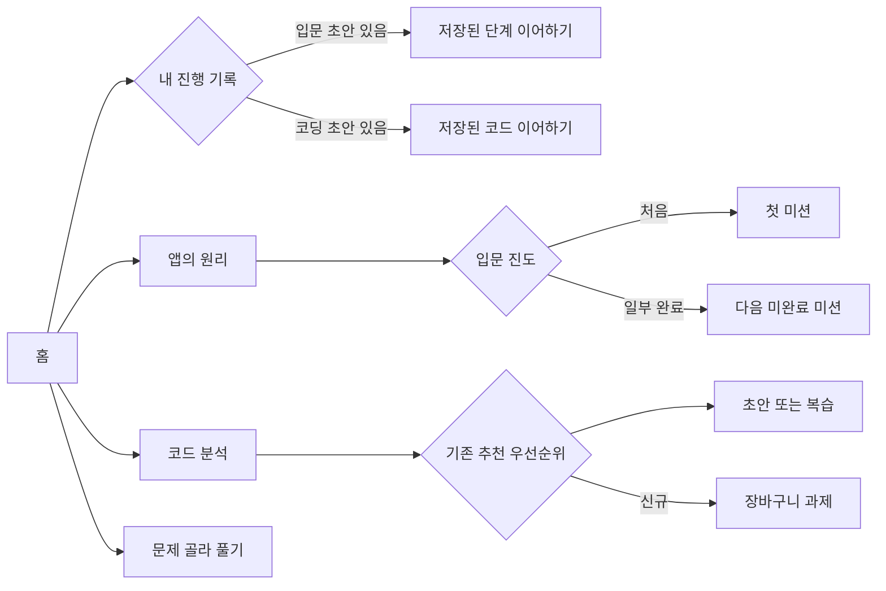
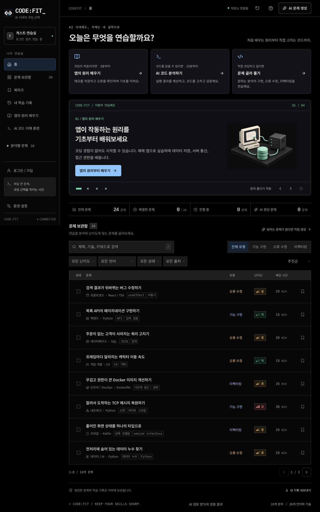
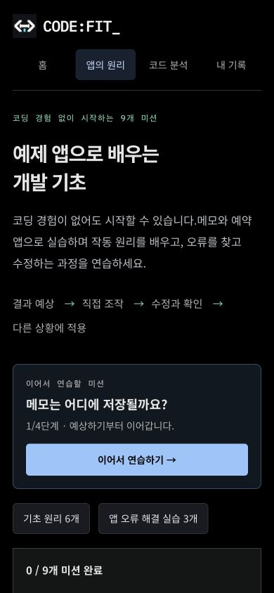
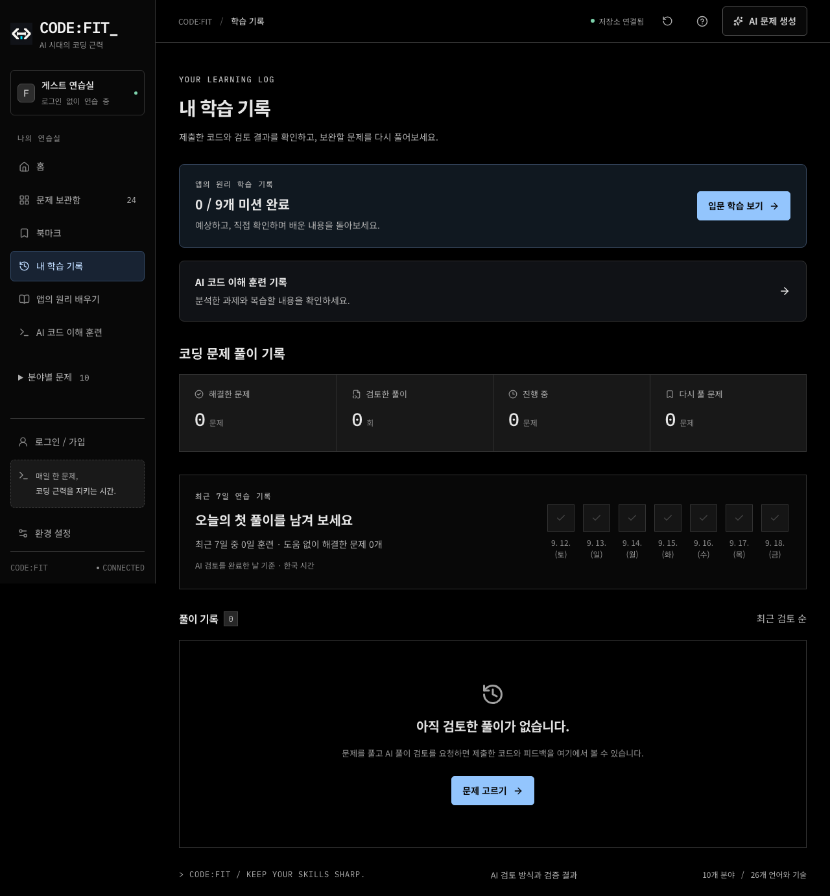
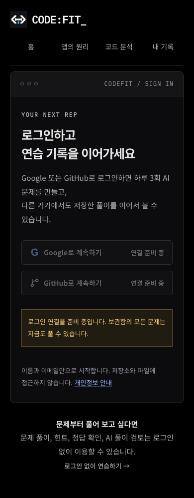
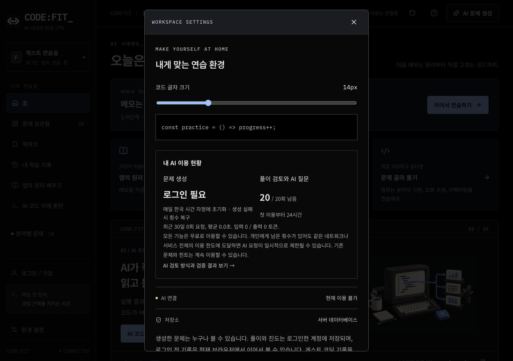
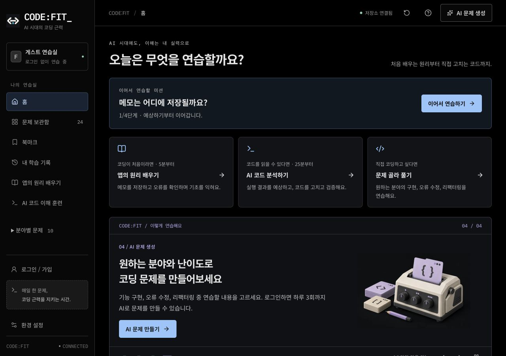
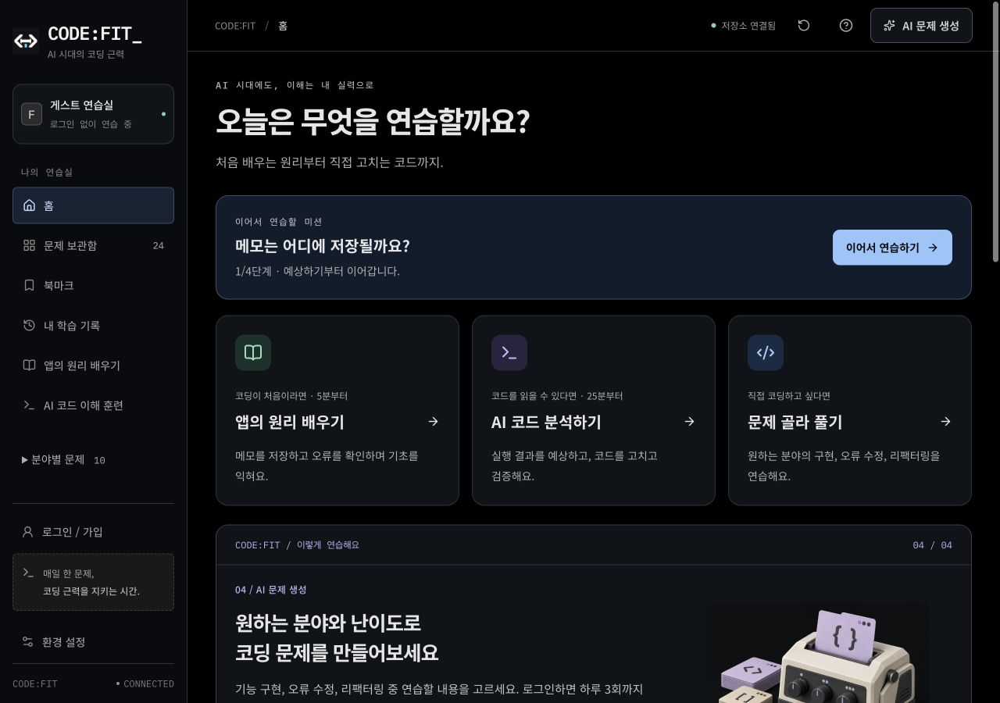
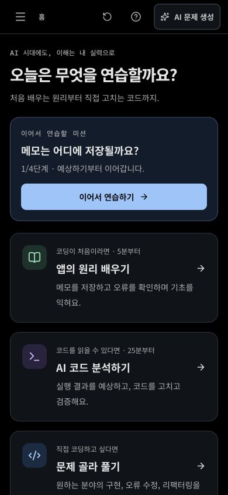
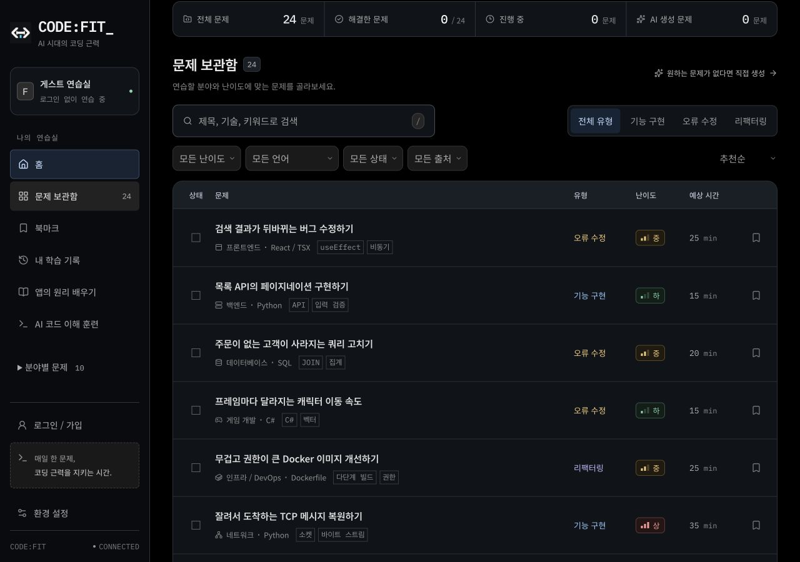

# 학습 경로와 화면 연결 개선 — 2026-09-18

기준 커밋은 `e6c27ba`다. 앞선 국내 B2C 서비스 비교에서 확인한 탐색 방식과 문장 원칙을 코드핏에 적용했다. 검정 DOS 테마, 코드의 고정폭 글꼴, 일반 설명의 한글 본문 글꼴은 유지했다. 이번 결과는 로컬 구현과 조작 검증이며, 사용자 전환율이나 학습 효과가 개선됐다는 실험 결과는 아니다.

## 참고한 설계와 적용

| 참고 자료                                              | 코드핏에 적용한 판단                                                                    |
| ------------------------------------------------------ | --------------------------------------------------------------------------------------- |
| [토스 UX 라이팅 원칙](https://toss.tech/article/21022) | ‘첫 미션’, ‘이어서’, ‘다음’ 버튼이 실제 도착 상태와 일치하도록 수정했다.                |
| [당근 공개 웹](https://www.daangn.com/kr/)             | 사용자의 목적에 따른 고정 진입 카드를 먼저 보여주고, 검은 배경 위 클릭 영역을 구분했다. |
| [오늘의집 공개 웹](https://ohou.se/)                   | 서비스 전체 메뉴와 개별 실습의 단계 메뉴를 구분했다.                                    |
| [코드잇 소개](https://www.codeit.kr/)                  | 입문 미션의 소요 시간과 실제 활동을 진입 카드와 추천 영역에 표시했다.                   |
| [인프런 로드맵](https://www.inflearn.com/roadmaps)     | 기술명보다 ‘앱의 원리’, ‘코드 분석’, ‘직접 코딩’이라는 목적부터 고르게 했다.            |

위 비교는 로그인하지 않은 공개 웹과 토스의 공식 글에 대한 앞선 관찰을 근거로 한다. 해당 서비스의 네이티브 앱 전체를 검증하거나 시각 디자인을 복제한 것은 아니다. 원본 비교 화면과 검토 기록은 로컬 `artifacts/b2c-ux-audit-2026-09-18/`에 있다.

## 화면별 변경

| 화면                           | 확인한 문제                                                                              | 적용                                                                                                                                                             |
| ------------------------------ | ---------------------------------------------------------------------------------------- | ---------------------------------------------------------------------------------------------------------------------------------------------------------------- |
| 홈                             | 배너와 반복 소개가 먼저 나타나고 실제 시작 경로가 아래에 있었다.                         | 3개 고정 학습 경로를 상단에 배치하고 배너 높이와 통계를 축소했다. 진행 중인 입문 미션과 코딩 초안은 위에서 이어간다.                                             |
| 입문 과정                      | ‘첫 미션’ 버튼을 눌러도 이전 3단계가 복원될 수 있었다.                                   | 저장된 초안과 완료 조건에 따라 첫 미션, 이어하기, 다음 미션을 구분한다. 예상 제출 전 작성한 내용도 초안으로 인정한다.                                            |
| 코드 이해 훈련                 | 고정 장바구니 시작 링크와 별도 추천 링크가 서로 다른 과제를 제시했다.                    | 추천 영역을 하나로 합쳤다. 신규 사용자는 장바구니, 기존 사용자는 기존 초안/복습 우선순위를 따른다.                                                               |
| 학습 기록                      | 입문 기록과 코드 분석 기록을 찾기 어려웠다.                                              | 입문 진도와 이어하기, 코드 분석 기록으로 가는 링크, 코딩 제출 기록을 같은 진입 화면에 모았다. 서로 다른 완료 기준을 단일 점수로 합치지 않았다.                   |
| 문제 목록과 북마크             | 모바일에 4개 선택 필터와 정렬이 동시에 나타났다.                                         | 모바일 상세 필터를 접을 수 있고 선택 조건과 초기화는 계속 보인다. 데스크톱의 비교 밀도는 유지한다.                                                               |
| 공통 메뉴                      | 과정/계정 화면에서 다른 학습 경로로 가기 어려웠다.                                       | 입문, 코드 분석, 로그인, 프로필, 개인정보, AI 검증 안내에 같은 상위 메뉴를 제공한다. 사이드바의 기술 분야는 펼쳐서 탐색한다.                                     |
| 실습, 편집기, 설정/생성/도움말 | 단계 이동 중 현재 위치를 놓치기 쉽고 대화상자의 밝은 제목 영역이 다크 테마와 불일치했다. | 입문 단계 메뉴를 고정하고 버튼/입력의 모서리와 상태 색을 정리했다. 대화상자는 어두운 표면으로 통일한다. 편집기, 힌트, 집중 모드, 저장 충돌 비교 흐름은 유지한다. |

행동 버튼은 밝은 파란색, 완료와 정상 상태는 기존 녹색, 주의는 주황색이라는 의미를 유지한다. 전체 배경을 녹색으로 바꾸지 않았다. 새 상위 메뉴와 모바일 조작 영역은 최소 44px이며, 기존 본문/입력 글자 크기 토큰은 줄이지 않았다.

## 구현과 비용

- `src/components/navigation/site-header.tsx`: 편집기 밖의 공통 목적지. 실습 내부에서는 기존 단계와 돌아가기 메뉴를 유지한다.
- `src/hooks/use-learning-overview.ts`: 홈/기록/과정의 개인 진도 읽기. 컴포넌트 안에만 보관하고 소유자 범위를 검사한다. 탭 복귀 시 다시 확인하며, 늦은 응답은 버전과 취소 신호로 버린다.
- `src/lib/learn/overview.ts`, `src/components/learn/learning-resume.tsx`: 미완료 초안과 다음 미션을 구분한다. 서버 기록 시각은 이어갈 초안의 정렬에만 쓰며 코드의 최신 여부를 판정하거나 저장 충돌을 해결하는 데 쓰지 않는다.
- `src/lib/handoff/learning.ts`: 동순위 신규 추천만 장바구니로 통일한다. 진행 중인 초안과 복습이 더 우선이다.
- `src/components/library/problem-library.tsx`: 목록이 늦게 마운트되는 직접 진입에서도 앵커 위치를 복원한다. 같은 페이지 이동은 기본 HTML 앵커를 사용해 반복 클릭 시 해시가 중복되지 않는다.
- `src/components/library/library-filters.tsx`, `src/styles/navigation.css`: 모바일 탐색과 공통 화면 배치. 저장 API, AI 모델, 사용량 정책과 DB 구조는 바꾸지 않았다.

홈과 기록에서 입문 진행을 읽는 개인 API 요청이 1개 추가된다. 로딩 실패가 문제 탐색을 막지 않으며 다시 확인할 수 있다. 새로운 전역 상태/캐시 라이브러리나 인프라는 도입하지 않았다. 개인 진도는 공개 콘텐츠 캐시에 넣지 않는다.

## 검증

최종 실행 결과와 제한은 [최신 검증 기록](../VERIFICATION.md)에 기록한다. 새 회귀 검사는 `e2e/navigation.spec.ts`, 반복 목록 이동은 `e2e/anchor-navigation.spec.ts`, 추천 우선순위 검사는 `src/lib/learn/overview.test.ts`와 `src/lib/handoff/handoff.test.ts`에 있다.

자동 axe 검사와 실제 브라우저 조작은 별개다. 모바일 폭 검사는 데스크톱 브라우저의 뷰포트로 수행했으며 실제 휴대전화, 스크린 리더 청취, 사용자 선호도 실험을 대체하지 않는다. 운영 AI 응답 품질과 성능 수치는 이번 UI 변경으로 다시 측정하지 않았다.

## 실제 화면

전체 화면 원본은 로컬 `artifacts/ui-refresh/`에 보관한다. 로그인 캡처는 OAuth와 AI 키를 비운 격리 서버의 준비 중 상태다.

## 시각 디자인 후속 개선 — 2026-09-18

사용자가 시각 디자인도 더 적극적으로 반영하도록 요청해, 위 탐색 개선에 이어 카드와 입력 요소의 형태를 정돈했다. 검은 바탕과 터미널 로고, 코드 영역의 고정폭 글꼴은 유지했다.

- 당근의 구분되는 서비스 타일과 코드잇의 학습 진입 방식에서 참고한 방향을 적용해, 세 경로에 민트/보라/파랑 아이콘을 배치했다. 경로명과 설명이 함께 있어 색만으로 구분하지 않는다.
- 배경, 일반 패널, 상단/선택 영역에 서로 다른 짙은 회색을 사용한다. 카드 16px, 조작 요소 9px, 작은 배지 6px 모서리와 표면 색을 `tokens.css`에 정의했다.
- 홈 제목은 데스크톱 최대 38px, 모바일 27px로 조정하고 설명을 바로 아래에 배치했다. 학습 카드의 제목, 소요 시간, 설명과 시작 링크를 분리해 읽기 순서를 만들었다.
- 검색창은 52px 높이와 명확한 포커스 테두리를 사용한다. 목록의 제목과 열 머리글, 필터, 기록 패널, 편집기 외곽, 로그인/프로필과 설정창에도 같은 표면 기준을 적용했다.
- 모바일 경로 카드는 아이콘을 왼쪽, 제목/설명을 오른쪽에 놓는다. 본문과 입력 글자 크기는 줄이지 않았다. 모션 감소 설정에서는 카드 전환 효과를 끈다.

이번 변경은 스타일과 홈 카드의 의미별 클래스에 한정된다. 저장 계약, 추천 로직, AI 호출과 데이터 구조는 변경하지 않았다. 큰 제목과 여유 있는 데스크톱 카드 때문에 화면의 세로 길이는 일부 늘어난다. 목록 바로가기와 모바일 카드 배치로 탐색을 유지했으며, 사용자 선호도나 전환율 향상은 측정하지 않았다.

### 같은 로컬 기록으로 비교한 홈

1280×900 화면, 같은 입문 초안과 4번 배너를 사용했다. 변경 전후 화면은 로컬 프로덕션 서버에서 직접 캡처했다.

