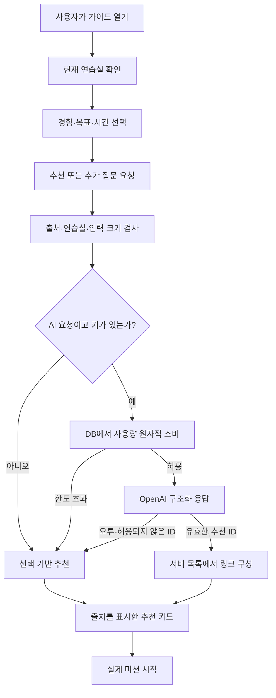

# 핏 마스코트와 시작 가이드

2026-09-18. 첫 방문자가 학습 경로를 이해하고 실제 첫 미션을 시작하도록 돕는 기능이다.

## 캐릭터

**핏(Fit)**은 작은 터미널을 닮은 코드핏의 안내 친구다. 흰 몸체, 검은 화면, 사각 눈과 커서 모양 장식을 사용한다. 로고의 흑백 색상과 분리된 사각 조각을 이어받고, 손을 흔드는 자세로 접근하기 쉬운 인상을 준다. 장식과 얼굴 요소를 줄여 작은 버튼에서도 식별되게 했다.

내장 `image_gen`으로 제작했다. [프롬프트](mascot-prompt.json), [최종 원본](assets/fit-mascot-master.png), 화면용 `public/brand/fit-mascot.webp`를 보관한다. 원본을 256px WebP로 축소해 헤더와 버튼에 같은 이미지를 사용한다. 정적 import로 파일 변경 시 URL 해시가 바뀐다. 사용자 인지도나 캐릭터 선호도 조사는 수행하지 않았다.

## 처음 쓰는 사람의 흐름

1. 홈에서는 핏의 ‘시작 가이드’ 버튼을 본문 상단에 배치한다. 고정 말풍선을 띄우지 않아 추천 미션과 스크롤 중인 내용을 덮지 않는다. 북마크, 기록과 분야별 목록에서도 본문 안에 가이드 버튼을 제공한다. 다른 페이지에서는 우측 하단 버튼을 제공하고 과정 목록의 첫 안내는 숨기거나 축소할 수 있다. 실습, 코드 편집과 프로젝트 점검에서는 48px 버튼으로 시작해 답안을 가리지 않는다. 대화창은 자동으로 열리지 않는다.
2. 개발 경험, 배우고 싶은 것, 가능한 시간을 한 단계씩 고른다. 이전 질문으로 돌아가 답변을 고칠 수 있다.
3. 첫 미션 하나와 추천 이유를 제안한다. 예: 서비스 제작 경험이 있고 오류 해결을 원하면 데이터 저장 오류 실습, 코드를 읽을 수 있고 시간이 충분하면 장바구니 코드 분석.
4. 추천 카드에서 바로 시작하거나 추가 질문을 보낸다. 대화를 지우거나 선택을 바꿔 다시 추천받을 수 있다.

처음에는 모든 질문을 한 화면에 배치했으나 작은 창에서 스크롤이 많아 세 단계로 나눴다. 별도의 챗봇 페이지보다 항상 찾을 수 있는 작은 버튼을 선택했고, 대화창은 네이티브 dialog로 키보드 포커스와 Escape 닫기를 제공한다. UI는 닫은 뒤 실행 버튼으로 포커스를 돌려준다. 떠 있는 버튼 아래에도 마지막 콘텐츠를 스크롤해 노출할 수 있도록 하단 공간을 확보했다.

## AI의 역할과 제한

기본 모델은 `gpt-5.6-luna`, 재설정은 서버 환경 변수 `OPENAI_GUIDE_MODEL`이다. 기존 서버 전용 `OPENAI_API_KEY`를 사용한다. 문제 생성 및 풀이 검토 모델은 변경하지 않는다.

AI는 대화와 명시적으로 고른 조건을 받아 **실제 학습 목록에서 시작점을 선택하고 설명**한다. 계정이나 저장소를 조작하거나 코드를 실행하는 범용 에이전트가 아니다. 모델이 임의로 URL을 만들게 하지 않고, 서버가 추천 ID를 공개 목록과 대조해 제목, 설명, 이동 링크를 붙인다. 코드 경험이 없는 사용자의 후보에서 코드 편집 훈련을 제외한다. 기존 풀이 코드, 개인 진도와 정답은 프롬프트에 포함하지 않는다.

첫 방문 화면을 보거나 대화창을 여는 것만으로 유료 AI 호출은 발생하지 않는다. 사용자가 추천 또는 질문 보내기를 선택해야 호출한다. AI 없이 선택 조건만으로 추천받는 경로도 제공한다. 키 미설정, 공급자 실패, 한도 초과에서는 ‘선택 기반 안내’로 구분한다. 키가 없는 환경에서는 해석할 수 없는 추가 질문 입력창을 제공하지 않는다.

## 개인정보와 비용

- 선택한 세 조건과 최근 대화 최대 3회, 새 질문을 서버를 통해 OpenAI에 전달한다. 선택 UI에 제공자 안내와 AI를 사용하지 않는 선택지를 제공한다.
- `store:false`, 자동 재시도 없음, 공급자 대기 25초, 최대 출력 1,600토큰. 서버는 요청 본문이나 공급자 오류 메시지를 로그로 남기지 않는다.
- 대화 원문을 DB나 localStorage에 저장하지 않는다. 이 탭의 React 메모리에만 유지하며 새로고침 또는 ‘대화 지우고 다시 시작’으로 지워진다. 안내 숨김 여부만 localStorage에 보관한다. AI 호출 통계에는 비용, 토큰, 시간과 성공 여부를 `guide` 작업으로 저장한다.
- 창을 다시 열거나 탭으로 돌아오면 연습실을 확인한다. 확인 전에는 기존 대화를 숨기며 소유자가 바뀌면 대화, 입력과 선택을 초기화한다. POST도 현재 연습실 헤더를 검사한다.
- DB 사용량 제한: 개인 분당 3회 및 24시간 12회, 접속망 24시간 40회. 기존 서비스 공용 시간당 40회/24시간 100회 제한도 적용한다. 생성 3회, 검토 20회라는 개인 한도는 소비하지 않는다. 연결 실패도 시도 횟수에는 포함한다.
- 접속망 식별과 사용량 원자성은 기존 SQLite/PostgreSQL 계약을 재사용한다. 쿠키를 지워도 접속망과 전체 한도는 남지만 이것이 모든 남용을 차단한다는 의미는 아니다.
- 이 기능은 기록 저장이나 문제 생성이 없는 대화이므로 별도 작업 테이블을 추가하지 않았다. 클라이언트 중복 전송을 막고 자동 재시도하지 않지만, 응답 유실 뒤 사용자가 다시 요청하면 별도 유료 호출이 될 수 있다. 중지·닫기는 늦은 응답을 UI에 적용하지 않으며 이미 발생한 공급자 비용의 취소를 보장하지 않는다.

## 코드와 검증 위치

| 책임                              | 위치                              |
| --------------------------------- | --------------------------------- |
| 조건, 입력 계약, 응답 타입        | `src/lib/guide.ts`                |
| 공개 후보와 기본 추천             | `src/lib/server/guide-catalog.ts` |
| AI 프롬프트, 구조화 응답, ID 검증 | `src/lib/server/ai-guide.ts`      |
| 출처, 소유자, 사용량, 대체 안내   | `src/app/api/guide/route.ts`      |
| 대화 요청, 취소, 소유자 재확인    | `src/hooks/use-start-guide.ts`    |
| 버튼, 단계별 질문, 대화 UI        | `src/components/guide/`           |
| 반응형 스타일                     | `src/styles/guide.css`            |
| 추천 계약과 공급자 모의 검증      | `src/lib/server/ai-guide.test.ts` |
| API 소유자, 크기와 사용량 검사    | `src/app/api/guide/route.test.ts` |
| 세 브라우저 조작과 접근성         | `e2e/guide.spec.ts`               |

홈의 가이드 진입은 본문 배치로 변경됐다. 아래는 가이드 창 내부의 화면이다.

[첫 질문](../images/guide-first-step.png), [선택 기반 추천](../images/guide-recommendation-desktop.png), [모바일 대화](../images/guide-chat-mobile.png)를 실제 로컬 브라우저에서 캡처했다. 모바일의 AI 응답은 재현 가능한 자동 UI 검사를 위한 **고정 모의 응답**이며 실모델 평가 결과가 아니다.

최종 실행 결과는 [검증 기록](../VERIFICATION.md)에 기록한다. 외부 유료 AI 호출, 운영 DB 변경과 배포는 이번 검증에 포함하지 않는다. 실제 모델의 추천 적합성, 사용자 전환율, 실제 휴대폰 키보드와 스크린 리더 청취는 별도 확인이 필요하다. 공급자의 데이터 보관 정책은 `store:false`와 별개로 적용된다.
