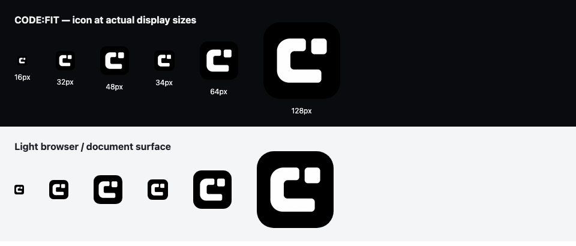

# CODE:FIT 로고 개편

2026-09-18. 서비스명은 사용자의 최종 결정에 따라 코드핏으로 유지한다.

## 참고와 선택

- [토스의 브랜드 심볼 리서치](https://toss.tech/article/43061): 심볼 단독뿐 아니라 배경, 색, 워드마크가 함께 반복되는 경험을 참고했다. 코드핏도 같은 아이콘을 헤더와 파비콘에 사용한다.
- [당근 공식 서비스 소개](https://team.daangn.com/): 둥근 실루엣과 적은 수의 요소로 친근하게 보이는 방식을 참고했다.
- [오늘의집 공식 소개](https://www.bucketplace.com/): 서비스와 연결되는 간결한 심볼, 명확한 색 대비를 참고했다.

위 사례의 구체적인 도형을 복제하지 않고 단순한 형태, 작은 크기에서의 구분, 반복되는 색 조합을 설계 기준으로 삼았다. 로고 유사성에 대한 법적 검토나 사용자 인지도 조사를 수행한 것은 아니다.

기존 코드 괄호와 운동기구 조합은 개발자의 코딩 근력이라는 초기 목적을 잘 드러냈지만, 작은 크기에서 복잡하고 비개발자 학습까지 확장된 현재 서비스에는 제한적이었다. 새 심볼은 **C와 맞춰지는 한 조각**이다. 앱과 코드의 원리를 이해하며 흩어진 지식을 연결하는 경험을 표현한다. 일반적인 코드 괄호, AI 반짝임, 체크 표시를 추가하는 방안보다 두 도형만 남기는 쪽을 선택했다.

최종 색상은 사용자의 터미널 테마 요청에 따라 검은 배경과 흰색 심볼로 정했다. 초기 연보라색 시안의 C와 조각, 간격, 곡선은 유지했다. 외곽은 부드럽게, 획과 도형 사이 여백은 굵고 넓게 유지해 16px에서도 C와 조각이 구분되도록 했다. 서비스의 검은 배경과 CODE:FIT 워드마크를 유지하고 로고 외 UI의 색 체계는 바꾸지 않았다.

## 제작과 적용

내장 `image_gen`으로 생성한 뒤 가장자리 잡음과 좁은 간격을 수정하고, 후속 요청에 따라 흑백으로 변경했다. [초기 생성 및 수정 프롬프트](logo-prompts.json), [최종 흑백 수정 프롬프트](logo-monochrome-prompt.json), [최종 원본](assets/codefit-icon-master.png)을 보관한다. PNG 축소와 압축, ICO 포장에는 Sharp를 사용했다.

| 파일                                  | 용도                                           |
| ------------------------------------- | ---------------------------------------------- |
| `public/brand/codefit-icon.png`       | 256px, 공통 헤더와 README                      |
| `src/app/icon.png`                    | 512px 브라우저 아이콘                          |
| `src/app/apple-icon.png`              | 180px Apple 홈 화면 아이콘                     |
| `src/app/favicon.ico`                 | 실제 16/32/48px RGBA PNG를 포함하는 ICO        |
| `src/components/ui/brand-icon.tsx`    | 정적 import로 콘텐츠 해시가 붙는 로고 URL 생성 |
| `src/components/shell/app-header.tsx` | 모바일 상단의 아이콘 홈 링크                   |

Next.js의 파일 기반 메타데이터를 유지했다. 같은 이름의 수동 아이콘 메타데이터나 별도 manifest는 추가하지 않았다. README는 기존 경로로 새 이미지를 표시한다. 공통 컴포넌트의 아이콘은 인접한 워드마크와 중복 낭독되지 않도록 장식 이미지로 유지한다. 모바일 아이콘 링크에는 `CODE:FIT 홈` 이름과 44px 조작 영역을 제공한다.

## 실제 화면과 검증

[데스크톱 홈](../images/logo-home-1280.png), [320px 모바일 홈](../images/logo-home-320.png), [390px 입문 화면](../images/logo-learn-390.png)은 로컬 브라우저 화면을 캡처했다.

- 격리 SQLite, 외부 AI 호출을 비활성화한 Next.js 개발 서버 `127.0.0.1:3011`에서 확인했다. 기존 3010 서버와 운영 서비스는 변경하지 않았다.
- Chromium, Firefox, WebKit에서 홈, 앱의 원리, 코드 분석, 로그인 화면을 1280/390/320px로 확인했다. 총 36개 조합에서 로고 디코딩, 링크 이름, 가로 넘침 없음, 아이콘 메타데이터를 확인했다.
- 세 브라우저에서 파비콘 및 Apple 아이콘 HTTP 200, 모바일 홈 링크의 포커스와 Enter 이동, 페이지 JavaScript 오류 없음을 확인했다.
- 첫 ICO 출력이 RGB PNG여서 Next.js가 거절하는 오류를 발견했고, ICO 내부 PNG를 RGBA로 다시 출력해 해소했다. 최종 검증은 수정 파일을 사용했다.
- 수정 TSX의 ESLint와 프로젝트 TypeScript 검사를 수행했다. 로컬 실행 자료는 `artifacts/brand-refresh/`에 저장했다.
- 이미지의 크기와 화면 배치는 직접 눈으로 확인했다. 실제 휴대폰 홈 화면 설치, 스크린 리더 청취, 학습 효과와 브랜드 인지도는 측정하지 않았다. 이번 확인은 프로덕션 성능 측정이나 전체 기능 회귀 검사가 아니다.

커밋, 푸시, 운영 배포는 수행하지 않았다.
