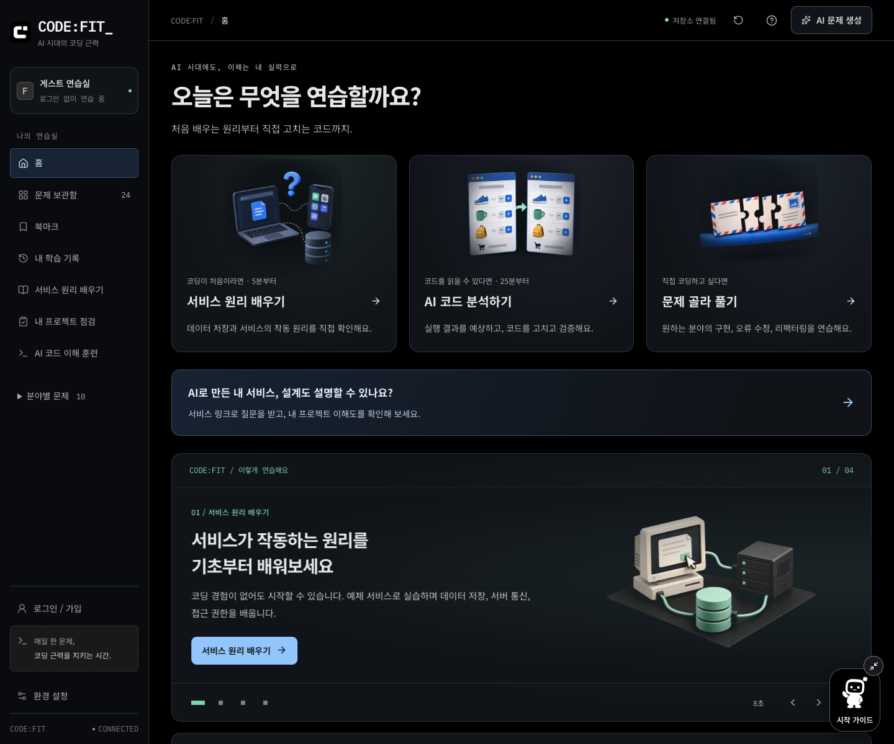
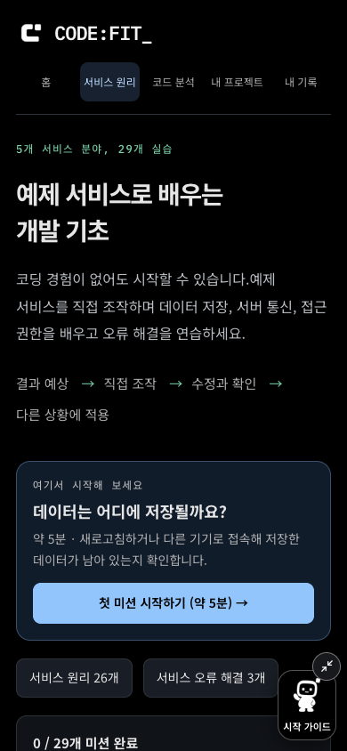
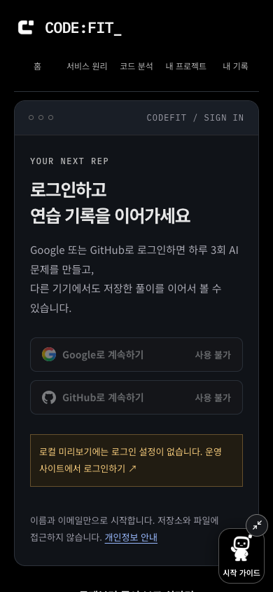
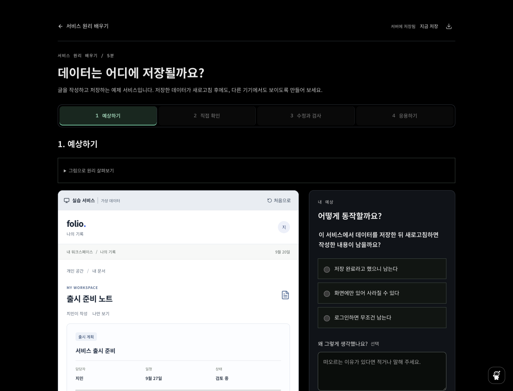

# 전체 화면 검토와 로그인 안내 — 2026-09-18

## 검토 범위

홈, 서비스 원리 과정, AI 코드 분석, 프로젝트 점검, 로그인, 프로필, 개인정보, AI 품질 안내, 학습 기록, 북마크, 입문 실습과 코드 편집기를 확인했다. 프로필과 프로젝트 질문/결과는 격리된 테스트 계정 및 고정 응답으로 검증했다. 29개 입문 미션은 단계 진행을 자동 검사하고, 서비스 화면은 다섯 분야의 대표 레이아웃을 검토했다.

데스크톱과 390px 화면 캡처를 직접 비교했다. Playwright는 Chromium, Firefox, WebKit에서 320/390/768px 가로 넘침, 키보드 메뉴, 대화상자 초점 복귀를 검사한다. axe 자동 검사와 화면을 보고 판단한 간격/가림 문제는 별도 근거다. 실제 휴대폰과 스크린 리더 청취 검사는 수행하지 않았다.

## 발견한 문제와 수정

| 문제                                                     | 사용자 영향                                          | 변경과 확인 위치                                                                                                                     |
| -------------------------------------------------------- | ---------------------------------------------------- | ------------------------------------------------------------------------------------------------------------------------------------ |
| OAuth 환경 변수가 없는 로컬 화면에서 ‘연결 준비 중’ 표시 | 기존 로그인이 삭제됐거나 기다리면 열리는 것으로 오해 | `provider-buttons.tsx`, 로그인 페이지에서 로컬 설정 누락과 운영 로그인 링크 표시. `e2e/account.spec.ts`에서 확인                     |
| 테스트 서버가 미리보기와 같은 3010 포트 사용             | OAuth를 비운 테스트 실행과 사용자가 보는 환경을 혼동 | 테스트 기본 포트를 3012로 분리하고 URL 설정을 `scripts/lib/e2e-environment.ts`로 통합. 로컬 주소만 허용                              |
| 큰 시작 가이드 말풍선이 실습의 답안 영역을 가림          | 선택지를 읽고 조작하기 어려움                        | 실습/편집/프로젝트 점검 화면에서 48px 버튼으로 시작. 다른 화면에서도 축소 가능. 열기/Escape/초점 복귀를 `e2e/guide.spec.ts`에서 확인 |
| 모바일 공통 메뉴의 마지막 항목이 다음 줄로 밀림          | 메뉴 높이가 달라지고 탐색 흐름이 끊김                | 5개 메뉴를 같은 행에 배치. `e2e/navigation.spec.ts`의 세 폭 검사                                                                     |
| 좁은 화면에서 상단 페이지명과 생성 버튼이 여러 줄로 꺾임 | 한글 단어가 잘리고 머리글이 답답하게 보임            | 420px 이하에서는 본문 제목과 중복되는 경로명 숨김, 생성 버튼 한 줄 유지                                                              |
| 프로젝트 사이드바 링크의 기호가 남는 폭을 차지           | 다른 메뉴와 아이콘/문자 정렬이 달라짐                | 공통 Lucide 아이콘과 별도 텍스트로 통일                                                                                              |
| 품질 안내에 새 프로젝트 점검 평가의 범위가 없음          | AI가 실제 소스와 DB까지 감사한다고 오해 가능         | 공개 텍스트 기반 질문/답변 평가, 모델과 이용 한도를 별도 설명                                                                        |

## 실제 화면

## 문서와 검증

README는 현재 이용할 수 있는 학습 경로를 중심으로 구성했다. 카탈로그 수, AI 모델, 개인/공용 사용 한도, 게스트와 계정 기록, 백업 범위를 구현과 대조했다. 개발 문서에는 프로젝트 평가 도구와 분리된 테스트 서버 설정을 추가했다. 과거 검증 기록은 그 실행 당시의 범위를 보존하고, 최신 결과를 검증 기록 맨 위에 별도로 정리한다.

[전체 검증 결과와 남은 한계](../VERIFICATION.md#최신-검증-요약--2026-09-18)를 참고한다. 자동 검사 통과는 모든 사용자 환경의 접근성, 실제 OAuth 인증, 실제 음성 인식 정확도와 AI 품질을 보장하는 결과가 아니다.
