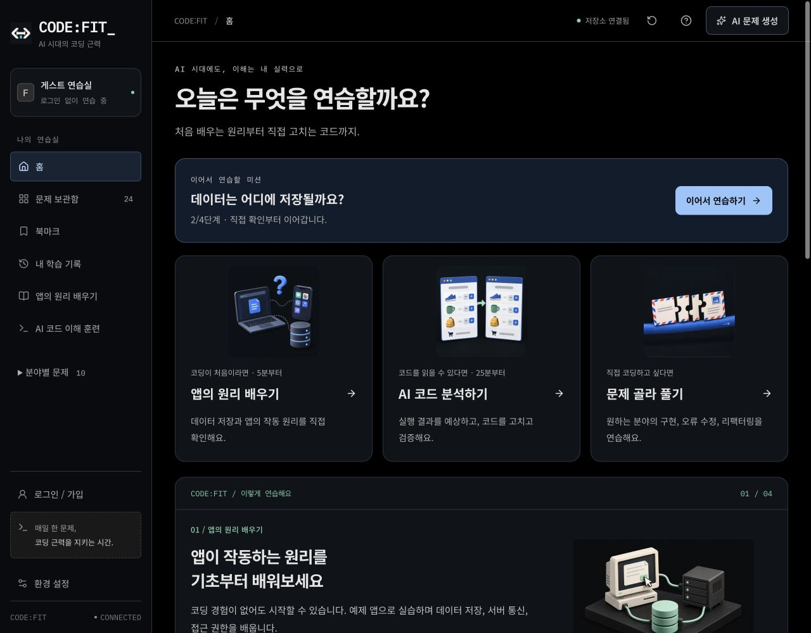
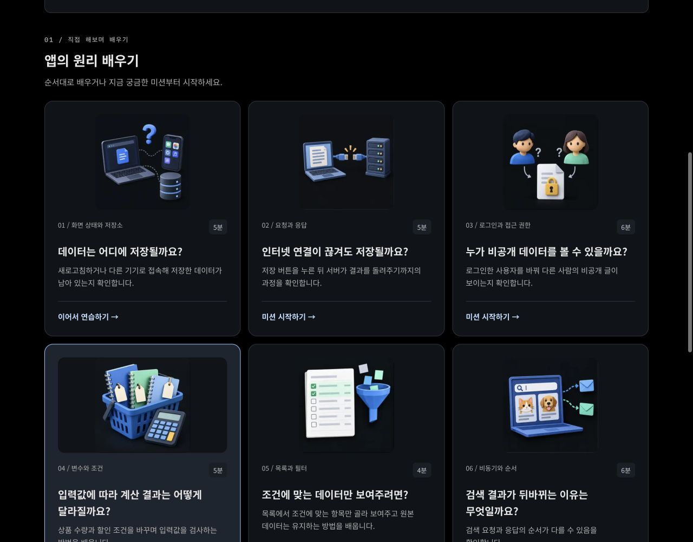
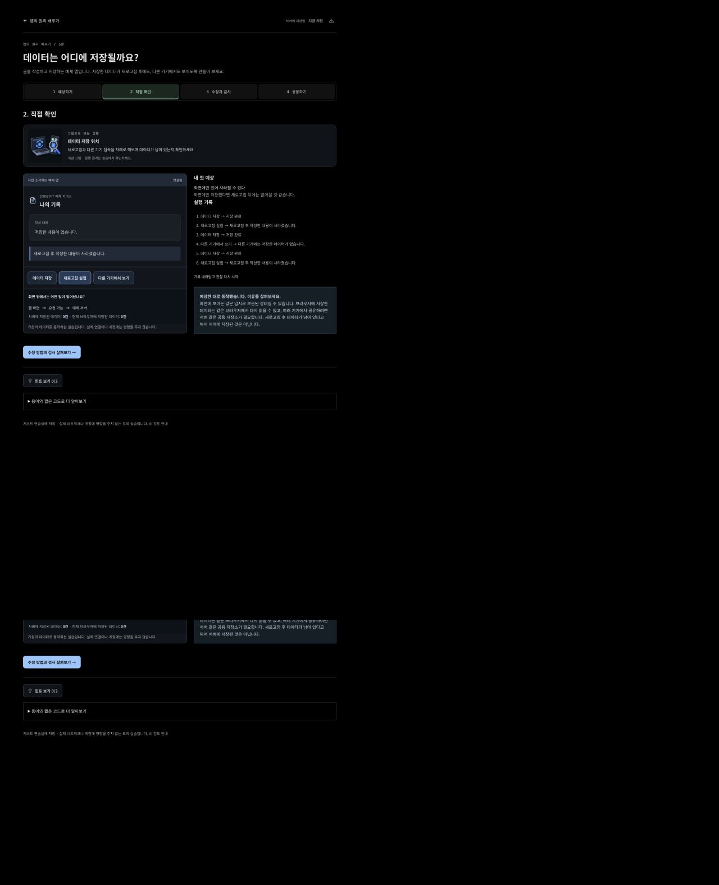

# 상황을 먼저 이해하는 학습 화면

2026-09-18 로컬 개선. 문구와 시각 자료의 역할을 함께 정리했다.

## 문구 기준

목록에서는 배우는 개념을 먼저 말하고, 문제에 들어가면 어떤 예제 앱을 다루는지 소개한다. 예를 들어 `메모는 어디에 저장될까요?`를 `데이터는 어디에 저장될까요?`로 바꾸고, 본문에 글을 작성하고 저장하는 예제 앱이라는 설명을 추가했다. 저장, 접근 권한, 계산 조건, 목록 필터, 검색 순서 미션에 같은 기준을 적용했다.

메인 학습 경로, 기능 배너, 입문 과정 소개, 미션 제목과 설명, 실습 버튼과 실행 기록, README와 입문 과정 문서를 확인했다. `메모`를 일괄 치환하지는 않았다. 코드 분석자가 남기는 `분석 메모`, `인수인계 메모`와 코드 안의 기존 식별자는 각각 의미와 저장 호환성을 유지한다. 문제 ID도 그대로여서 기존 학습 기록을 이어갈 수 있다.

## 그림과 실제 화면의 역할

- 메인 학습 경로 3개, 입문 미션 카드 9개, 코드 분석 카드 6개에는 대표 일러스트를 표시한다.
- 입문 미션 9개는 현재 단계에 맞춰 상황, 관찰, 수정 검사, 응용 장면을 보여준다. 예상 단계에서는 실제 실습 컴포넌트의 초기 화면도 읽기 전용으로 보여준다.
- 기본 코딩 문제 24개(일반 문제 12개, 인수인계 기본/변형 12개)도 모두 상황 그림을 연결했다. 인수인계는 기존 학습 단계에 연동하고, 일반 문제는 사용자가 네 장면을 선택해서 볼 수 있다.
- 실행 단계의 중심은 직접 조작하는 예제 앱이다. 문서 카드, 사용자 표시, 상품과 가격, 목록, 검색 결과, 예약 내역을 서비스 화면 형태로 보여준다. 앱 내부 상태 패널은 사용자 화면과 실제 저장 결과를 구분한다.
- 그림은 설명용이다. 실행 결과나 수정안 통과 표시를 그림에서 판정하지 않는다. 실제 동작은 기존 시뮬레이터와 코드 실행기가 확인한다.

변형 과제는 기본 과제와 같은 원리를 다루므로 개념 그림을 공유한다. 정확한 입력값과 계약은 각 과제 본문과 실행 결과가 기준이다. 이번에 만든 이미지 범위는 기본 제공 예제다. 사용자마다 내용이 다른 AI 생성 문제에 무관한 기본 그림을 붙이지 않으며, 요청 시마다 이미지를 생성하는 기능도 추가하지 않았다.

## 이미지 제작과 전달

내장 imagegen으로 21개의 네 장면 이미지(84장면)를 제작했다. 초기 생성물의 작은 영문 설명은 8개 세트에서 제거했고, 예약 그림의 숙박 아이콘은 실습에 맞는 카메라로 교체했다. TCP 그림에 잘못 생성된 설명도 제거했다. 그림의 설명은 확대와 접근성 도구를 지원하는 한국어 HTML로 제공한다.

- 최종 WebP 합계는 1,493,588바이트(21개)다. 이는 저장소 파일 크기이며 브라우저 전송량이나 운영 성능 측정치가 아니다.
- 최종 파일: `public/images/scenarios/*.webp`
- 생성/수정 프롬프트 전체: [scenario-image-prompts.json](scenario-image-prompts.json)
- 원본 제작: 내장 imagegen. 파일 크기와 형식 최적화만 로컬 Sharp 사용.
- 1024×1024 WebP 한 파일에 네 장면을 담고, CSS로 현재 장면만 표시한다. 이미지 자체를 매 단계 다시 생성하거나 별도로 내려받지 않는다.
- `next/image`의 지연 로딩과 크기별 최적화를 사용한다. 고정된 비율로 자리를 확보하고, 캡션은 이미지와 독립적으로 렌더링한다.
- 이미지의 시각적 의미는 인접 캡션에 설명한다. 동일 내용을 중복 낭독하지 않도록 이미지의 alt는 비우고, 단계 선택 버튼에는 현재 선택 상태를 표시한다.

## 구현 위치

| 책임                                | 파일                                                                                  |
| ----------------------------------- | ------------------------------------------------------------------------------------- |
| 상황별 설명과 문제 매핑             | `src/lib/scenario-visuals.ts`                                                         |
| 이미지와 현재 단계 캡션             | `src/components/ui/scenario-visual.tsx`                                               |
| 일반 문제의 그림 단계 선택          | `src/components/ui/scenario-walkthrough.tsx`                                          |
| 실습할 앱의 초기 화면               | `src/components/learn/mission-prediction.tsx`                                         |
| 직접 조작하는 예제 앱               | `src/components/learn/simulation-view.tsx`                                            |
| 단계와 이미지 연결                  | `src/components/learn/mission-session.tsx`, `src/components/handoff/learning-lab.tsx` |
| 카드 이미지와 모바일 배치           | `src/styles/scenario-visuals.css`                                                     |
| 이미지 로딩, 전체 예제, 키보드 확인 | `e2e/scenario-visuals.spec.ts`                                                        |

## 실제 화면

로컬 프로덕션 빌드의 화면이다. 이미지 생성 결과를 제품 화면처럼 합성한 자료가 아니라, 브라우저에 적용된 화면을 캡처했다. 예제 앱의 데이터와 학습 기록은 격리된 로컬 테스트 환경의 값이다.

### 메인 학습 경로

### 미션 목록

### 직접 조작하는 예제 앱

[모바일 전체 화면](../images/scenario-mission-mobile.png)에서도 같은 설명과 조작을 사용할 수 있다.

## 검증과 한계

[검증 기록](../VERIFICATION.md)에 실행 결과를 기록한다. 자동 접근성 검사와 수동 브라우저 확인을 구분한다. 그림 추가가 이해도나 완료율을 높였는지는 사용자 실험으로 측정하지 않았다. 이미지가 늘어난 만큼 첫 방문의 전송량은 늘어나며, 실제 운영 성능을 측정한 결과로 표현하지 않는다. DB 구조, AI 모델, 학습 채점과 저장 계약은 변경하지 않았다.
