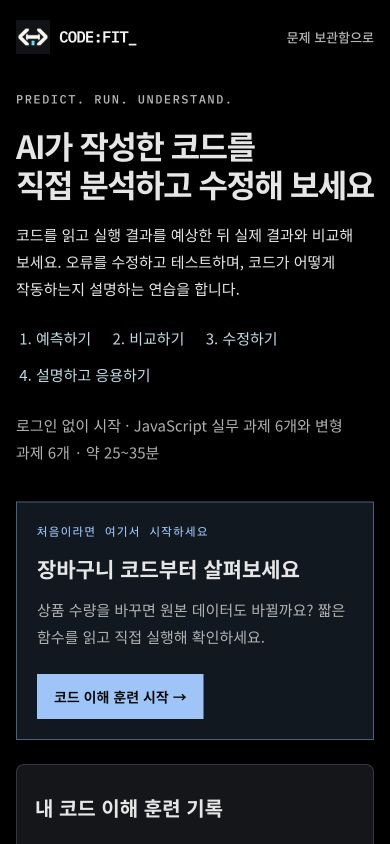

# 서비스 화면 문구 점검

2026-09-17. 메인 배너뿐 아니라 목록, 검색, 북마크, 학습 기록, 로그인과 프로필, 입문 미션, 코드 이해 훈련, 문제 풀이, 설정과 도움말, 오류 안내를 함께 점검했다.

## 수정 기준

사용자가 무엇을 배우고 어떤 행동을 할 수 있는지 바로 알 수 있게 쓴다. 추상적인 홍보 표현과 맥락 없는 질문은 줄이고, 실제 예상을 묻는 학습 질문은 유지한다. 제목과 버튼에는 화면의 목적이나 실행할 동작을 쓴다. ‘앱의 원리 배우기’, ‘앱 오류 해결 실습’, ‘AI 코드 이해 훈련’ 명칭을 진입 화면과 돌아가기 링크에서 맞춘다.

| 위치           | 적용한 문구 또는 변경                                           |
| -------------- | --------------------------------------------------------------- |
| 입문 배너      | ‘앱이 작동하는 원리를 기초부터 배워보세요’                      |
| 오류 실습 배너 | ‘앱 오류를 찾고 수정하는 방법을 익혀보세요’                     |
| 학습 기록      | ‘내 학습 기록’, ‘풀이 기록’                                     |
| 로그인         | ‘로그인하고 연습 기록을 이어가세요’                             |
| 프로필         | ‘내 프로필과 학습 현황’                                         |
| 코드 이해 훈련 | ‘AI가 작성한 코드를 직접 분석하고 수정해 보세요’                |
| 과제 진입      | ‘코드 분석 시작’                                                |
| 검토 결과      | ‘AI 검토 기준을 모두 충족했습니다’, ‘보완할 점’                 |
| 복습 안내      | 7일 기준, 처음 제출한 변형 과제, 도움 사용 여부를 문장으로 설명 |
| AI 오류        | 내부 설정 이름 대신 현재 이용 가능 여부와 다음 행동 안내        |

사용량은 계정별 문제 생성과 풀이 검토/AI 질문의 공용 제한을 구분했다. 한국 시간 자정 초기화, 실패한 생성의 횟수 복원과 기존 문제 이용 가능 여부를 설명한다. 저장된 문제는 공개되며 개인 기록은 해당 사용자에게만 보인다는 범위도 명시했다.

당시 설정의 코딩 백업에는 입문 실습 기록이 포함되지 않아 미션별 텍스트 내보내기만 안내했다. 현재는 v3 JSON 백업으로 입문 기록도 내보내고 가져올 수 있다. [현재 백업 계약](../workspace-backup.md)을 참고한다. 실제 연결 성공 여부를 확인하지 않는 설정 표시는 ‘연결 설정 완료’로 표현했다.

## 검증과 범위

변경한 접근성 이름에 맞춰 기존 계정/인수인계 브라우저 테스트 선택자를 갱신했다. 학습 판정, AI 지침과 모델, 사용량 정책, 저장 형식, 과거 유료 평가에 사용한 문제와 지문은 변경하지 않았다. 자동 생성되는 문제와 사용자 입력의 모든 미래 문장이 자연스럽다는 보장은 아니다.

인앱 브라우저에서 학습 기록, 설정, 로그인과 코드 이해 훈련을 직접 조작하고 데스크톱 및 390×844 모바일 화면을 확인했다. 자동 axe 검사와 별도로 제목 줄바꿈, 설명 길이, 버튼과 이동 결과를 확인했다. 실제 스크린 리더 청취와 사용자 선호도 실험은 수행하지 않았다. 전체 테스트 결과와 미실행 항목은 [검증 기록](../VERIFICATION.md)에 남긴다.

