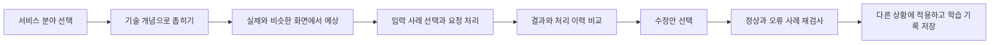
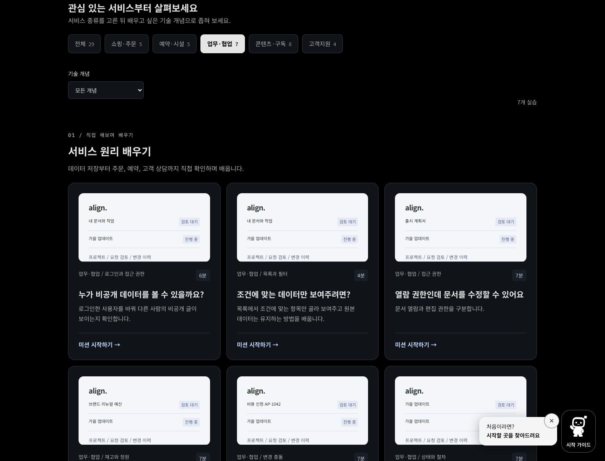
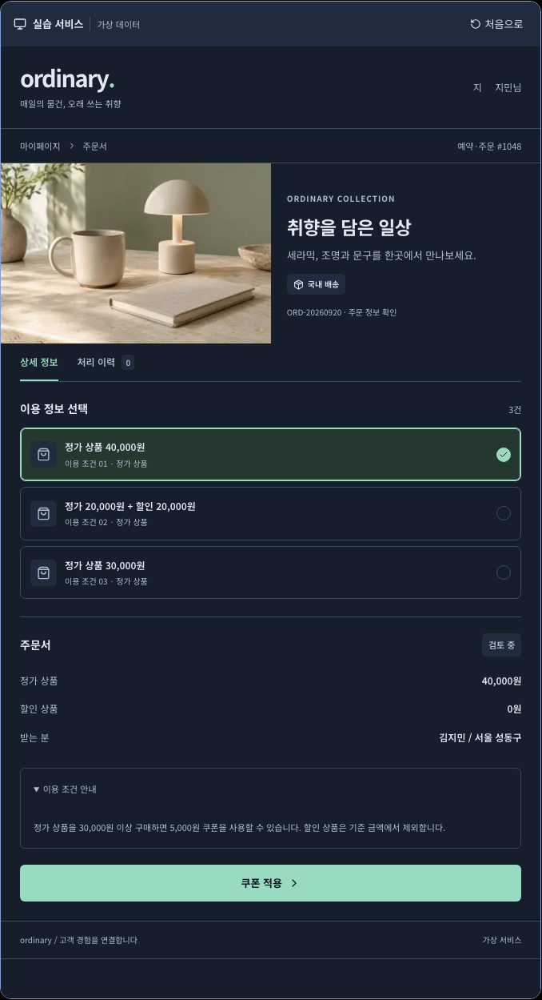
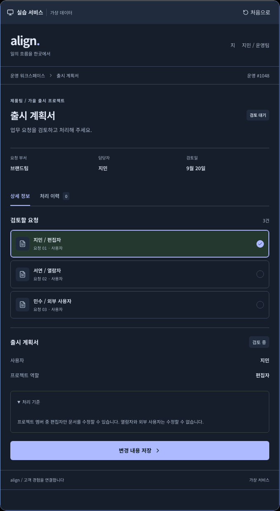
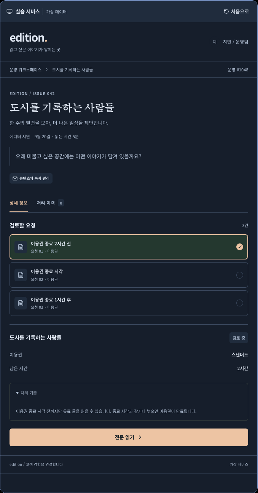
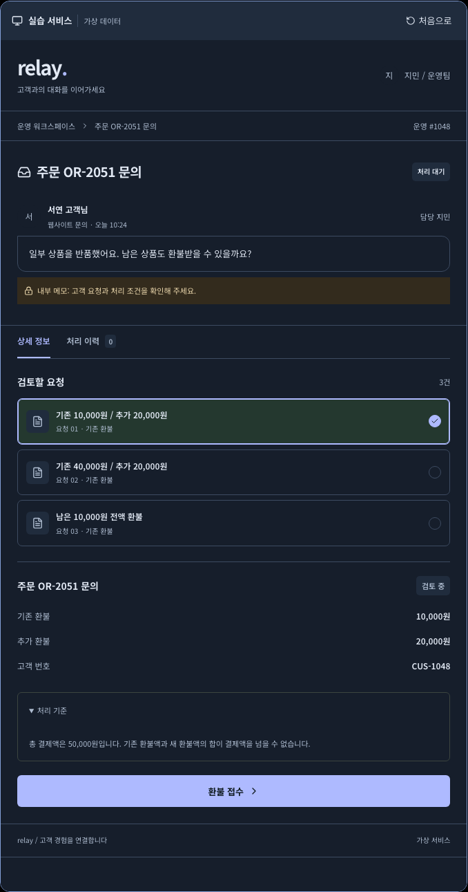

# 서비스 분야별 실습 확장

현재 목록은 **21개**이며 실습 화면은 다크 테마다. 아래는 최초 확장 당시의 구성이다. 2026-09-20에 단순하거나 중복된 8개를 목록에서 제외하고 조작 안내를 추가했다. [현재 학습 목록과 안내](../beginner-training.md#조작-안내와-현재-학습-목록)를 참고한다.

2026-09-18. ‘앱’이라는 표현이 모바일 학습으로 좁게 읽히는 문제와, 미리보기가 단순한 예제 화면처럼 보이는 문제를 함께 개선했다. 사이트의 공통 메뉴와 소개는 **서비스 원리 배우기**, **서비스 오류 해결**, **실습 서비스**로 통일했다. Kotlin 등 실제 모바일 문제의 ‘앱’은 문맥상 정확하므로 유지한다.

## 조사와 적용

로그인이 필요한 타사 운영 계정에 접근하지 않았다. 아래 공식 공개 도움말과 소개에서 화면의 정보 구조, 상태 구분, 용어를 조사했다. 상표나 화면을 그대로 복제하지 않고 가상 서비스로 재구성했다. 실습의 가격, 수수료, 정원은 교육용 정책이며 실제 서비스의 현재 약관이 아니다.

| 참고 자료                                                                                                                                                                                      | 관찰한 패턴                                              | Codefit에 적용                                     |
| ---------------------------------------------------------------------------------------------------------------------------------------------------------------------------------------------- | -------------------------------------------------------- | -------------------------------------------------- |
| [Cafe24 쿠폰 사용 조건](https://support.cafe24.com/hc/ko/articles/18802805861529)                                                                                                              | 주문 합계와 쿠폰 적용 대상 금액을 구분                   | 주문서, 상품 금액, 쿠폰, 배송 정보와 처리 결과     |
| [네이버 주문 운영 매뉴얼](https://booking.pstatic.net/shared/documents/manual/NAVER_%EC%A3%BC%EB%AC%B8_%ED%85%8C%EC%9D%B4%EB%B8%94%EC%84%9C%EB%B9%99%ED%98%95_%EB%A7%A4%EB%89%B4%EC%96%BC.pdf) | 주문을 이용자 화면과 운영 상태로 구분                    | 요청 정보, 처리 상태, 작업 이력의 분리             |
| [Flow 프로젝트 설정](https://support.flow.team/ko/flow/4404585678861)                                                                                                                          | 프로젝트 소속과 읽기, 수정, 다운로드 권한을 세분화       | 부서, 담당자, 검토 상태, 문서와 내보내기 권한 실습 |
| [Stibee 자동 이메일 발송](https://help.stibee.com/email/automation/sending)                                                                                                                    | 예약과 실제 발송을 구분하고 실행 시점의 구독 상태를 검사 | 콘텐츠 운영 화면, 구독자 조건과 예약 발행 실습     |
| [채널톡](https://channel.io/kr)과 [공식 도움말](https://docs.channel.io/help/ko)                                                                                                               | 고객 대화와 상담 운영을 연결                             | 고객 메시지, 내부 메모, 상담원과 문의 처리 이력    |

## 분류 선택

| 대안             | 장점                                                 | 한계 / 결정                                                                                           |
| ---------------- | ---------------------------------------------------- | ----------------------------------------------------------------------------------------------------- |
| 서비스 도메인    | 비개발자도 주문, 예약, 상담처럼 익숙한 상황으로 진입 | 주 분류로 사용. 기술 개념은 여러 도메인에서 반복될 수 있음                                            |
| 기술 분야        | 개발자는 프론트엔드, DB 등으로 찾기 쉬움             | 한 실습에 여러 기술이 걸치므로 입문 과정의 주 분류에는 부적합. 기존 코딩 문제 보관함은 기술 분류 유지 |
| 오류 유형 / 개념 | 권한, 조건, 시간, 충돌 등 학습 목표를 찾기 쉬움      | 입문자에게 추상적이므로 기술 개념 보조 필터로 제공                                                    |
| 숙련도 / 직무    | 학습 경로 선택에 도움                                | 이번 고정 사례는 5–12분 입문 실습. 별도의 난이도 단계를 임의로 늘리지 않음                            |

총 **29개**: 기존 9개의 주소와 기록 구조를 유지하고, 5개 분야에 새 실습을 각각 4개씩 추가했다. 서비스 원리 26개와 수정 요청 작성까지 하는 기존 오류 해결 3개로 구분한다.

| 분야        | 새 실습                                                  | 전체 실습 |
| ----------- | -------------------------------------------------------- | --------- |
| 쇼핑·주문   | 쿠폰 대상 금액, 할인 후 배송비, 예약 재고, 포인트 잔액   | 5         |
| 예약·시설   | 정원, 시간 겹침, 무료 취소 경계, 추가 인원 요금          | 5         |
| 업무·협업   | 편집 권한, 결재 대기 예산, 문서 리비전, 선행 검수        | 7         |
| 콘텐츠·구독 | 이용권 만료, 수신 거부, 시간대, 독자 조건                | 8         |
| 고객지원    | 부분 환불, 첨부 제한, 고객 정보 내보내기, 답변 발송 상태 | 4         |

## 화면과 학습 흐름

- 흰색 실습 화면과 검정색 학습 화면을 구분한다. 첫 예상 선택과 선택 이유는 우측에, 작은 화면에서는 아래에 배치한다.
- 쇼핑은 상품 사진과 주문 요약, 예약은 공간 사진과 이용 정보, 업무는 검토 요청, 콘텐츠는 편집과 독자 관리, 고객지원은 고객 대화와 내부 메모로 구성한다.
- 사례 선택 → 요청 처리 → 결과 확인 → 처리 이력 확인이 실제로 동작한다. 선택을 바꾸면 이전 결과를 지우고 이력은 유지한다. ‘처음으로’는 미리보기의 조작 기록을 초기화한다.
- 작업 수행에 필요한 버튼만 배치한다. 사진 속 UI나 작동하지 않는 가짜 메뉴를 넣지 않는다.
- 기존 9개 화면도 상품/공간 사진, 문서 담당자와 일정, 작업 메타데이터, 배송 안내를 보강했다. 개념 그림은 보조 펼침 영역으로 옮겨 조작 화면부터 볼 수 있게 했다.
- 새 사례는 각 3개 입력 조합, 독립적으로 작성한 기대 결과, 의도된 결함, 올바른 수정과 불완전한 수정 2개를 갖는다. 총 60개 입력 조합을 검증한다.
- 주관식 이유는 선택 사항이고 음성 입력을 유지한다. 실제 제품 적용을 돌아보는 마지막 입력은 기존대로 필수다.

## 확장 구조와 코드

- `src/lib/learn/services/cases.ts`: 도메인 정책, 사례 데이터, 교육 문구와 기대 결과. UI와 분리한다.
- `types.ts`, `domains.ts`: 데이터 계약, 주 분류와 기존 미션 매핑.
- `rules.ts`: 실제 입력값으로 계산하는 결함/수정 규칙. 기대 답을 가져다 결과로 쓰지 않는다.
- `messages.ts`: 상황별 거절 안내와 예상 선택지.
- `missions.ts`: 기존 네 단계 학습 계약에 맞춰 미션을 구성한다.
- `src/lib/learn/simulation.ts`: 기존 상태 전이를 유지하고 서비스 사례를 연결한다. 입력 변경과 실행 기록을 불변 상태로 처리한다.
- `src/components/learn/simulation/service-surface.tsx`: 분야별 실제 서비스 형태와 공통 조작 영역.
- `src/components/learn/learning-dashboard.tsx`: 도메인과 기술 개념 필터. 합계는 카탈로그에서 계산한다.
- `src/styles/service-examples.css`: 실습 서비스 전용 테마. 코드핏 전체 다크 테마와 분리한다.

대량 확장 시 UI 코드를 사례마다 복제하지 않는다. 정책과 데이터, 계산 규칙을 추가하고 아래 검증을 통과한 사례만 공개하는 구조다. **이번에 AI가 무제한으로 사례를 자동 생성·게시하는 별도 기능을 추가한 것은 아니다.** AI 작성 초안에도 사람이 정책과 기대 결과를 검토해야 하며, 임의 스크립트를 브라우저에서 실행하지 않는다.

## 화면 증거

아래 화면은 실제 로컬 브라우저의 실습 영역 캡처다. 조작 화면을 가리지 않도록 캡처 시 고정 학습 단계 메뉴와 가이드 버튼만 숨겼다.

| 쇼핑                                              | 예약                                             |
| ------------------------------------------------- | ------------------------------------------------ |
|  |  |

| 업무                                          | 콘텐츠                                             | 고객지원                                             |
| --------------------------------------------- | -------------------------------------------------- | ---------------------------------------------------- |
|  |  |  |

[모바일 쇼핑](../images/service-commerce-390.png), [모바일 예약](../images/service-booking-390.png), [모바일 고객지원](../images/service-support-390.png).

상품과 공간 사진은 이번 작업에서 생성했다. [이미지 프롬프트](service-photo-prompts.json). 최적화된 WebP 두 장을 공유하며 타사 상품 사진은 재사용하지 않았다.

## 검증과 한계

검증 실행 결과는 [VERIFICATION.md](../VERIFICATION.md)의 ‘서비스 분야별 실습 확장’에 기록한다.

- `src/lib/learn/services/services.test.ts`: 5개 분야별 새 사례 4개, 고유 주소/선택지, 결함 재현, 60개 기대 결과, 불변 상태와 재생 검사.
- `src/lib/learn/learning.test.ts`: 모든 미션에서 올바른 수정안만 통과하며 미완료/위조 기록을 거절하는 계약.
- `e2e/beginner.spec.ts`: 예상 → 재현 → 잘못된/올바른 수정 검사 → 응용 → 저장/새로고침 복원.
- `e2e/service-domains.spec.ts`: 복합 필터, 분야별 화면, 키보드, 320/390/1440px, 자동 접근성 검사, 처리 이력.
- 기존 미리보기 격리, 음성, 계정/탭 충돌, 탐색과 가이드 테스트를 회귀 검사한다.

실제 서비스와 유사한 정보 구조를 갖춘 **고정 입력 시뮬레이터**다. 자유 입력, 실제 결제·메일·예약 서버, 실제 파일 업로드·내보내기는 제공하지 않는다. 재고/예산 검사 사례는 업무 규칙 학습이며 운영 DB의 동시성 구현을 검증하는 부하 테스트가 아니다. 시간대 사례는 고정 날짜의 KST/UTC를 다루며 세계 시간대 전체를 구현하지 않는다. 이러한 범위를 실습 안내와 해설에 명시했다.
