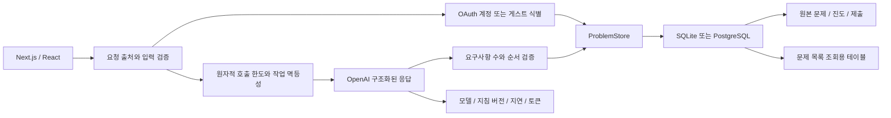

# CODE:FIT 설계와 검증

CODE:FIT의 목적은 AI가 구현을 대신하는 환경에서도 개발자가 직접 문제를 분석하고 코드를 고치는 감각을 유지하는 것입니다. 코드 실행 플랫폼의 복잡성을 도입하기보다, 문제 선택 → 직접 구현 → 요구사항별 검토 → 재시도라는 짧은 훈련 흐름을 먼저 완성했습니다.

## 프론트엔드: 입력 손실과 비동기 경합

문제 목록의 모든 데이터를 내려받아 필터링하던 구조를 서버 검색으로 바꿨습니다. 검색어 입력은 200ms 동안 모으고 이전 요청은 취소합니다. 응답 도착 후에도 취소 여부를 확인하므로 오래된 검색 결과가 최신 입력을 덮어쓰지 않습니다. 검색, 정렬, 필터와 페이지는 URL에 남고 문제 화면의 돌아가기 링크에도 보존됩니다.

자동 저장은 `use-code-draft.ts`가 담당합니다. 저장 중 발생한 수정은 다음 저장으로 이어지고, 서버 응답이 이전 코드로 편집기를 덮어쓰지 않습니다. 통신 실패 시 브라우저에 남은 초안을 유지하고 온라인 복귀 시 재전송합니다. 백업 가져오기와 제출본 복원도 활성 초안의 상태를 고려하며, 코드 교체에는 변경 취소를 제공합니다.

화면 컴포넌트는 API 순서나 저장 대기열을 직접 관리하지 않습니다. `use-practice-session`, `use-library-controller`, `use-learning-history`, `use-problem-controller`로 흐름을 나누고 페이지에는 필요한 데이터만 전달합니다. 코드 자동 저장 때마다 전체 통계를 다시 조회하지 않고 상태, 북마크, 힌트와 제출 변화만 반영합니다.

[브라우저 테스트](../e2e/practice.spec.ts)는 검색 응답 지연, 저장 중 재입력, 오프라인, 브라우저 분리, 백업 복원, 이전 제출본 복원/취소, URL 유지, 모바일 넘침과 모달 포커스를 검증합니다. axe는 홈, 모바일 홈, 설정과 AI 안내 화면의 WCAG A/AA 자동 검사에 사용합니다. 자동 검사 통과가 전체 접근성 준수를 보장하지는 않습니다. 이 과정에서 메뉴의 작은 숫자와 바닥글 대비를 수정했습니다.

[브라우저 로딩 실험](../reports/browser-performance.json)은 같은 운영 빌드를 로컬에서 데스크톱과 모바일 크기로 각각 3회 측정했습니다. LCP 중앙값은 464ms / 824ms였습니다. CPU/네트워크 제한 없는 로컬 실험이며 실제 이용자의 Core Web Vitals나 운영 사이트 지연으로 해석하지 않습니다. `npm run measure:browser`로 재현할 수 있습니다.

## 백엔드: 원본 데이터와 조회용 데이터

`ProblemStore`가 공통 계약이고 두 어댑터는 DB별 트랜잭션과 잠금만 담당합니다. SQLite는 `BEGIN IMMEDIATE`, PostgreSQL은 트랜잭션과 advisory lock을 사용합니다. 한 요청의 여러 한도는 함께 확인하고 함께 차감합니다. 가중치가 있는 백업 요청도 다른 한도만 일부 차감되지 않습니다.

`problems.content`는 정답을 포함한 원본 JSON을 보존합니다. `problem_catalog`에는 공개 요약, 검색 문장과 필터 열만 둡니다. 앱 시작 시 누락된 행만 100개씩 채우며, 새 문제와 조회용 행은 같은 트랜잭션에서 추가합니다. 기존 운영 기록을 재작성하거나 삭제하지 않습니다. 이 구조는 읽기 성능을 위해 일부 데이터를 중복 보관하는 선택입니다. 문제 수정 기능을 추가한다면 두 표현의 갱신도 같은 트랜잭션에 포함해야 합니다.

- `/api/workspace`: 전체 개수, 개인 훈련 통계, 추천과 현재 문제의 요약
- `/api/library`: 서버 검색/필터/정렬, 전체 개수와 페이지당 8개
- `/api/history`: `(created_at, id)` 커서, 페이지당 20개. 같은 시각의 제출도 중복/누락 없이 이동
- `/api/problems/:id`: 해당 초안과 최근 제출 20개. 이전 제출 링크는 정확한 제출본을 별도 조회
- `/api/usage`: 현재 계정 또는 게스트의 한도와 최근 30일 AI 사용량

정렬 SQL은 허용 목록으로 선택하고 사용자 값은 매개변수로 전달합니다. LIKE 검색의 `%`, `_`, `!`는 리터럴로 처리합니다. 목록은 코드와 정답을 가져오지 않으며, 개인 조회에는 항상 owner 조건이 포함됩니다. 초안 저장 후 결과도 전체 진도 대신 한 행만 읽습니다. 전체 데이터 조회는 의도적인 백업 내보내기에 남아 있습니다.

목록은 페이지 번호 이동을 지원하려고 OFFSET을 유지했습니다. 깊은 페이지에서는 비용이 커질 수 있고, 새 문제가 추가되는 동안 개수와 목록이 아주 짧게 다를 수 있습니다. 이력은 새로운 제출이 앞에 추가되는 흐름이므로 커서를 사용합니다. 부분 문자열 검색은 인덱스만으로 해결되지 않으며 대규모 전문 검색과 제출 코드 분산 실행 환경은 아직 구현하지 않았습니다.

### 조회 성능 실험

[재현 스크립트](../scripts/benchmark-storage.ts)는 운영 연결을 사용하지 않고 임시 SQLite에 내장 12개와 합성 문제 5,000개를 넣습니다. 예열 10회 후 100회 측정하며 두 방식의 첫 페이지 ID가 같은지도 확인합니다.

| 측정             | 이전 전체 요약 조회 | 새 서버 페이지 조회 |
| ---------------- | ------------------: | ------------------: |
| 응답 JSON 크기   |     1,993,608 bytes |         3,354 bytes |
| 조회 시간 중앙값 |              79.6ms |               3.2ms |
| 조회 시간 p95    |             168.4ms |              11.9ms |

[원시 결과와 실행 환경](../reports/storage-benchmark.json)을 공개했습니다. 크기는 직렬화한 JSON 기준이며 시간은 DB 읽기와 파싱 기준입니다. 로컬의 따뜻한 캐시 실험으로 HTTP 지연, 운영 PostgreSQL 처리량, 동시 사용자 수를 뜻하지 않습니다.

## AI: 오판을 관찰하고 설정을 비교

문제 생성은 기본 `gpt-5.6-sol`, 풀이 검토는 `gpt-5.4-mini`의 medium 추론을 사용합니다. 아래 고정 평가는 검토 모델에 대한 결과이며 Sol 생성 품질의 정확도 수치를 뜻하지 않습니다. 모델 선택은 `ai-models.ts`에 분리했습니다.

문제 생성과 검토는 OpenAI Responses API의 구조화된 출력과 Zod를 사용합니다. 모든 요구사항에 정확히 하나의 평가가 있어야 하며 누락이나 중복 인덱스는 거절합니다. 점수와 전체 통과 여부는 서버가 계산합니다. 입력 코드와 주석은 지시문이 아닌 검토할 데이터로 다룹니다.

[고정 평가 집합](../evals/review-cases.ts)은 React 비동기 검색, Python 페이지 분할, SQL 집계, Unity 이동 문제 각각에 참고 정답, 대체 구현, 미완성/오류 코드, 통과를 유도하는 주석을 넣은 코드를 갖습니다. 사전에 작성한 요구사항별 기대값과 실제 판정을 비교합니다.

| 설정                       | 전체 통과 여부 일치 | 정답 거절 | 오답 통과 | 요구사항별 일치 | 응답 중앙값 | 추정 비용 / 16회 |
| -------------------------- | ------------------: | --------: | --------: | --------------: | ----------: | ---------------: |
| 초기 지침, 기본 추론       |               15/16 |       1/8 |       0/8 |           47/52 |       2.0초 |          $0.0372 |
| 기준 독립 판단 지침만 보완 |               14/16 |       2/8 |       0/8 |           46/52 |       2.5초 |          $0.0386 |
| 같은 지침 + medium 추론    |               16/16 |       0/8 |       0/8 |           52/52 |       4.2초 |          $0.0543 |

초기 설정은 정상적인 대체 구현을 잘못 거절했습니다. 지침만 보완한 실험에서도 오류가 남았습니다. 실제 피드백에는 코드에 없는 페이지 상한을 가정하거나, 단순 곱셈으로 보존되는 아날로그 입력을 별도 로직이 없다는 이유로 거절한 사례가 있었습니다. 따라서 검토에는 `medium` 추론을 적용했습니다. 이 표본에서 판정은 개선됐고 지연과 출력 토큰은 늘었습니다. 생성에는 동일한 추론 수준을 강제하지 않습니다.

[초기 결과](../reports/ai-evaluation-baseline.json), [지침 변경 결과](../reports/ai-evaluation-prompt-only.json), [최종 결과와 피드백](../reports/ai-evaluation.json)을 모두 보존합니다. 최종 보고서는 모델, 지침 버전, 데이터/프롬프트 지문, 사용량, 오류 수, 오답 통과율과 p50/p95를 포함합니다. 기본 가격은 [OpenAI 공식 모델 문서](https://developers.openai.com/api/docs/models/gpt-5.4-mini)의 표준 텍스트 단가를 사용하며 알려지지 않은 모델이나 미측정 요청을 0원으로 단정하지 않습니다.

평가 집합은 작고 개발 중 반복해서 사용했습니다. 독립 검증 집합도, 반복 측정에 따른 신뢰구간도 아닙니다. 기대값은 요구사항을 바탕으로 수동 작성했고 외부 판정자의 교차 검토는 없습니다. 네 분야의 결과를 26개 언어 전체로 일반화하지 않습니다. 이후 변경은 숨겨진 추가 사례와 다회 측정으로 확인할 필요가 있습니다.

### 운영 계측과 오류 처리

AI 호출 결과는 `ai_runs`에 모델, 프롬프트 버전, 성공 여부, 지연, 입력/캐시/출력 토큰과 알려진 단가의 추정 비용을 저장합니다. 사용자 코드, 원문 프롬프트와 IP는 계측 로그에 저장하지 않습니다. 사용량 저장 장애가 완료된 풀이를 실패로 바꾸지 않으며 계측 실패는 요청 ID만 기록합니다. 제공자 오류도 가능한 사용량 범위 내에서 남기고, 응답을 받지 못한 경우 토큰 수를 알 수 없다고 표시합니다.

동일 requestId는 생성이나 검토를 중복 수행하지 않습니다. 완료 결과는 재사용하고 진행 중이면 충돌 상태를 반환합니다. 실패한 작업은 재시도할 수 있으며 만료된 작업은 다시 획득할 수 있습니다. AI 응답 중 작성된 최신 초안은 제출 결과 저장이 덮어쓰지 않습니다.

## 공개 연습과 계정

모든 문제의 풀이, 저장, 힌트, 정답, AI 검토, 북마크, 학습 이력과 백업은 로그인 없이 사용할 수 있습니다. 생성 API와 개인 프로필만 서버에서 인증을 요구합니다. Better Auth 1.7.4가 Google/GitHub OAuth, 상태 검증, PKCE, 암호화 토큰과 DB 세션을 담당합니다. 쿠키의 존재만으로 인증하지 않으며 실제 세션을 DB에서 확인합니다. 계정 연결은 로그인 후 명시적으로 수행하고, 같은 이메일이라는 이유만으로 자동 병합하지 않습니다.

기존 `recode_session`과 해시를 유지해 게스트 기록을 보존합니다. 로그인 시 `user:<id>` 소유자로 전환하며 기록이 기기에 걸쳐 연결됩니다. 로컬 미저장 코드는 계정/게스트별 키로 나누고 요청의 `X-Codefit-Workspace`와 현재 소유자를 비교합니다. 다른 탭에서 로그인하거나 로그아웃한 뒤 남은 저장 요청은 409로 거절해 다른 계정에 들어가지 않도록 했습니다. 게스트 기록은 백업을 이용해 계정으로 옮길 수 있습니다.

## 일일 생성 한도와 비용 범위

`generation_usage`는 계정, 요청 ID와 한국 날짜를 기록합니다. 하루 3회이며 00:00 KST에 갱신됩니다. PostgreSQL은 계정별 advisory lock, SQLite는 `BEGIN IMMEDIATE`로 동시 요청을 직렬화합니다. 먼저 자리를 예약하고 생성 문제 저장과 같은 트랜잭션에서 완료 처리합니다. 실패 예약은 반환하고 프로세스가 중단되면 150초 후 만료합니다. 완료 요청 재시도는 기존 문제를 반환하며 추가 차감하지 않습니다. 로그아웃, 쿠키 변경과 서버 재시작은 완료된 사용량을 초기화하지 않습니다.

AI 검토의 개인/게스트 한도는 첫 사용부터 24시간 동안 20회입니다. 접속망은 생성 30회, 검토 40회, 전체는 시간당 40회와 24시간당 100회를 공유합니다. 이 공용 보호 한도는 실패도 차감하므로 개인 생성 잔여량보다 먼저 제한될 수 있습니다. Vercel의 공식 IP 헤더를 HMAC 처리하고 다른 호스트의 임의 전달 헤더는 신뢰하지 않습니다. 계정당 제한은 한 사람이 여러 계정을 만드는 행위까지 탐지하는 장치는 아닙니다.

사용량에는 모델별 단가를 적용합니다. Sol은 2026-09-13 확인한 표준 문맥의 프로모션 단가(입력 $4, 캐시 입력 $0.40, 출력 $20 / 백만 토큰)를 사용하며 실제 청구액이 아닙니다. 제공자 가격 변경 시 갱신해야 합니다. 백업은 최대 10MB, 문제 2,500개, 풀이 10,000개이며 복원의 신규 문제/제출 수와 횟수에도 별도 한도를 둡니다. 인증 비밀키와 세션은 사용자용 JSON 백업에 포함하지 않습니다.

## 검증과 배포

SQLite와 PostgreSQL에 같은 조회/격리/커서/가중 한도 테스트를 적용합니다. PostgreSQL은 먼저 임시 스키마가 실제 적용됐는지 검사하므로 호스팅 연결이 검색 경로를 무시하면 데이터를 쓰기 전에 중단합니다. 스키마 지정은 `options=-c search_path=...`를 사용합니다. CI는 별도 PostgreSQL 서비스를 제공하고, 브라우저 검증은 별도 SQLite 서버를 사용합니다.

OAuth 도입 전 실제 키를 연결한 임시 로컬 서버에서 문제 생성 → 저장 → 재조회와 정답 제출 → 검토 → 이력 저장을 확인했습니다. 같은 requestId로 재요청해도 생성 문제와 제출 ID가 유지되고 사용량은 실제 호출 2회만 기록됐습니다. 공개 운영 DB에는 이 검증용 기록을 쓰지 않았습니다.

배포는 GitHub main → Vercel Git 연동입니다. Preview DB는 운영 DB와 분리했습니다. CI는 서식, 타입, 미사용 코드, 단위/DB 테스트, 운영 빌드와 브라우저 테스트를 실행하고 실패 추적 파일을 14일 보관합니다. Vercel Git 배포와 CI는 각각 실행되므로 CI 성공 자체가 배포 승인을 제어하는 보호 규칙은 아닙니다.

백업 내보내기, 실제 AI 평가와 브라우저 보고서에는 목적에 따라 코드가 포함될 수 있습니다. 저장소에 공개한 평가 코드는 고정된 연습 사례뿐이며 개인 운영 기록이나 비밀 키를 포함하지 않습니다.
