# CODE:FIT 설계와 검증

CODE:FIT은 AI가 만든 서비스와 코드를 이해하고, 문제를 재현하고, 수정 결과를 확인하는 연습 서비스입니다. 입문자는 실습 서비스로 개발 원리를 배우고, 개발자는 코드의 실행 결과를 예상하거나 기능 구현, 오류 수정과 리팩터링을 연습합니다.

## 현재 구조와 문서 안내

프론트엔드와 백엔드는 하나의 Next.js App Router 프로젝트에 있습니다. 별도 Express 서버는 없으며 `src/app/api/**/route.ts`의 Route Handler가 Node.js 런타임에서 인증, 검증, 저장소와 AI 호출을 연결합니다. 로컬은 SQLite, Vercel은 PostgreSQL을 사용합니다. 코드 이해 훈련의 JavaScript 실행은 브라우저 Worker/QuickJS에서 수행하며 서버가 사용자 코드를 실행하지 않습니다. 입문 미션은 준비된 동작을 재현하는 실습 서비스입니다.

| 책임                                 | 위치                                                                                                         |
| ------------------------------------ | ------------------------------------------------------------------------------------------------------------ |
| 페이지와 HTTP 경계                   | `src/app/`, `src/app/api/`                                                                                   |
| 화면과 접근 가능한 조작              | `src/components/`의 `library`, `workspace`, `handoff`, `learn`, `account`, `shell`, `guide`, `project-check` |
| 요청 순서, 취소와 화면 상태          | `src/hooks/`                                                                                                 |
| 코드 초안 저장 상태와 브라우저 복구  | `src/lib/drafts/`                                                                                            |
| 코드 이해 훈련의 기록과 실행         | `src/lib/handoff/`                                                                                           |
| 입문 미션, 모의 동작과 완료 규칙     | `src/lib/learn/`                                                                                             |
| DB 계약, 공유 조회와 DB별 트랜잭션   | `src/lib/server/store-contract.ts`, `store-queries.ts`, `sqlite-store.ts`, `postgres-store.ts`               |
| 입문 기록의 조건부 저장              | `src/lib/server/learning-store.ts`                                                                           |
| 인증, AI 모델/지침과 사용량          | `src/lib/server/auth*.ts`, `ai*.ts`, `usage-policy.ts`, `generation-quota.ts`                                |
| 공개 프로젝트의 JS 실행 화면 수집    | `src/lib/server/project-browser.ts`, `scripts/create-project-browser-snapshot.mjs`                           |
| 공개 보안 설정과 탭별 확인 기록      | `src/lib/server/security-check.ts`, `src/hooks/use-security-draft.ts`                                        |
| 타입별 탐색과 공통 시각 안내         | `src/lib/learner-types.ts`, `src/components/experience/`                                                     |
| 개발/이관 도구, 평가 입력, 검증 자료 | `scripts/`, `evals/`, `reports/`, `e2e/`                                                                     |

[개발과 운영](development.md)은 실행 명령과 백업 범위를, [OAuth 설정](authentication.md)은 인증 환경을 설명합니다. [입문 훈련 설계](beginner-training.md)와 이 문서의 [코드 이해 훈련](#ai-코드-이해-훈련)은 현재 기능의 상세 설계입니다. 날짜가 있는 실험과 아래 인수인계 최초 설계는 당시 기록이며, 검증 결과는 [검증 기록](VERIFICATION.md)의 날짜와 대상 커밋을 함께 확인합니다. 로컬 검증 결과를 운영 성능이나 현재 배포 상태로 해석하지 않습니다.

## 서비스 분야와 AI 기능 확장

- 입문 실습은 [5개 서비스 분야, 21개 사례](design/service-domain-curriculum.md)다. 서비스 분야를 주 분류, 기술 개념을 보조 필터로 사용한다. 화면과 데이터는 교육용이며 외부 서비스에 요청하지 않는다.
- [핏 시작 가이드](design/fit-start-guide.md)는 제한된 미션 카탈로그에서 첫 시작점을 추천한다. 개발 경험, 목표, 시간을 사용하며 기존 코드나 개인 기록을 자동으로 보내지 않는다.
- [내 프로젝트 점검](project-check.md)은 공개 HTTPS 페이지 수집, 근거 있는 질문 생성, 계정별 답변 평가와 기록을 담당한다. 질문 생성 Sol/평가 Luna를 분리하며, URL 접근 제한과 회원 한도, 소유 실행 토큰을 적용한다. 이 기능은 실제 소스 코드나 DB 감사가 아니다.
- [공개 보안 설정 점검](security-check.md)은 AI나 공격 요청 없이 공개 응답을 규칙으로 분류한다. 수동 확인 메모는 탭에 임시 보관하며 서버 학습 백업과 구별한다.
- [타입별 탐색](personalized-navigation.md)과 [이미지·탐색 UI](design/experience-ui.md)는 기록과 권한을 바꾸지 않고 홈의 우선순위와 설명 방식을 조정한다.
- `src/components/ui/select.tsx`는 모든 실제 서비스 필터/생성 드롭다운을 담당한다. Popover API의 최상위 레이어를 이용해 모달과 스크롤 영역 안에서도 옵션을 표시하고 키보드와 포커스를 관리한다.

## 입문 화면과 이관 도구 책임 분리 — 2026-09-18

`MissionSession`에 모여 있던 네 단계 화면을 `mission-prediction`, `mission-observation`, `mission-repair`, `mission-transfer`로 나눴습니다. 각 단계는 필요한 데이터와 동작만 받습니다. 상위 화면은 단계 전환, 포커스, 충돌 안내를 조율하고, `use-beginner-mission`은 저장과 AI 요청을 담당합니다. 관찰 복구와 수정안 실험 상태는 상위 화면에 남겨 단계 컴포넌트가 다시 생성되어도 유지합니다. 새로운 전역 상태나 화면용 Context는 추가하지 않았습니다.

`LearningSession`은 화면 로더에서 `src/lib/learn/session.ts`로 옮겨 API 응답과 클라이언트가 같은 계약을 사용합니다. 기존 기록 스키마와 저장 리비전은 그대로입니다. 컴포넌트가 늘어나는 대신 각 단계의 변경 위치가 분명해졌으며, 이 변경을 렌더링 성능 개선으로 주장하지 않습니다.

SQLite→PostgreSQL 도구의 이관 대상에 `learning_progress`가 누락되어 입문 기록이 빠질 수 있었습니다. `scripts/lib/migration-data.mjs`에 영구 데이터 선택과 구형 리비전/인증 값 변환을 분리하고 입문 기록을 포함했습니다. 기존 스크립트는 PostgreSQL 트랜잭션, 스키마 준비와 충돌 시 기존 행 보존을 담당합니다. 사용자용 JSON 백업의 범위는 별개입니다. [이관 데이터 테스트](../scripts/lib/migration-data.test.mjs)는 실제 메모리 SQLite에서 소유자, 리비전, 내용, 구형 DB와 인증 값 변환을 검사하며, PostgreSQL 쓰기 검증을 대신하지 않습니다.

## 프론트엔드: 입력 손실과 비동기 경합

문제 목록의 모든 데이터를 내려받아 필터링하던 구조를 서버 검색으로 바꿨습니다. 검색어 입력은 200ms 동안 모으고 이전 요청은 취소합니다. 응답 도착 후에도 취소 여부를 확인하므로 오래된 검색 결과가 최신 입력을 덮어쓰지 않습니다. 검색, 정렬, 필터와 페이지는 URL에 남고 문제 화면의 돌아가기 링크에도 보존됩니다.

자동 저장은 `use-code-draft.ts`가 담당합니다. 저장 중 발생한 수정은 다음 저장으로 이어지고, 서버 응답이 이전 코드로 편집기를 덮어쓰지 않습니다. 통신 실패 시 브라우저에 남은 초안을 유지하고 온라인 복귀 시 재전송합니다. 백업 가져오기와 제출본 복원도 활성 초안의 상태를 고려하며, 코드 교체에는 변경 취소를 제공합니다.

화면 컴포넌트는 API 순서나 저장 대기열을 직접 관리하지 않습니다. `use-practice-session`, `use-library-controller`, `use-learning-history`, `use-problem-controller`로 흐름을 나누고 페이지에는 필요한 데이터만 전달합니다. 코드 자동 저장 때마다 전체 통계를 다시 조회하지 않고 상태, 북마크, 힌트와 제출 변화만 반영합니다.

[브라우저 테스트](../e2e/practice.spec.ts)는 검색 응답 지연, 저장 중 재입력, 오프라인, 브라우저 분리, 백업 복원, 이전 제출본 복원/취소, URL 유지, 모바일 넘침과 모달 포커스를 검증합니다. axe는 홈, 모바일 홈, 설정과 AI 안내 화면의 WCAG A/AA 자동 검사에 사용합니다. 자동 검사 통과가 전체 접근성 준수를 보장하지는 않습니다. 이 과정에서 메뉴의 작은 숫자와 바닥글 대비를 수정했습니다.

[브라우저 로딩 실험](../reports/browser-performance.json)은 같은 운영 빌드를 로컬에서 데스크톱과 모바일 크기로 각각 3회 측정했습니다. LCP 중앙값은 464ms / 824ms였습니다. CPU/네트워크 제한 없는 로컬 실험이며 실제 이용자의 Core Web Vitals나 운영 사이트 지연으로 해석하지 않습니다. `npm run measure:browser`로 재현할 수 있습니다.

## 코드 구조 정리 — 2026-09-14

기준 커밋 `3ad93c3`에서 화면 동작을 유지하면서 수정 책임을 좁혔다.

- `use-code-review.ts`는 검토 중 중복 요청 방지, 저장 완료 확인, 동일 제출의 요청 ID 재사용과 오류 처리를 담당한다. `use-problem-controller.ts`는 받은 결과를 현재 화면과 제출 기록에 반영한다. 코드나 인수인계 메모가 달라지면 새 요청 ID를 발급하며, 요청에는 해당 화면의 계정 범위를 명시한다.
- `lib/handoff/draft.ts`의 필드 정의가 최대 길이와 직렬화 스키마의 기준이다. 최소 길이와 누락 판정, 오류 문구도 공유한다. 입력 UI, 작성 상태, 검토 훅과 API는 같은 규칙을 사용하되 서버 검증은 유지한다. 코드/메모 저장 형식과 기존 데이터는 바뀌지 않는다.
- 기존 1,773줄의 `responsive.css`를 `shell-responsive.css`, `library-responsive.css`, `workspace-responsive.css`, `dialogs-responsive.css`와 소수의 공통 규칙으로 나눴다. 각 파일 안에서는 기존 미디어 쿼리 순서를 유지한다. `globals.css`에는 기본 스타일 → 반응형 → 테마 → 개별 기능이라는 적용 순서를 명시한다. CSS Modules나 새로운 스타일 라이브러리는 도입하지 않았다.
- 색상과 폰트의 공통 변수는 `tokens.css`로 모았다. 반복되는 흑백, 동작 강조색과 인수인계 색상을 변수로 공유한다. 한 번만 쓰는 모든 색상을 무리하게 변수화하지 않으며, 최종 DOS 테마의 덮어쓰기는 `palette.css`에 유지한다.

스타일 이동은 파일 길이를 줄이는 것뿐 아니라 수정 위치를 찾기 쉽게 하는 목적이다. 파일 수가 늘고 CSS의 적용 순서를 계속 관리해야 하는 비용은 남는다. 검증 조건과 결과는 [검증 기록](VERIFICATION.md)에 남긴다.

## 백엔드: 원본 데이터와 조회용 데이터

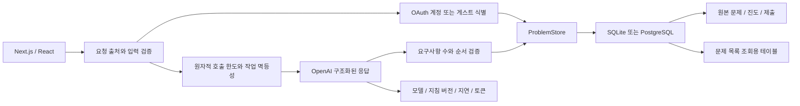

`ProblemStore`가 공통 계약이고 두 어댑터는 DB별 트랜잭션과 잠금만 담당합니다. SQLite는 `BEGIN IMMEDIATE`, PostgreSQL은 트랜잭션과 advisory lock을 사용합니다. 한 요청의 여러 한도는 함께 확인하고 함께 차감합니다. 가중치가 있는 백업 요청도 다른 한도만 일부 차감되지 않습니다.

`problems.content`는 정답을 포함한 원본 JSON을 보존합니다. `problem_catalog`에는 공개 요약, 검색 문장과 필터 열만 둡니다. 앱 시작 시 누락된 행만 100개씩 채우며, 새 문제와 조회용 행은 같은 트랜잭션에서 추가합니다. 기존 운영 기록을 재작성하거나 삭제하지 않습니다. 이 구조는 읽기 성능을 위해 일부 데이터를 중복 보관하는 선택입니다. 문제 수정 기능을 추가한다면 두 표현의 갱신도 같은 트랜잭션에 포함해야 합니다.

- `/api/workspace`: 전체 개수, 개인 훈련 통계, 추천과 현재 문제의 요약. 첫 요청은 필요한 목록 페이지 또는 상세도 포함
- `/api/library`: 서버 검색/필터/정렬, 전체 개수와 페이지당 8개
- `/api/history`: `(created_at, id)` 커서, 페이지당 20개. 같은 시각의 제출도 중복/누락 없이 이동
- `/api/problems/:id`: 해당 초안과 최근 제출 20개. 이전 제출 링크는 정확한 제출본을 별도 조회
- `/api/usage`: 현재 계정 또는 게스트의 한도와 최근 30일 AI 사용량

정렬 SQL은 허용 목록으로 선택하고 사용자 값은 매개변수로 전달합니다. LIKE 검색의 `%`, `_`, `!`는 리터럴로 처리합니다. 목록은 코드와 정답을 가져오지 않으며, 개인 조회에는 항상 owner 조건이 포함됩니다. 초안 저장 후 결과도 전체 진도 대신 한 행만 읽습니다. 전체 데이터 조회는 의도적인 백업 내보내기에 남아 있습니다.

목록은 페이지 번호 이동을 지원하려고 OFFSET을 유지했습니다. 깊은 페이지에서는 비용이 커질 수 있고, 새 문제가 추가되는 동안 개수와 목록이 아주 짧게 다를 수 있습니다. 이력은 새로운 제출이 앞에 추가되는 흐름이므로 커서를 사용합니다. 부분 문자열 검색은 인덱스만으로 해결되지 않으며 대규모 전문 검색과 제출 코드 분산 실행 환경은 아직 구현하지 않았습니다.

### 조회 성능 실험

[재현 스크립트](../scripts/benchmark-storage.ts)는 운영 연결을 사용하지 않고 임시 SQLite에 내장 문제와 합성 문제 5,000개를 넣습니다. 아래 기록 당시 내장 문제는 12개였으며, 현재 코드는 인수인계 과제를 포함해 24개입니다. 과거 수치를 재현하려면 당시 커밋과 데이터 규모를 맞춰야 합니다. 예열 10회 후 100회 측정하며 두 방식의 첫 페이지 ID가 같은지도 확인합니다.

| 측정             | 이전 전체 요약 조회 | 새 서버 페이지 조회 |
| ---------------- | ------------------: | ------------------: |
| 응답 JSON 크기   |     1,993,608 bytes |         3,354 bytes |
| 조회 시간 중앙값 |              79.6ms |               3.2ms |
| 조회 시간 p95    |             168.4ms |              11.9ms |

[원시 결과와 실행 환경](../reports/storage-benchmark.json)을 공개했습니다. 크기는 직렬화한 JSON 기준이며 시간은 DB 읽기와 파싱 기준입니다. 로컬의 따뜻한 캐시 실험으로 HTTP 지연, 운영 PostgreSQL 처리량, 동시 사용자 수를 뜻하지 않습니다.

## AI: 오판을 관찰하고 설정을 비교

문제 생성은 기본 `gpt-5.6-sol`, 풀이 검토는 `gpt-5.6-luna`의 medium 추론을 사용합니다. 아래 표는 이전 `gpt-5.4-mini` 설정의 개선 이력이며, 현재 Luna 평가와 생성 모델 비교는 문서 끝의 2026-09-14 모델 선택 절에 정리했습니다. 이 고정 검토 평가는 생성 품질의 정확도 수치를 뜻하지 않습니다. 모델 선택은 `ai-models.ts`에 분리했습니다.

문제 생성과 검토는 OpenAI Responses API의 구조화된 출력과 Zod를 사용합니다. 모든 요구사항에 정확히 하나의 평가가 있어야 하며 누락이나 중복 인덱스는 거절합니다. 점수와 전체 통과 여부는 서버가 계산합니다. 입력 코드와 주석은 지시문이 아닌 검토할 데이터로 다룹니다.

[고정 평가 집합](../evals/review-cases.ts)은 React 비동기 검색, Python 페이지 분할, SQL 집계, Unity 이동 문제 각각에 참고 정답, 대체 구현, 미완성/오류 코드, 통과를 유도하는 주석을 넣은 코드를 갖습니다. 사전에 작성한 요구사항별 기대값과 실제 판정을 비교합니다.

| 설정                       | 전체 통과 여부 일치 | 정답 거절 | 오답 통과 | 요구사항별 일치 | 응답 중앙값 | 추정 비용 / 16회 |
| -------------------------- | ------------------: | --------: | --------: | --------------: | ----------: | ---------------: |
| 초기 지침, 기본 추론       |               15/16 |       1/8 |       0/8 |           47/52 |       2.0초 |          $0.0372 |
| 기준 독립 판단 지침만 보완 |               14/16 |       2/8 |       0/8 |           46/52 |       2.5초 |          $0.0386 |
| 같은 지침 + medium 추론    |               16/16 |       0/8 |       0/8 |           52/52 |       4.2초 |          $0.0543 |

초기 설정은 정상적인 대체 구현을 잘못 거절했습니다. 지침만 보완한 실험에서도 오류가 남았습니다. 실제 피드백에는 코드에 없는 페이지 상한을 가정하거나, 단순 곱셈으로 보존되는 아날로그 입력을 별도 로직이 없다는 이유로 거절한 사례가 있었습니다. 따라서 검토에는 `medium` 추론을 적용했습니다. 이 표본에서 판정은 개선됐고 지연과 출력 토큰은 늘었습니다. 생성에는 동일한 추론 수준을 강제하지 않습니다.

[초기 결과](../reports/ai-evaluation-baseline.json), [지침 변경 결과](../reports/ai-evaluation-prompt-only.json), [최종 결과와 피드백](../reports/ai-evaluation.json)을 모두 보존합니다. 최종 보고서는 모델, 지침 버전, 데이터/프롬프트 지문, 사용량, 오류 수, 오답 통과율과 p50/p95를 포함합니다. 기본 가격은 [OpenAI 공식 모델 문서](https://developers.openai.com/api/docs/models/gpt-5.4-mini)의 표준 텍스트 단가를 사용하며 알려지지 않은 모델이나 미측정 요청을 0원으로 단정하지 않습니다.

평가 집합은 작고 개발 중 반복해서 사용했습니다. 독립 검증 집합도, 반복 측정에 따른 신뢰구간도 아닙니다. 기대값은 요구사항을 바탕으로 수동 작성했고 외부 판정자의 교차 검토는 없습니다. 네 분야의 결과를 26개 언어 전체로 일반화하지 않습니다. 이후 변경은 숨겨진 추가 사례와 다회 측정으로 확인할 필요가 있습니다.

### 운영 계측과 오류 처리

AI 호출 결과는 `ai_runs`에 모델, 프롬프트 버전, 성공 여부, 지연, 입력/캐시/출력 토큰과 알려진 단가의 추정 비용을 저장합니다. 사용자 코드, 원문 프롬프트와 IP는 계측 로그에 저장하지 않습니다. 사용량 저장 장애가 완료된 풀이를 실패로 바꾸지 않으며 계측 실패는 요청 ID만 기록합니다. 제공자 오류도 가능한 사용량 범위 내에서 남기고, 응답을 받지 못한 경우 토큰 수를 알 수 없다고 표시합니다.

동일 requestId와 동일 요청 내용의 완료 결과는 재사용하고 진행 중이면 충돌 상태를 반환합니다. 실패하거나 만료된 작업을 재획득할 때는 실행 토큰으로 이전 응답을 차단합니다. 외부 AI 호출 자체는 응답 유실/재획득 시 중복될 수 있으며, 아래 저장 경합 개선 절에서 보장 범위를 구분합니다. AI 응답 중 작성된 최신 초안은 제출 결과 저장이 덮어쓰지 않습니다.

## 공개 연습과 계정

모든 문제의 풀이, 저장, 힌트, 정답, AI 검토, 북마크, 학습 이력과 백업은 로그인 없이 사용할 수 있습니다. 생성 API, 개인 프로필과 내 프로젝트 점검은 서버에서 인증을 요구합니다. Better Auth 1.7.4가 Google/GitHub OAuth, 상태 검증, PKCE, 암호화 토큰과 DB 세션을 담당합니다. 쿠키의 존재만으로 인증하지 않으며 실제 세션을 DB에서 확인합니다. 계정 연결은 로그인 후 명시적으로 수행하고, 같은 이메일이라는 이유만으로 자동 병합하지 않습니다.

기존 `recode_session`과 해시를 유지해 게스트 기록을 보존합니다. 로그인 시 `user:<id>` 소유자로 전환하며 기록이 기기에 걸쳐 연결됩니다. 로컬 미저장 코드는 계정/게스트별 키로 나누고 요청의 `X-Codefit-Workspace`와 현재 소유자를 비교합니다. 다른 탭에서 로그인하거나 로그아웃한 뒤 남은 저장 요청은 409로 거절해 다른 계정에 들어가지 않도록 했습니다. 게스트 코딩 기록은 JSON 백업으로 계정에 옮길 수 있습니다. 현재 v3 JSON 백업은 입문 미션과 프로젝트 평가·학습 기록도 내보내고 다른 계정으로 가져올 수 있습니다. 자동 병합은 하지 않으며 기존 기록을 덮어쓰지 않습니다. [복원 범위](workspace-backup.md)를 참고하세요.

## 일일 생성 한도와 비용 범위

`generation_usage`는 계정, 요청 ID와 한국 날짜를 기록합니다. 하루 3회이며 00:00 KST에 갱신됩니다. PostgreSQL은 계정별 advisory lock, SQLite는 `BEGIN IMMEDIATE`로 동시 요청을 직렬화합니다. 먼저 자리를 예약하고 생성 문제 저장과 같은 트랜잭션에서 완료 처리합니다. 실패 예약은 반환하고 프로세스가 중단되면 150초 후 만료합니다. 완료 요청 재시도는 기존 문제를 반환하며 추가 차감하지 않습니다. 로그아웃, 쿠키 변경과 서버 재시작은 완료된 사용량을 초기화하지 않습니다.

AI 풀이 검토와 두 훈련의 맞춤 질문은 개인/게스트별 첫 사용부터 24시간 동안 총 20회를 공유합니다. 접속망은 생성 30회, 검토 40회, 전체는 시간당 40회와 24시간당 100회를 공유합니다. 이 공용 보호 한도는 실패도 차감하므로 개인 생성 잔여량보다 먼저 제한될 수 있습니다. Vercel의 공식 IP 헤더를 HMAC 처리하고 다른 호스트의 임의 전달 헤더는 신뢰하지 않습니다. 계정당 제한은 한 사람이 여러 계정을 만드는 행위까지 탐지하는 장치는 아닙니다.

사용량에는 모델별 단가를 적용합니다. Sol은 2026-09-13 확인한 표준 문맥의 프로모션 단가(입력 $4, 캐시 입력 $0.40, 출력 $20 / 백만 토큰)를 사용하며 실제 청구액이 아닙니다. 제공자 가격 변경 시 갱신해야 합니다. 현재 웹 백업은 최대 4,000,000바이트, 문제 2,500개, 풀이 10,000개, 입문 기록 500개와 프로젝트 500개이며 복원의 신규 문제/제출 수와 횟수에도 별도 한도를 둡니다. 인증 비밀키와 세션은 사용자용 JSON 백업에 포함하지 않습니다.

## 검증과 배포

SQLite와 PostgreSQL에 같은 조회/격리/커서/가중 한도 테스트를 적용합니다. PostgreSQL은 먼저 임시 스키마가 실제 적용됐는지 검사하므로 호스팅 연결이 검색 경로를 무시하면 데이터를 쓰기 전에 중단합니다. 스키마 지정은 `options=-c search_path=...`를 사용합니다. CI는 별도 PostgreSQL 서비스를 제공하고, 브라우저 검증은 별도 SQLite 서버를 사용합니다.

OAuth 도입 전 실제 키를 연결한 임시 로컬 서버에서 문제 생성 → 저장 → 재조회와 정답 제출 → 검토 → 이력 저장을 확인했습니다. 같은 requestId로 재요청해도 생성 문제와 제출 ID가 유지되고 사용량은 실제 호출 2회만 기록됐습니다. 공개 운영 DB에는 이 검증용 기록을 쓰지 않았습니다.

배포는 GitHub main → Vercel Git 연동입니다. Preview DB는 운영 DB와 분리했습니다. CI는 서식, 타입, 미사용 코드, 단위/DB 테스트, 운영 빌드와 브라우저 테스트를 실행하고 실패 추적 파일을 14일 보관합니다. Vercel Git 배포와 CI는 각각 실행되므로 CI 성공 자체가 배포 승인을 제어하는 보호 규칙은 아닙니다.

백업 내보내기, 실제 AI 평가와 브라우저 보고서에는 목적에 따라 코드가 포함될 수 있습니다. 저장소에 공개한 평가 코드는 고정된 연습 사례뿐이며 개인 운영 기록이나 비밀 키를 포함하지 않습니다.

## 저장 경합과 편집 대기 개선 — 2026-09-14

검토 기준과 작업 시작 시 HEAD는 모두 `1eeefc7c3884df3a8061a98cbf8be8fec92a7cff`였습니다. 그 이후에 이미 해결된 항목은 없었습니다. 기존 저장 큐, 계정 격리, 제출본 복원/취소, 검색 취소와 Monaco 지연 로딩은 유지했습니다. 아래는 이번 변경의 근거이며, 앞의 과거 AI 평가 및 LCP 실험과 구분합니다.

### 코드 리비전과 초안 보존

변경 전 실제 Chromium 두 탭에서 A의 PUT을 지연시키고 B의 저장을 먼저 완료했습니다. 화면 B에는 새 코드가 남아 있지만 DB에는 A의 오래된 코드가 저장됐습니다. 별도 실행한 기준 빌드에서도 A를 오프라인으로 두고 B를 저장한 뒤 A를 재접속하자 B의 저장본이 A 코드로 바뀌는 것을 실제 브라우저로 재현했습니다. 저장소 재현과 실제 탭의 최종 코드는 [재현 기록](../reports/concurrency-baseline.json)에 남겼습니다.

선택한 방법은 서버의 `code_revision`을 이용하는 낙관적 동시성 제어입니다. PUT은 `baseRevision`을 보내며 SQLite의 `BEGIN IMMEDIATE`, PostgreSQL의 행 잠금 안에서 리비전을 검사하고 조건부 UPDATE를 수행합니다. 실제 코드가 바뀌면 1 증가합니다. 북마크, 힌트, 정답 보기와 제출 상태에는 증가하지 않습니다. 기준 버전 없는 코드 저장은 428, 다른 코드와 충돌하면 현재 저장본과 리비전을 포함한 409입니다. 응답을 잃고 같은 코드를 재전송한 경우에는 현재 코드와 바이트가 같을 때만 성공으로 확인합니다.

브라우저 시각은 권한 판단에 사용하지 않습니다. 코드의 최신 여부는 리비전으로, 기존 진도 메타데이터의 화면 병합은 서버가 보낸 갱신 시각으로 구분합니다. 예전 브라우저 초안에 리비전이 없으면 시각으로 버리지 않고 비교를 요청합니다. 백업으로 새로 들어온 코드에는 해당 저장소가 리비전을 발급하며, 기존 진도는 가져오기가 덮어쓰지 않습니다.

대안으로 마지막 도착 요청 우선, 수정 시각 비교, 전체 진도 행 버전, 자동 병합 및 CRDT를 검토했습니다. 앞의 두 방식은 편집 의도나 시계 오차를 해결하지 못합니다. 전체 행 버전은 힌트 클릭에도 충돌합니다. 자동 병합은 문법이 맞아도 의미가 달라질 수 있고, 실시간 공동 편집 구조는 이번 범위보다 큽니다. 대신 충돌 시 사용자가 비교하고 다시 저장하는 한 단계를 감수했습니다.

[DraftController](../src/lib/drafts/draft-controller.ts)는 저장 상태와 허용 동작을 담당하고, [브라우저 보관](../src/lib/drafts/browser-draft.ts)과 [React 연결](../src/hooks/use-code-draft.ts)을 분리했습니다. 하나의 실행 중 요청에는 최신 입력을 모아 이어 저장합니다. 충돌 상태에서는 자동 재전송을 중단하고 내 초안을 보존합니다. 비교창의 내 초안은 편집기와 연결되어 있으며, 재저장 중 입력도 응답으로 교체하지 않습니다. 다시 저장할 때 화면에서 비교한 서버 리비전을 사용하므로 그사이 다른 기기가 저장하면 다시 충돌을 안내합니다.

계정/문제/편집 인스턴스별 로컬 키를 사용해 복제한 탭도 같은 보관 키를 덮어쓰지 않습니다. 같은 탭의 재접속에는 세션 포인터로 복구하고, 다른 창에 남은 초안은 별도 펼침 영역에서 복사할 수 있습니다. 보관 공간이 막히면 저장됐다고 표시하지 않고 복사를 안내합니다. 브라우저 데이터 삭제, 디스크 손상이나 저장 공간 자체의 실패까지 영구 보관을 보장하지는 않습니다.

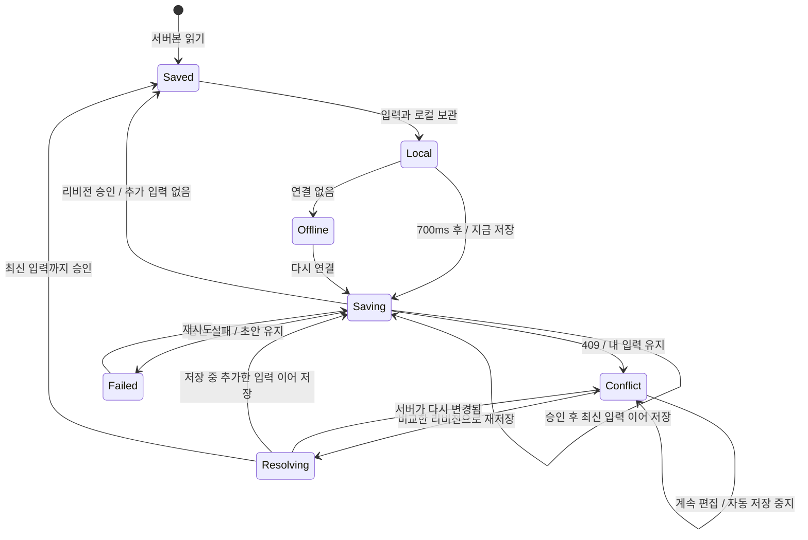

[실제 충돌 UI](../src/components/workspace/draft-conflict.tsx)는 입력 중 포커스를 빼앗지 않습니다. 비교 펼치기, 두 코드 영역, 재저장 버튼을 키보드로 이동할 수 있고, 버튼으로 완료한 경우 편집기로 돌아갑니다. 다른 위치에서 계속 입력하고 있었다면 포커스를 강제로 옮기지 않습니다. WebKit의 포인터 클릭이 버튼에 포커스를 주지 않는 차이도 확인해 설정/도움말/생성 창의 시작 버튼에서 반환 위치를 명시했습니다.

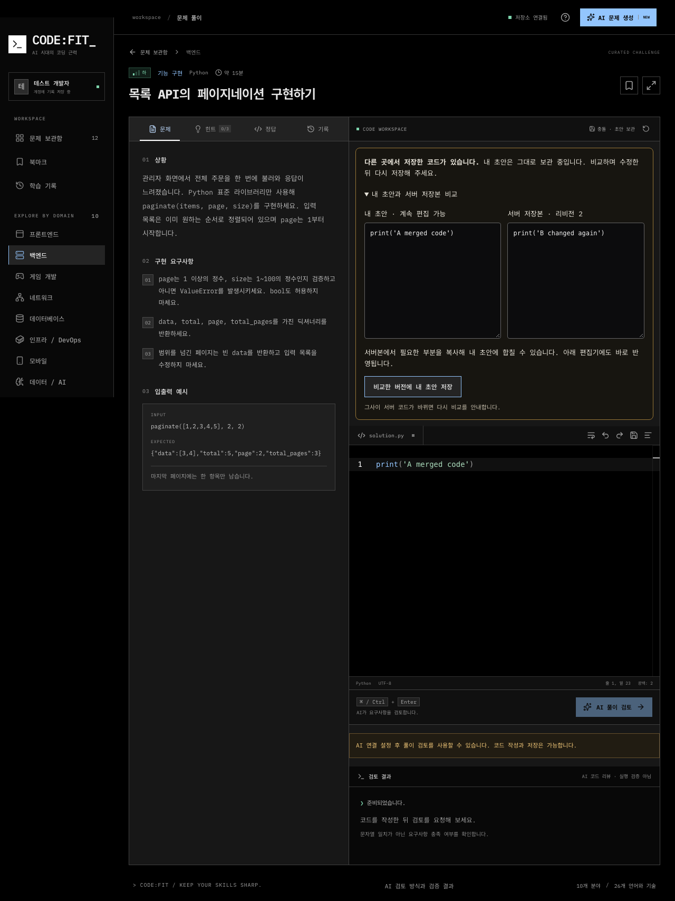

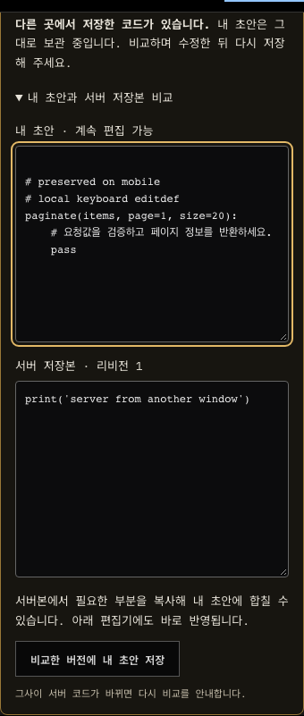

검증 코드는 [상태 전이 테스트](../src/lib/drafts/draft-controller.test.ts), [브라우저 보관 테스트](../src/lib/drafts/browser-draft.test.ts), [두 저장소 공통 계약](../src/lib/server/concurrency-contract.test-helper.ts), [실제 탭/기기/모바일 테스트](../e2e/draft-conflict.spec.ts)에 있습니다. 기존 [제출본 복원과 실행 취소](../e2e/practice.spec.ts), [계정 전환](../e2e/account.spec.ts)도 함께 확인합니다.

### AI 실행 소유권과 원자적 완료

기준 버전에서는 `startJob → 만료 → 같은 ID 재획득 → 첫 실행의 failJob` 순서로 새 진행 작업이 삭제됐습니다. `finishJob` 역시 ID만 검사해 늦은 성공이 새 결과를 변경할 수 있었습니다. 이제 획득마다 새 UUID 토큰을 발급하며, 작업의 ID/소유자/종류/토큰/진행 상태/유효 기간을 함께 검사합니다. 예약 변경, 실패 반환, 제출 저장과 생성 완료 모두 현재 실행만 허용합니다. 완료 함수는 저장소 내부에서만 호출됩니다.

단순히 만료 시간을 늘리면 문제 발생을 늦출 뿐입니다. 실행 세대 정수와 무작위 토큰 모두 가능하지만, 별도 카운터 없이 실행 식별을 명확히 하는 토큰을 선택했습니다. 생성 예약에도 같은 토큰을 저장해 재획득한 실행만 예약을 넘겨받고 확정할 수 있습니다. 이전 실행의 실패는 아무것도 변경하지 않으며, 늦은 성공은 트랜잭션을 중단합니다. 완료 후 다시 도착한 결과도 문제/제출을 추가하지 않습니다.

[요청 지문](../src/lib/server/write-conflicts.ts)은 정규화한 필드를 정해진 순서의 배열로 직렬화한 SHA-256입니다. 생성은 분야, 언어, 난이도, 유형, 주제이고 검토는 문제 ID와 검증한 코드입니다. 검토 API의 기존 앞뒤 공백 정규화는 유지합니다. 같은 ID와 같은 지문은 진행 중 409, 완료 후 기존 결과, 실패/만료 후 새 실행으로 처리합니다. 다른 코드/조건, 소유자, 종류에 ID를 재사용하면 409로 거절합니다. 실패 행도 지문을 남기며, 지문을 알 수 없는 과거 작업 ID는 재사용하지 않습니다. 이 경우 화면을 새로고침해 새 요청 ID로 시작해야 합니다.

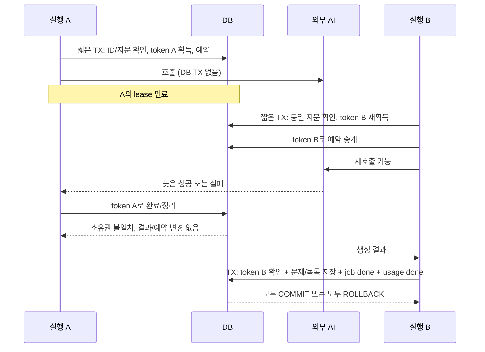

SQLite와 PostgreSQL은 동일 계약을 구현합니다. PostgreSQL은 같은 ID 획득을 advisory lock으로 직렬화하고, 이후 작업 행을 먼저 잠근 뒤 계정 한도 잠금을 잡습니다. 외부 AI 호출 중에는 트랜잭션을 유지하지 않습니다. 검토는 제출/진도/작업 완료를, 생성은 문제/목록/작업 완료/사용량 확정을 하나의 트랜잭션으로 묶습니다. 최종 `jobs` UPDATE에 강제로 오류를 발생시켜 이미 삽입한 문제까지 롤백되는 것도 검사했습니다.

이 계약은 **DB 결과의 중복 저장 방지**입니다. lease가 살아 있는 동안 중복 획득을 막지만, 외부 AI가 응답을 처리한 뒤 네트워크 응답이 유실되거나 lease가 만료되면 호출 사실을 확정할 수 없습니다. 다시 획득한 실행이나 SDK 재시도가 외부 호출과 비용을 늘릴 수 있습니다. DB와 제공자를 묶는 분산 트랜잭션은 없으며 외부 호출의 정확히 한 번 실행을 보장하지 않습니다. `ai_runs`는 호출 계측이고 확정된 문제 개수와 같을 필요가 없습니다. 개인 생성 사용량은 성공한 DB 결과 기준이며 공용 보호 한도는 실패도 차감합니다.

구현은 [SQLite](../src/lib/server/sqlite-store.ts), [PostgreSQL](../src/lib/server/postgres-store.ts), [생성 경로](../src/app/api/generate/route.ts), [검토 경로](../src/app/api/problems/[id]/review/route.ts)에 있습니다. [PostgreSQL 테스트](../src/lib/server/postgres-store.test.ts)는 동시에 확보한 5개 연결의 서로 다른 backend PID를 확인하고, 다섯 조건부 코드 저장 및 동일 실행의 다섯 완료 요청에서 각각 하나만 성공하는지 검사합니다. 별도의 생성 요청 경합에서는 예약 세 개만 허용합니다.

### 초기 로딩 측정과 변경 범위

변경 전 요청 기록에는 목록에서 `/api/workspace` 응답 뒤 약 200ms 이상의 대기를 거쳐 `/api/library`가 시작됐고, 상세에서도 workspace가 끝나야 문제 API가 시작됐습니다. 첫 방문의 게스트 쿠키가 workspace에서 정해지기 때문에 단순히 두 브라우저 요청을 동시에 보내면 서로 다른 게스트로 처리될 위험이 있습니다.

선택한 변경은 첫 workspace 요청에 해당 목록 페이지 또는 문제 상세를 함께 전달하는 방식입니다. 서버에서 소유자를 한 번 확정한 후 독립 조회를 병렬 수행합니다. 기존 문제 조회는 [공통 함수](../src/lib/server/problem-detail.ts)로 분리했습니다. 이후 검색은 기존 200ms 지연과 취소를 유지하고, 통계 새로고침에는 초기 상세를 다시 전송하지 않습니다. 초기 화면 데이터만 클라이언트에 전달하므로 새로운 서버 컴포넌트 경계나 캐시 계층을 추가하지 않았습니다.

대안인 서버 최초 렌더링은 인증/게스트 발급 경로와 초기 HTML 책임을 더 바꿔야 합니다. 단순 병렬 요청은 앞의 쿠키 문제가 있습니다. Monaco는 기존에도 `next/dynamic`과 내부 로더로 지연 로딩하고 있었으므로 다시 구현하지 않았습니다. 긴 코드 입력과 검색의 추가 최적화 여부는 아래 실제 전후 측정에 따라 결정합니다.

초기 응답은 공개 문제와 개인 초안을 함께 포함하므로 **모두 `Cache-Control: no-store`**입니다. 공개 목록은 코드/정답을 제외한 요약만 반환하고, 개인 진도와 상세는 같은 owner로 조회합니다. 서버 공유 캐시나 다른 계정으로 재사용하는 클라이언트 캐시는 만들지 않았습니다. 계정 변경 시 bootstrap 재사용도 scope가 같을 때만 허용합니다.

측정 환경과 원본: [변경 전](../reports/interactions-before.json), [변경 후](../reports/interactions-after.json), [동일 측정 스크립트](../scripts/measure-interactions.mjs). 전후 원시 표본과 아래 결과 표를 함께 읽어 주세요.

측정은 Apple M2, macOS 25.6.0, Node 22.21.0, Chromium 153.0.8010.12의 `next build` 결과로 했습니다. 내장 문제 12개만 있는 별도 SQLite로 각 빌드를 시작하고, 각 표본마다 개인 진도가 없는 새 게스트를 사용했습니다. 서버는 예열하고 HTTP 캐시는 비웠습니다. 데스크톱은 1440×1000에서 제한 없이, 모바일은 390×844에서 CDP CPU 4배 감속, 지연 100ms, 다운로드 10Mbps/업로드 5Mbps로 각각 5회 측정했습니다. 긴 코드는 500개 함수, 22,281자이고 32개 키 입력을 40ms 간격으로 보냈습니다. 다른 브라우저 테스트와 측정을 동시에 실행하지 않았습니다.

| 지표                                         | 데스크톱 변경 전 → 후 | 제한된 모바일 변경 전 → 후 |
| -------------------------------------------- | --------------------: | -------------------------: |
| 첫 목록 표시 확인 중앙값                     |       942.8 → 836.0ms |        2,127.1 → 1,579.6ms |
| 상세 진입 후 편집 가능 확인 중앙값           |       902.9 → 902.9ms |        3,645.3 → 3,677.8ms |
| 초기 목록/상세 API 요청 수                   |            각각 2 → 1 |                 각각 2 → 1 |
| 검색 `TCP`의 요청 / React 루트 commit        |         1 / 8 → 1 / 8 |              1 / 8 → 1 / 8 |
| 긴 코드 입력의 저장 요청 / React 루트 commit |       1 / 34 → 1 / 34 |            1 / 34 → 1 / 34 |
| 키 입력→다음 animation frame p95             |         16.4 → 16.4ms |              17.8 → 38.0ms |

목록 중앙값은 이 표본에서 데스크톱 약 11%, 제한 모바일 약 26% 줄었습니다. 상세의 API 왕복은 하나 줄었지만 편집 가능 시점의 이득은 확인되지 않아 Monaco 구성은 유지했습니다. 검색 요청과 자동 저장 요청, React 루트 commit 수 역시 같아 추가 메모이제이션이나 검색 구조 변경을 하지 않았습니다. commit 계측은 React DevTools hook으로 얻은 루트 반영 횟수이며, 개별 컴포넌트 render 횟수나 Profiler의 렌더 비용을 뜻하지 않습니다.

모바일 변경 후에는 목록 최대 2,776.7ms, 편집 준비 최대 5,469.4ms로 분산이 커졌고 입력 p95도 나빠졌습니다. 이 값을 제외하지 않았습니다. 데스크톱 입력 중 50ms 이상 long task는 전후 모두 0건, 모바일은 전 2건/후 5건이었습니다. 첫 표본의 성능 trace에서 가장 긴 keypress 처리는 데스크톱 10.4→9.5ms, 모바일 42.9→46.4ms입니다. 단일 순서의 측정만으로 입력 지연 증가를 코드 변경에 귀속할 수 없어 아래 교대 실험을 추가했습니다.

공개한 [요약 및 trace 해시](../reports/interactions-summary.json)에는 모든 원시 표본, 범위와 압축 성능 기록 경로가 연결됩니다. 표시는 `goto`와 DOM 가시성 확인, 편집 준비는 Monaco 모델과 입력 요소의 사용 가능 확인까지의 시간으로 자동화 관찰 비용을 포함합니다. 키→animation frame은 INP가 아닙니다. 5회 표본으로 통계적 유의성이나 운영 SLA를 주장하지 않으며 실제 사용자 Core Web Vitals로 인용하지 않습니다. 변경 후 예비 측정은 E2E DB를 공유했고, 위 최종 변경 후 값은 별도 성능 DB로 조건을 맞춰 다시 측정한 결과입니다. 변경 전 원본은 처음부터 별도 성능 DB를 사용했습니다.

후속 [교대 입력 실험](../reports/typing-paired.json)은 같은 두 프로덕션 빌드를 각각 3011/3010 포트에서 실행하고, 제한 모바일 입력만 전/후 순서를 교대해 5쌍 측정했습니다. 모든 표본에 trace를 켰고 브라우저 저장 호출 시간과 시스템 load average도 기록했습니다. 계측이 추가됐으므로 최초 표를 대체하는 수치가 아닙니다.

| 교대 실험 지표                    |   기준 빌드 |   변경 빌드 |
| --------------------------------- | ----------: | ----------: |
| 입력→다음 frame 중앙값            |     14.20ms |     15.15ms |
| 입력→다음 frame p95               |      27.3ms |      28.5ms |
| 가장 긴 입력                      |      60.7ms |      64.6ms |
| 표본별 React 루트 commit / PUT    | 모두 34 / 1 | 모두 34 / 1 |
| 32개 입력의 브라우저 저장 호출 수 |          32 |          64 |
| 표본별 브라우저 저장 총 소요      |   2.7~6.4ms |  4.1~10.0ms |

초기 측정의 큰 입력 지연 차이가 교대 실험에서는 같은 크기로 재현되지 않았습니다. 변경 버전의 초안 키와 세션 복구 포인터 보관 비용은 늘었지만, 32개 입력 전체에서 최대 10ms였으며 키 하나의 큰 지연을 설명할 수준의 병목으로 확인되지 않았습니다. 복구 안전성의 비용으로 기록하고 추가 구조 변경은 하지 않았습니다. 시스템 변동의 정확한 원인을 단정하거나 성능 회귀가 모든 환경에서 없다고 보장하지 않습니다. 제한 CPU에서 첫 입력이 약 50~65ms 걸리는 사례와 편집기 초기 준비 지연은 남은 한계입니다.

`npm run measure:typing-pair`로 두 빌드를 번갈아 측정할 수 있습니다. 기준 빌드는 해당 커밋을 별도 경로에 복원하고 동일 의존성과 생성된 Monaco 자산으로 `next build`해야 합니다. 새 캐시/서버 컴포넌트/에디터 교체를 더 추가하는 대신, 확인된 목록 요청 대기 제거와 두 저장 경합의 안전성 개선에서 이번 범위를 마쳤습니다.

## 모델 선택: 검토 Luna, 생성 Sol 유지 — 2026-09-14

풀이 검토 기본값을 **`gpt-5.6-luna`, medium 추론**으로 변경했습니다. 문제 생성은 **`gpt-5.6-sol`**을 유지합니다. [설정 코드](../src/lib/server/ai-models.ts), [판단 요약](../reports/ai-model-decision.json), [현재 검토 결과](../reports/ai-review-luna.json)를 연결했습니다. 환경 변수 우선순위는 유지하며, 생성 모델과 검토 모델을 서로 덮어쓰지 않습니다. `/quality`도 현재 Luna 결과를 보여줍니다.

### 검토: 같은 코드, 같은 기준으로 32회

기존 16개 개발용 사례를 Luna로 각각 두 번 실행했습니다. 프롬프트와 medium 추론, 요구사항별 기대값을 고정하고 동시 요청은 2개로 제한했습니다. 전체 판정 **32/32**, 기준별 판정 **104/104** 일치, 정답 거절 0, 오답 통과 0, 응답/검증 실패 0이었습니다. 응답 중앙값은 5.883초, p95는 10.433초, 기록된 토큰 기준 총 추정 비용은 **$0.023385 / 32회**입니다. 이 범위에서는 Terra로 올릴 근거가 없어 Luna를 선택했습니다.

이전 Mini 16회의 $0.054349와 요청당 추정 비용을 비교하면 약 78.5% 낮습니다. 같은 시점에 무작위 교차 실행한 비교는 아니며, 캐시 사용과 출력 길이도 달라 실제 운영 절감률이나 속도 향상을 보장하지 않습니다. 반복 사용한 개발 사례이므로 숨겨진 평가 집합, 모든 언어의 정확도, 독립적인 인간 평가로 표현하지 않습니다. 검토 프롬프트는 이번 평가에 맞춰 수정하지 않았습니다.

### 생성: 6개 분야 × 2회 × 3개 모델

[고정 주제와 사전 기준](../evals/generation-cases.ts)을 작성한 뒤 실제 생성 함수를 호출했습니다. 프론트엔드/TSX와 DB/SQL은 중, 백엔드/Python과 게임/C#은 하, 네트워크/Python과 인프라/Python은 상입니다. 구현, 오류 수정, 리팩터링을 포함합니다. 같은 주제, 빈 기존 제목 목록, 운영 프롬프트와 구조화 출력, 10,000 출력 토큰, 90초 타임아웃, 재시도 0회를 사용했습니다. 생성 추론은 기존과 같이 제공자 기본값이며 세 모델 문서에서 medium으로 확인했습니다. 모델별 동시 요청 2개로 진행했고 모델 실행 시간은 겹칩니다.

| 생성 모델 | 구조 검증을 통과한 출력 | 응답/검증 실패 | 요청 시간 중앙값¹ | 기록된 추정 비용² |
| --------- | ----------------------: | -------------: | ----------------: | ----------------: |
| Sol       |                   11/12 |              1 |          47.459초 |         $0.643084 |
| Terra     |                   12/12 |              0 |          19.542초 |         $0.368916 |
| Luna      |                   12/12 |              0 |          20.818초 |         $0.036481 |

¹ 실패 요청도 시간 표본에 포함합니다. 로컬에서 관찰한 API 지연이며 운영 사용자의 응답 시간은 아닙니다. ² Sol의 실패 요청은 사용량을 받지 못해 비용을 알 수 없습니다. 0원 처리한 것이 아니며 표의 합계에서 제외됩니다. Sol은 이 표본에서 약 90초 후 결과를 받지 못한 사례가 있습니다. 원문 오류를 보관하지 않아 세부 제공자 오류 원인은 확정하지 않았습니다.

처음 인프라 주제가 216자로 앱의 200자 제한을 넘었습니다. 이 6건은 **API 호출 전 fixture 검증 실패**였고 모델 오류에 넣지 않았습니다. 동일 계약을 197자로 줄인 뒤 미호출 인프라 사례만 실행했습니다. 나머지 30개 호출은 재시도하지 않았고, Sol의 실제 실패도 보존했습니다. 평가 도구는 이제 모든 입력을 첫 유료 호출 전에 검증합니다. 보고서에 이 수정 이력과 최종 입력 지문을 남겼습니다.

원문 결과: [Sol](../reports/ai-generation-sol.json), [Terra](../reports/ai-generation-terra.json), [Luna](../reports/ai-generation-luna.json). 구조 검증 성공은 문제의 정답성과 교육 품질을 보장하지 않습니다. 구현을 담당한 Codex가 모델명을 아는 상태에서 정답, 예제, 계약, 유형/난이도, 힌트를 살펴본 정성 검토이며 독립 심사자의 맹검 평가가 아닙니다. 별도의 의미 정확도 점수는 만들지 않았습니다.

확인한 차이는 다음과 같습니다.

- 이메일 중복 제거, 일반 검색 응답 처리, SQL 집계와 이동 계산의 핵심 알고리즘은 세 모델 모두 대체로 비슷했습니다. 쉬운 문제에서는 Luna가 비용 면에서 유망합니다.
- **Terra의 TCP 두 예제는 길이 헤더 바이트가 빠졌습니다.** `00 00 04 61`은 4가 아니라 1121, `00 00 04 74`는 1140입니다. 예제는 페이로드를 기다린다고 하지만 정답은 즉시 길이 초과 오류를 냅니다. 이메일 두 번째 출력에는 잘못된 구분자와 영어 작성 중 메모도 남았습니다.
- **Luna의 인프라 두 사례는 리팩터링 대신 동작 수정이 필요했습니다.** 시작 코드가 입력을 변경하거나 첫 오류에서 중단하며, 일부는 `bool("false")`를 잘못 사용합니다. 이는 정상 동작을 유지하며 구조를 개선하는 연습과 다릅니다.
- Terra의 인프라 두 사례와 Sol의 두 번째 사례도 같은 유형 문제가 있었습니다. 세 정답은 5,000자리 숫자 입력에서 `int()` 예외를 모으지 못해 나머지 오류 필드를 보고하지 못했습니다. Sol도 이런 결함에서 자유롭지 않습니다.
- Sol의 첫 번째 인프라 사례는 선언형 필드 정의와 공통 검증 흐름을 제시해 일반 입력에서 리팩터링 목적이 더 분명했습니다. 다만 시작 코드의 긴 정수 경계 결함까지 없다고 단정하지 않습니다.

[집중 반례 확인 도구](../scripts/check-generation-counterexamples.py)로 검토 후 해시를 고정한 일부 코드를 별도 인터프리터에서 실행해 **10개 반례 검사를 확인**했습니다. [결과](../reports/generation-counterexamples.json)는 Python 3.11.4에서의 보조 검증입니다. Python 3.12 전용 타입 별칭을 쓴 Sol 사례, React, PostgreSQL, Unity를 이 도구로 실행했다고 주장하지 않습니다. 임의 사용자 코드 실행용 샌드박스나 서비스 기능으로 추가하지 않았습니다.

**선택과 비용:** Luna 검토를 적용하고 생성은 기존 Sol을 유지합니다. 저렴한 생성 모델의 가능성은 확인했지만, 분야와 문제 유형 전반에서 품질 차이가 미미하다는 근거는 아직 부족합니다. 이 작은 표본이 Sol의 보편적인 우위를 입증하는 것도 아닙니다. 자동 모델 전환, 추가 AI 심사 단계, 문제 유형별 모델 분기는 이번 범위에 넣지 않았습니다.

[공식 Luna 가격](https://developers.openai.com/api/docs/models/gpt-5.6-luna), [Terra 가격](https://developers.openai.com/api/docs/models/gpt-5.6-terra), [Sol 가격](https://developers.openai.com/api/docs/models/gpt-5.6-sol)을 2026-09-14 확인했습니다. 백만 토큰당 입력/캐시 입력/출력은 각각 Luna $0.20/$0.02/$1.20, Terra $2/$0.20/$12, Sol $4/$0.40/$20입니다. 표준 문맥 가격이며 Sol은 프로모션 단가입니다. [비용 계산](../src/lib/ai-telemetry.ts)에 반영했으며 알려지지 않은 모델은 비용 미상으로 유지합니다. 실제 청구액이나 장문 문맥 단가를 뜻하지 않습니다.

## AI 코드 인수인계 훈련

이 절은 2026-09-14 도입 당시의 설계와 평가 기록입니다. 이후 예측과 브라우저 실행을 추가한 현재 흐름은 [AI 코드 이해 훈련](#ai-코드-이해-훈련)을 참고하세요.

이번 변경은 커밋 전 로컬에서 검증했다. 기존 일반 문제 12개에 기본 인수인계 과제 6개와 변형 6개를 추가한다. 초기 범위는 프론트엔드와 백엔드의 의존성 없는 ES2022 JavaScript 함수다. 실제 회사의 AI 생성 코드나 여러 파일로 된 저장소를 가져오는 기능은 포함하지 않는다.

### 사용자가 수행하는 일

구조 이해 → 문제 판단 → 코드 수정 및 확장 → 검증 계획과 회귀 테스트 → 인수인계 판단을 한 화면에서 작성한다. 단계 버튼은 해당 입력으로 포커스를 옮기며 순서를 강제하지 않는다. 시작 코드에는 검색 응답 경합, 상태 불변성, 페이지 경계, 환경 입력 검증, 이벤트 재시도, 정상적인 집계 코드의 리팩터링이 있다. 마지막 과제는 기존 동작이 정상임을 판단하고 새 기능 요구사항과 구분하는 연습이다.

모든 참고 코드와 20종의 계약 사례를 각 기본/변형 과제에서 확인하고 공개 예제도 실제 반환값과 비교한다. 실행은 개발용 테스트에 포함된 신뢰할 수 있는 고정 코드에만 한정한다. `node:vm`을 사용자 코드용 보안 샌드박스로 사용하지 않는다. 당시 서비스의 제출 코드는 실행하지 않았다. 이후 코드 이해 훈련에는 분리된 브라우저 실행을 추가했다.

### 기획 목적 충족 범위

| 의도한 행동                                     | 현재 구현 및 확인 방법                                                             |
| ----------------------------------------------- | ---------------------------------------------------------------------------------- |
| AI가 넘긴 코드를 먼저 이해하고 변경 이유를 판단 | 원본 코드 보기, 구조 이해와 문제 판단 메모, 정상 코드 확장 과제 포함               |
| 직접 수정하고 검증 근거를 남김                  | 편집기, 검증 계획 및 회귀 테스트 메모, 여섯 기준의 AI 정적 리뷰                    |
| 다음 개발자에게 근거와 남은 위험을 전달         | 인수인계 판단 메모와 현재 초안 문서 저장                                           |
| 피드백을 반영하고 일정 후 같은 역량을 다시 연습 | 최근 기본/변형 피드백 링크, 미검토 초안 이어가기, 7일 재훈련과 첫 변형 지표 분리   |
| 편집과 복구 중 작성 내용을 보존                 | 코드/메모의 동일 리비전 저장, 오프라인, 두 탭 충돌, 제출본 복원/취소 브라우저 검사 |

첫 버전의 연습 흐름은 구현되어 있다. 실제 저장소를 넘겨받는 여러 파일 작업, 사용자 코드 실행 채점, 장기간 학습 효과 측정은 이번 구현의 완료 범위가 아니다. AI가 설명을 엄격하게 판단하는 한계는 아래 실제 평가 결과에 그대로 남긴다.

### 데이터 보존과 책임 분리

새 메모 테이블을 별도로 저장하면 메모와 코드가 서로 다른 시점의 상태가 되거나 두 저장 큐의 충돌 처리가 필요하다. 기존 `Progress.code`와 `Attempt.code`에 구현 코드와 버전이 붙은 한 줄 JSON 주석을 함께 보관하도록 선택했다. [draft.ts](../src/lib/handoff/draft.ts)는 이를 편집용 코드와 구조화 메모로 분리하며, 줄바꿈과 JS 줄 구분자를 이스케이프한다. 인식할 수 없는 형식은 원문 코드로 보존한다. 비용은 코드 문자열에 메모가 포함되어 전체 30,000자 제한을 공유하고, 기존 외부 소비자에게 주석이 보일 수 있다는 점이다. 독립적인 대형 DB 마이그레이션은 필요하지 않다.

- 기존 서버 코드 리비전과 조건부 갱신이 코드와 메모 전체를 보호한다. 북마크와 힌트 변경은 코드 리비전을 올리지 않는다.
- 충돌 화면에서는 양쪽 코드 및 메모를 각각 비교한다. 비교 도중 입력과 서버의 재변경도 기존 충돌 제어기에 맡긴다.
- 오프라인 보관, 계정별 범위, 백업과 제출본 복원/취소를 재사용한다. 시작 코드 초기화는 메모를 유지한다.
- AI 검토 시점의 코드와 메모를 고정하고, 대기 중 새로 작성한 내용은 유지한다. 구현과 메모가 달라졌다면 이전 제출본의 결과임을 알린다.
- [리뷰 API](../src/app/api/problems/[id]/review/route.ts)는 메모 누락을 작업 획득과 AI 사용량 차감 전에 거절한다. 글자 수는 입력 안내일 뿐 정확성 판정은 별도 리뷰에서 수행한다.

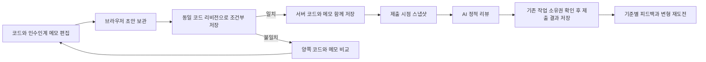

### 재훈련 규칙과 측정의 한계

[learning.ts](../src/lib/handoff/learning.ts)는 기본과 변형 중 **최근 제출**의 부족한 기준과 해당 제출본 링크를 표시한다. **최초 기본 제출**에서 7일 이상 지난 후 첫 변형 제출이 모든 AI 기준을 충족하고 해당 문제의 서비스 내 힌트, 정답이나 AI 맞춤 질문을 사용하지 않았을 때 첫 지연 재도전 지표에 포함한다. 이후 기본 재제출로 과거 지표가 취소되지 않는다. 미리 변형을 풀었거나 도움을 사용한 시도는 나중에 반복 통과해도 첫 무도움 재도전 성공으로 바꾸지 않는다. 백업으로 더 이른 기록을 가져오면 최초 기록의 기준은 달라질 수 있다.

반복 복습 일정은 이 일회성 지표와 분리한다. 첫 변형 제출 전에는 최초 기본 제출 7일 뒤, 변형 제출 후에는 가장 최근 검토 7일 뒤를 권한다. 변형 과제는 즉시 열 수도 있으며 미리 푼 기록의 의미를 안내한다. 다음 행동은 아직 제출하지 않은 초안, 기한이 된 복습, 최근 미충족 기준 보완, 새 기본 과제 순으로 제안한다. 단순히 코드가 저장되어 있다는 이유로 이미 제출한 과제를 계속 미검토 초안으로 표시하지 않는다.

이것은 규칙 기반 추천이며 개인 능력을 추정하는 AI 모델이 아니다. 변형은 다른 시작 구현과 적용 맥락을 제공하지만 함수 계약을 공유하므로 광범위한 전이 능력을 입증하지 않는다. 실제로 7일간 사용자를 관찰한 실험도 아니다. 외부 AI 사용, 백업 기록의 진위, 학습 효과를 인증하지 않는다. 학습 기록의 시간은 재도전 일정에만 사용하며 초안 충돌 판단에는 사용하지 않는다.

[공유 SQL 조회](../src/lib/server/store-queries.ts)의 `handoffAttempts`는 현재 소유자의 첫/최근 제출만 문제당 최대 2개 읽으며 코드 본문을 반환하지 않는다. [개인 기록 API](../src/app/api/handoff/route.ts)는 `no-store`이고 공개 과제 소개만 정적 페이지에 포함한다. `handoffProgress`는 같은 소유자의 코드 존재 여부만 읽고 본문을 전송하지 않는다. 두 독립 조회를 병렬 실행한다. 추가 저장 테이블이나 전역 개인 데이터 캐시는 없다.

### 목적 및 사용성 재검토에서 수정한 점

기본 재제출 후 달성 기록이 사라지는 문제와, 실패한 변형의 피드백이 기본 과제의 과거 결과에 가려지는 문제를 먼저 실패하는 단위 테스트로 재현했다. 재도전 지표와 반복 일정을 분리하고 최근 제출을 기준으로 피드백을 선택해 해결했다. 별도 학습 이력 테이블 대신 기존 첫/최근 제출 조회를 활용한다. 비용은 과거 기록을 가져올 때 최초 기준이 재계산되며 추천이 규칙 기반이라는 점이다.

원본을 다시 보려면 초기화가 필요했던 흐름에는 접어서 여는 원본 코드 보기를 추가했다. 메모에는 빈칸 작성 예시, 4개 항목의 작성 상태, 누락 항목으로 이동하는 버튼을 제공한다. AI 검토를 누르면 첫 누락 필드에 포커스를 옮기며, 접근 가능한 입력 이름은 글자 수가 바뀌어도 유지한다. 예시는 실제 입력값으로 채우지 않으므로 검토 최소 길이를 자동 충족하지 않는다.

현재 코드와 네 가지 메모는 [document.ts](../src/lib/handoff/document.ts)와 [handoff-export.tsx](../src/components/handoff/handoff-export.tsx)에서 Markdown 파일로 저장한다. 저장 시점의 초안임을 명시하며 코드 내부의 백틱이 문서 코드 블록을 깨뜨리지 않도록 구분자를 만든다. AI 정적 리뷰나 실행 성공을 보증하는 결과물로 표현하지 않는다.

대시보드는 숫자와 다음 행동을 분리하고 최신 제출의 상세 피드백으로 연결한다. 개인 기록 요청에는 15초 제한을 두고 계정 변경 오류는 전체 계정을 다시 확인할 수 있게 했다. 별도 AI 호출이나 신규 인프라는 추가하지 않았다.

### 코드와 검증 위치

| 책임                                       | 위치                                                    |
| ------------------------------------------ | ------------------------------------------------------- |
| 공개 훈련 과정과 주제                      | `src/lib/handoff/catalog.ts`                            |
| 참고 코드, 예제, 기존/확장 계약            | `src/data/handoff-problems.ts`                          |
| 메모 직렬화와 입력 규칙                    | `src/lib/handoff/draft.ts`                              |
| 재도전 판정                                | `src/lib/handoff/learning.ts`                           |
| 안내, 입력 화면, 개인 대시보드             | `src/components/handoff/`                               |
| 일반 리뷰와 분리한 인수인계 지침           | `src/lib/server/ai-prompts.ts`, `ai.ts`                 |
| 계약, 예제, 직렬화, 재도전, 평가 근거 검사 | `src/lib/handoff/handoff.test.ts`                       |
| 계정 격리 및 첫/최근 조회 공통 계약        | `src/lib/server/query-contract.test-helper.ts`          |
| 브라우저 흐름                              | `e2e/handoff.spec.ts`                                   |
| 유료 AI 평가 입력/도구                     | `evals/handoff-cases.ts`, `scripts/evaluate-handoff.ts` |

### 실제 AI 검토에서 발견한 문제

GPT-5.6 Luna, medium, 동시 요청 2개, 사례당 1회로 총 19건을 호출했다. API 키는 기존 로컬 설정에서 메모리로만 읽고 실제 사용자 코드나 운영 DB를 사용하지 않았다. 일반 리뷰의 기존 프롬프트와 32건 평가를 변경하지 않고 인수인계용 추가 지침을 별도 버전으로 관리한다.

- [첫 13건](../reports/ai-handoff-review.json): 통과를 예상한 참고 제출 6건, 오류 시작 코드 6건, 역할 변경을 요구하는 메모 1건. 예상과 일치한 것은 8/13, 제공자 오류 0. 시작 코드와 공격 메모는 모두 거절됐다. 참고 코드가 정상이더라도 구체적인 재현 입력, 변경 근거와 테스트 준비 설명이 부족한 메모 5건이 거절됐다. 단순히 코드가 맞으면 인수인계도 통과할 것이라는 평가 작성자의 가정에 문제가 있었다.
- [보완한 참고 제출 6건](../reports/ai-handoff-strengthened.json): 코드와 모델 지침을 유지하고 재현 입력, 변경/유지 사항, 테스트 import 및 경계 예제를 명시했다. 5/6이 예상대로 통과했고 제공자 오류는 없었다. 집계 과제는 지역 `result`의 생성, 누적, 반환과 상태 소유를 설명하지 않았다는 이유로 구조 이해 기준에서 거절됐다. 원래 결과를 덮어쓰거나 통과로 수정하지 않았다.
- 각 보고서의 예상 비용은 $0.030462와 $0.010452, 합계 약 $0.040914다. 실제 청구액과 다를 수 있다. 이 수치는 고정 개발용 입력을 작성한 구현자의 비독립 평가이며 전체 정확도, 개선율 또는 학습 효과가 아니다. 판정의 엄격성과 표현에 대한 민감성은 남은 한계다.

### 화면 증거

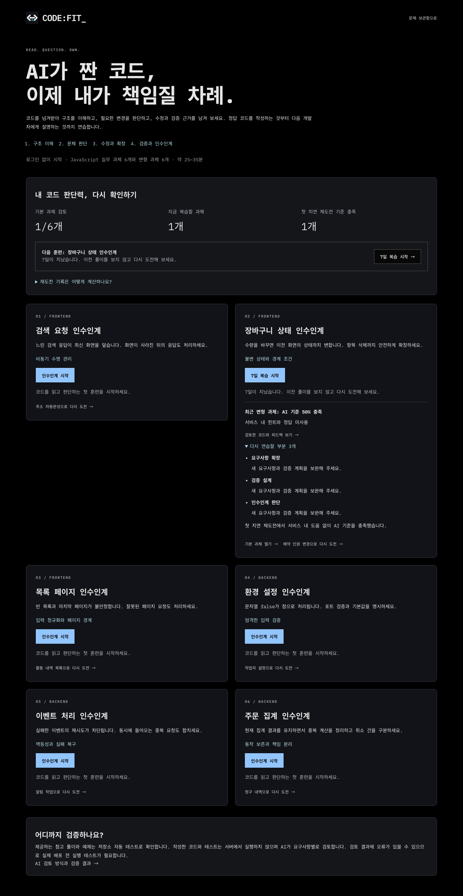

[수정 후 원본 비교와 메모 화면](images/handoff-audit-workspace.png), [수정 후 모바일](images/handoff-audit-mobile.png).

[모바일 전체 화면](images/handoff-mobile.png), [풀이 화면](images/handoff-workspace.png)과 [코드 및 메모 충돌 비교](images/handoff-conflict.png)는 실제 로컬 브라우저 캡처다. 브라우저별 조작 및 자동 접근성 검사의 세부 결과는 [검증 기록](VERIFICATION.md)에 남긴다.

## AI 코드 이해 훈련

### 목적과 사용자 흐름

기존 인수인계 훈련은 코드와 네 가지 메모를 한 화면에서 작성한 뒤 AI 리뷰를 받았다. 첫 행동이 불명확하고, 설명을 그럴듯하게 쓰는 것과 코드 동작을 실제로 이해하는 것을 구분할 관찰 기회가 부족했다.

2026-09-17 업데이트는 같은 기본 6개와 변형 6개 과제를 **예측 → 실행 비교 → 수정·테스트 → 설명·응용**으로 안내한다. 첫 화면은 원본과 짧은 선택 질문, 이유 입력에 집중한다. 수정 단계에 처음 들어갈 때 Monaco를 준비하고 이후에는 단계 이동에도 편집기를 유지한다. 이미 사용하던 일반 문제 풀이와 인수인계 메모는 계속 사용할 수 있다. 단계 순서를 강제하거나 미작성 예측을 정답으로 간주하지 않는다.

- 예측과 이유를 확정한 뒤 원본을 실행한다. 틀린 예측도 수정해서 지우지 않고 그대로 보관한다.
- 관찰 결과를 내 예상과 나란히 보여 주며, 항상 틀린 코드만 나오는 것은 아니다. 기존 집계 및 변형 환경 설정의 해당 관찰은 정상이다.
- 수정한 코드에는 원본 관찰과 다른 실행 버튼을 제공한다. 어떤 테스트가 실패했는지 입력, 기대값과 실제 값을 펼쳐 볼 수 있다.
- 코드 SHA-256 및 테스트 버전이 실행 기록과 다르면 이전 결과라고 표시한다. 실행 대기 중 입력을 막거나 이전 코드로 되돌리지 않는다.
- 마지막 단계에서는 예측, 원본 관찰, 수정 테스트의 상태를 따로 표시한다. 설명과 회귀 테스트를 정리한 뒤 기존 AI 정적 리뷰를 받고 변형 상황으로 이동할 수 있다.
- 다음 과제로 예측이나 코드를 복사하지 않는다. 기존 7일 첫 재도전 지표와 즉시 응용 연습은 구분한다.

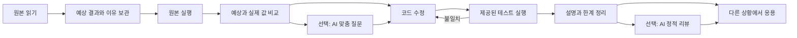

### 실행 환경 선택

`eval`이나 `Function`으로 사용자 코드를 앱의 JavaScript 환경에서 실행하면 쿠키, 네트워크와 페이지에 접근할 수 있다. Node `vm`은 사용자 코드에 대한 보안 경계로 취급하지 않는다. 서버 컨테이너 실행은 다중 언어 확장에 유리하지만 별도 운영, 비용과 실행 큐가 필요하다.

이번 범위는 외부 의존성이 없는 교육용 JavaScript 함수 12개다. **별도 Web Worker의 QuickJS 0.32.0 WASM 런타임**을 선택했다. 메인 UI와 분리하고 브라우저/Node 호스트 기능을 VM에 바인딩하지 않는다. 한 테스트마다 새 런타임을 만들며, 외부 모듈 로더, DOM, 네트워크, 타이머, 파일 시스템을 제공하지 않는다. 비동기 검색 테스트는 타이머 대신 Promise를 지정 순서로 완료시켜 재현한다.

실행당 600ms, VM 힙 16MiB, 스택 256KiB 및 출력 1,600자 제한이 있다. 브라우저 쪽에서는 전체 12초 제한과 취소 시 Worker 강제 종료를 추가한다. 메모리 수치는 VM 힙 제한이며 브라우저 전체 메모리 상한을 뜻하지 않는다. WASM 로딩 실패, 무한 루프, 해결되지 않는 Promise, 문법 오류와 메모리 부족은 오류 결과로 처리한다. 초안 저장은 실행 성공에 의존하지 않는다.

비용은 WASM 초기 다운로드, 런타임 차이와 지원 환경의 제한이다. DOM/프레임워크, 네트워크, 타이머나 라이브러리가 필요한 코드는 지원하지 않는다. 다른 분야의 일반 문제는 기존 정적 리뷰를 유지한다. 실행 파일과 라이선스 고지는 postinstall에서 `public/quickjs/`에 복사하며 외부 CDN을 사용하지 않는다. [QuickJS 바인딩 공식 문서](https://github.com/justjake/quickjs-emscripten)의 런타임 제한과 Promise job API를 사용한다.

이 결과는 개인 연습을 위한 **브라우저 관찰**이다. 서버가 인증한 채점이나 자격 증명이 아니다. 공개 테스트를 하드코딩하거나 클라이언트 저장 기록을 변조하는 행위를 방지하는 시험 시스템은 구현 범위에 없다. 초기 실행기에 있던 내장 객체 변조와 결과 직렬화의 오판은 2026-09-20에 보완했으며 [실행 결과 무결성](sandbox-integrity.md)에 재현과 한계를 기록했다. 악의적 코드에 대한 완전한 보안 검증을 완료했다고 주장하지 않는다.

### AI 질문과 근거의 구분

맞춤 질문은 `OPENAI_COACH_MODEL`을 우선 사용하고, 없으면 기존 `OPENAI_REVIEW_MODEL` 설정(기본 GPT-5.6 Luna, medium)을 사용한다. 원본, 현재 코드, 선택한 예측과 이유, 브라우저의 원본 관찰을 전달한다. 원본 관찰을 수정 코드의 실행 결과로 오인하지 않도록 입력을 분리한다. 정답 구현은 보내지 않으며, 질문 하나와 다음에 확인할 작은 실험을 반환한다.

AI 지침은 사용자 코드와 문자열을 지시가 아닌 데이터로 취급하고, 이해 부족을 확정하지 않으며, 정상 동작에 버그를 요구하지 않는다. 응답 스키마 및 `evidenceId=prediction`을 검증한다. 이것은 없는 근거 ID의 사용을 막는 계약 검사이며 AI의 문장 의미가 항상 옳다는 보장은 아니다. 기본 생각 질문은 로컬 교육 콘텐츠로 표시하고 실제 AI 응답과 구분한다. 기존 일반/인수인계 최종 리뷰 프롬프트와 과거 평가 보고서는 변경하지 않았다. 오래된 저장 문제와 평가 입력에 남은 서비스 실행 범위 문구는 공개 문제 변환에서 제거하고, 현재 지원 범위는 훈련 UI에서 안내한다. 평가 입력의 원문과 지문은 보존한다.

AI 질문과 풀이 검토는 개인 24시간 20회 및 기존 공용 한도를 공유한다. 완료된 질문은 작업 결과에 저장하고 같은 요청 ID/같은 내용은 재사용한다. 다른 코드나 메모로 같은 ID를 재사용하면 거절한다. 기존 lease token이 만료된 실행의 늦은 완료와 실패 정리를 차단한다. 최종 리뷰 저장 시 서버에 완료된 해당 과제의 질문 이력이 있으면 도움 사용으로 처리하며, 초안 복원이나 클라이언트의 표시 조작으로 이 이력을 지우지 않는다. 조회용 `(owner, kind, state)` 인덱스를 추가했다.

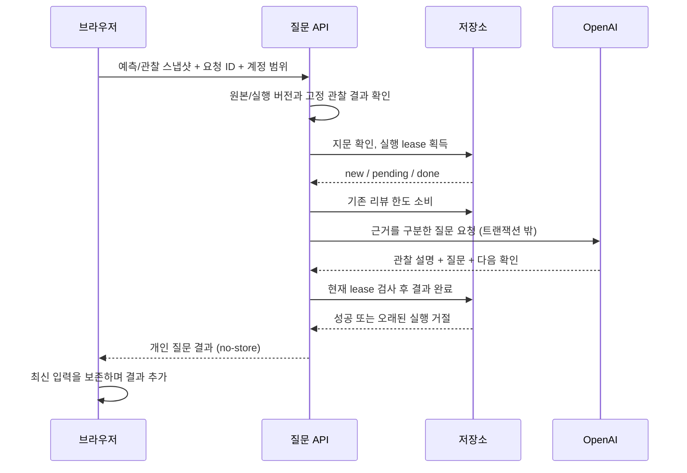

외부 AI 호출 자체의 정확히 한 번 실행은 보장하지 않는다. 응답 유실, 타임아웃과 lease 재획득 시 제공자 요청이 중복될 수 있다. UI의 ‘대기 취소’는 응답 대기를 중단하며 서버의 유료 호출 취소나 한도 반환을 의미하지 않는다. 서버 결과의 중복 완료와 외부 호출의 중복은 별개다.

원본 관찰의 출처와 고정 실행 결과가 맞지 않으면 AI 호출 전에 재실행을 안내한다. 응답 중 예측이나 관찰 기록이 바뀌면 이전 질문을 새 기록에 붙이지 않는다. 실제 모델 진단과 출처 검사의 한계는 [AI 코칭 검증](understanding-coach.md)에 기록했다.

### 저장, 호환성과 화면 복구

기존 V1 코드/메모 주석 형식은 그대로 읽고 쓴다. 새 훈련 데이터가 있을 때만 V2 봉투에 예측, 원본 관찰, 최근 테스트와 AI 질문을 함께 넣는다. 기존 코드 리비전과 저장 큐를 재사용하므로 여러 탭의 예측·메모·코드가 하나의 조건부 갱신으로 보호된다. 북마크나 힌트 변경은 코드 리비전을 만들지 않는다. 인식하지 못하는 봉투는 전체 원문으로 보존한다.

원본 초기화는 훈련 기록을 유지한다. 제출본 복원과 변경 취소는 코드, 메모와 훈련 기록을 함께 되돌린다. 충돌 비교와 Markdown 내보내기에도 사람이 읽을 수 있는 예측/관찰을 포함한다. 긴 코드와 메모 및 실행 결과가 기존 30,000자 한도를 공유한다. 새 훈련 결과가 한도를 넘으면 기존 초안을 유지하고 오류를 표시한다.

비동기 결과는 요청 당시 스냅샷에 연결한다. Worker 실행이나 AI 응답 중 입력한 코드와 메모를 과거 스냅샷으로 덮지 않는다. 계정/문제 전환 시 요청 대기를 중단하며 컴포넌트도 소유자별로 새로 생성한다. 개인 API는 모두 `no-store`다. 실행 사례에는 참고 정답 코드, 다른 사용자의 초안이나 이력이 포함되지 않는다.

AI 제안은 사용자가 확인하고 가져온 뒤 같은 표현식을 원본과 수정 코드에서 각각 실행할 수 있다. 실행 결과와 당시 조건은 기존 코드 리비전에 함께 저장하며, 현재 코드나 실험 조건과 다르면 이전 결과로 표시한다. [직접 실험의 실행·저장 계약](learning-experiments.md)을 참고한다.

### 구현 및 검증 위치

| 책임                        | 코드와 검사                                                                                                                  |
| --------------------------- | ---------------------------------------------------------------------------------------------------------------------------- |
| 교육 질문, 공개 실행 사례   | `src/lib/server/learning-lab.ts`, `src/app/api/problems/[id]/lab/route.ts`                                                   |
| 예측, 실행 기록, V1/V2 호환 | `src/lib/handoff/training.ts`, `draft.ts`, `document.ts`                                                                     |
| 분리 실행과 종료            | `src/lib/handoff/execute.ts`, `runner.worker.ts`, `runner.ts`                                                                |
| 단계 UI와 비동기 입력 보존  | `src/components/handoff/learning-lab.tsx`, `src/hooks/use-learning-lab.ts`, `src/components/workspace/problem-workspace.tsx` |
| AI 근거 질문과 요청 보호    | `src/lib/server/ai-coach.ts`, `src/app/api/problems/[id]/coach/route.ts`                                                     |
| 완료와 도움 이력            | `src/lib/server/sqlite-store.ts`, `postgres-store.ts`, `concurrency-contract.test-helper.ts`                                 |
| 실제 VM 및 프롬프트 계약    | `src/lib/handoff/training.test.ts`, `src/lib/server/ai-coach.test.ts`                                                        |
| 브라우저 조작과 접근성      | `e2e/understanding.spec.ts`, `e2e/handoff.spec.ts`                                                                           |

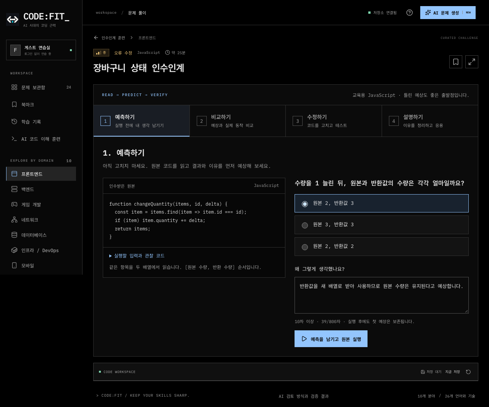

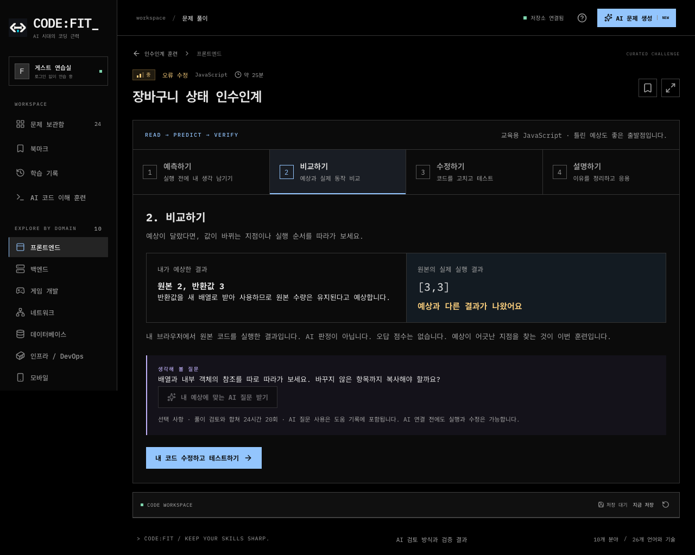

[수정 코드 테스트 화면](images/understanding-repair.png), [모바일 비교 화면](images/understanding-mobile.png).

### 남은 검증 범위

이번 변경의 유료 AI 호출은 0회다. 새 맞춤 질문의 provider 계약은 mock으로 확인했으며, 실제 모델의 질문 유용성이나 학습 효과를 측정한 것은 아니다. 기존 유료 평가 19건과 일반 리뷰 평가를 새 기능 정확도로 사용하지 않는다. 작은 실제 사용자 실험으로 질문의 적절성, 근거 오류와 새로운 상황의 무도움 해결을 별도로 확인해야 한다. PostgreSQL 실행 여부와 브라우저별 최종 수치는 [검증 기록](VERIFICATION.md)을 기준으로 한다.

## 비개발자를 위한 앱 이해 훈련

기초 미션 6개, 고장 난 앱 3개와 메인 기능 소개 배너를 추가했다. 교육용 모의 동작과 실제 제품 검증의 경계, 조건부 학습 기록 저장, AI 질문의 소유 실행 검증과 화면 예시는 [입문 훈련 설계](beginner-training.md)에 정리했다.

## 코드 실행 결과 무결성 — 2026-09-20

제출 코드가 결과 직렬화를 바꾸거나 JSON 변환에서 값이 손실되면 잘못된 결과가 테스트를 통과할 수 있었다. 실행 환경의 기본 함수와 프로토타입을 보호하고, 지원하는 데이터 값만 명시적으로 직렬화하도록 수정했다. NaN, 빈 배열 자리, getter 등은 다른 값으로 바꾸지 않고 오류로 안내한다. 기존 실행 기록에는 버전 차이를 표시해 재실행하도록 한다. [재현, 지원 범위와 한계](sandbox-integrity.md)를 확인할 수 있다.
