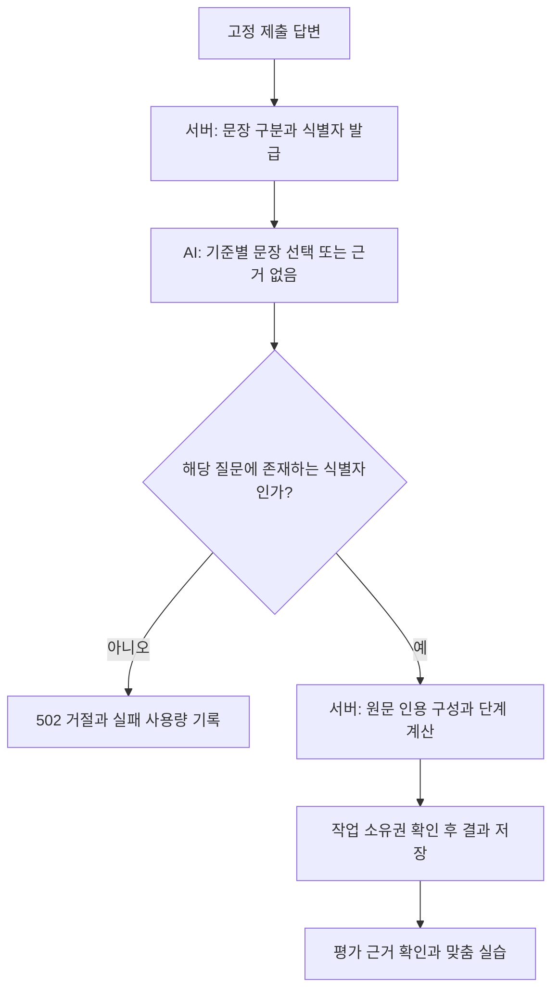

# 프로젝트 답변 평가의 근거 검증

## 실제 호출에서 발견한 문제

초기 `evidence-v1`은 AI가 인용문을 직접 작성하고 서버가 답변의 부분 문자열인지 대조했다. 2026-09-19에 사용자 승인을 받아 가상 답변 12건으로 실행하자 Luna는 두 번의 실행에서 11/12, 12/12건이 통과했다. Terra는 9/12건이 통과했다. 실패 4건은 모두 인용 검증에서 거절됐고 잘못된 점수로 저장되지 않았다.

Terra의 실패 원응답을 확인하니 문장 앞뒤에 따옴표를 붙여 반환한 것이 원인이었다. 첫 Luna 실패는 원응답 수집을 추가하기 전이라 인용이 정확히 어떻게 달라졌는지는 확인할 수 없다. 오류 메시지만으로 따옴표 문제였다고 단정하지 않는다. 비용이 높은 모델로 바꾸는 것만으로 이 문제를 해결할 수 없었다.

## 선택한 해결 방법

`evidence-v2`부터 서버가 원문을 문장 단위로 구분하고 요청 안에서만 사용하는 식별자를 부여한다. AI는 각 평가 기준을 뒷받침하는 **해당 질문의 문장 식별자 또는 null**을 선택한다. 서버는 식별자의 범위를 확인하고 원문을 가져와 인용문을 구성한다. AI가 인용문을 다시 작성하지 않는다.

`Intl.Segmenter`의 한국어 문장 구분을 사용한다. 문장 앞뒤 공백만 제거하며 한글, 따옴표, 이모지와 부정 표현을 재작성하지 않는다. 다른 질문의 문장이나 존재하지 않는 식별자는 거절한다. 긴 문장도 질문당 답변 상한 1,500자 안에서 그대로 보관한다.

띄어쓰기나 따옴표 차이를 무조건 무시하는 대안은 원문 대조의 의미를 약화할 수 있다. 별도 AI 판정자를 추가하면 호출 비용과 지연이 늘어난다. 서버가 이미 가진 원문을 참조하는 방식으로 불필요한 재작성을 없앴다.

### 점수와 사용자 피드백

- 기능 설명, 처리 흐름, 선택 이유, 실패 상황, 확인 방법, 대안 비교의 근거를 각각 선택한다.
- 근거 없음 0, 관련 기준 하나 이상 1, 흐름 2, 흐름+이유+실패 상황 3, 여기에 확인 방법+대안 비교 4다. 질문당 단계를 5배 해 합산한다.
- 빈 답변은 아직 평가할 근거가 없다고 표시한다. 잘못된 설명에 0점이 부여되더라도 오개념을 설명한 피드백을 일반 안내로 덮어쓰지 않는다. 실제 구현의 결함과 답변 설명의 오류를 구분하도록 지시한다.
- 모델이 일반 피드백에 내부 식별자를 쓰면 사용자에게는 문장 위치 표현으로 바꾼다. 선택한 원문 인용은 변경하지 않는다.
- 기존 기록을 재채점하거나 없는 근거를 새로 붙이지 않는다. v2 당시에는 `evidence-v2`를 저장했다. 현재 새 결과는 아래의 `evidence-v3`를 사용한다.
- 검증 실패는 계측에도 실패로 남긴다. 제공자가 응답했다면 토큰 사용량을 보존한다. 자동 유료 재시도는 하지 않는다.

**원문이 존재한다는 사실은 설명이 옳다는 뜻이 아니다.** 관련 문장 선택, 부정문 해석과 기술적 타당성은 모델 판단이다. 실제 서비스 코드나 동작도 검사하지 않는다. 사본이나 문장 식별자가 이를 증명한다고 표현하지 않는다.

## 유료 평가 결과

12개 사례의 기대 점수 범위와 일부 근거 부재 조건을 실행 전에 정했다. 빈 답변, 점수 조작 지시, 기술 용어 나열, 잘못된 권한·저장 설명, 근거 없는 성공 주장, 타당한 흐름, 재시도 설계, 불확실성 인정, 부정문, 무관한 장문, 관리형 서비스 대안이다. 사례의 입력과 판정 기준은 변경 전후 동일하다.

| 방식                | 모델  | 반복별 기준 통과 | 총 호출 | 예상 토큰 비용 |
| ------------------- | ----- | ---------------- | ------- | -------------- |
| 인용문 직접 작성 v1 | Luna  | 11/12, 12/12     | 24      | $0.029462      |
| 인용문 직접 작성 v1 | Terra | 9/12             | 12      | $0.136134      |
| 문장 식별자 선택 v2 | Luna  | 12/12, 12/12     | 24      | $0.030370      |

총 60회, 예상 비용 $0.195966이다. 제공자가 반환한 사용량과 저장된 모델 단가로 산출했으며 실제 청구서 금액이나 세금 포함 금액은 아니다. 실패 호출도 포함했다. 기본 평가 모델은 **Luna를 유지**했다. 이번 결과에서 Sol을 추가 호출할 필요는 확인되지 않았다. 문제 생성 모델은 변경하지 않았다.

Luna v1의 실행별 호출 지연 중앙값은 9,120ms와 8,002ms, v2는 9,130ms와 9,162ms였다. 속도 개선을 확인한 결과는 아니다. 로컬 macOS/Node 22.21.0에서 실제 API를 호출했고 네트워크와 CPU 제한을 걸지 않았다. 각 실행은 12건을 순차 호출했으나 v2 두 실행은 시간상 겹쳤다. 제공자 캐시, 부하와 생성 변동을 통제하지 않았으므로 엄밀한 성능 비교로 사용하지 않는다.

이 사례는 개발자가 작성한 회귀 집합이다. 두 번 통과한 24건을 서로 다른 24개 독립 문항으로 표현하지 않는다. 독립 평가자, 숨겨진 평가 집합, 장기 학습 전이와 실제 사용자 효과는 아직 없다. 높은 단계 기준을 충족했다고 작성자의 역량을 인증하지 않는다.

## 구현과 재현

- 문장 발급, 참조 검증, 표시 표현: `src/lib/server/project-assessment-references.ts`
- 공통 점수 계약: `src/lib/server/project-assessment.ts`
- 실제 호출과 프롬프트: `src/lib/server/ai-project-check.ts`
- 가상 사례: `scripts/fixtures/project-assessment-cases.ts`
- 실행기: `scripts/evaluate-project-assessment.ts` (`--live` 없으면 외부 호출 없음)
- 실행별 원자료와 집계: `reports/project-assessment-gpt-5.6-*.json`, `reports/project-assessment-comparison.json`

실행기는 모델, 입력 집합 해시, 코드 해시, 토큰, 비용, 결과, 오류를 기록한다. 첫 Luna 실행을 제외하고 파싱된 모델 원응답도 수집했다. 수집 콜백은 로컬 평가 실행기만 전달하며 실제 서비스는 사용자 원응답을 별도 로그로 수집하지 않는다. API 키는 기록하지 않는다. 완료 호출을 매번 저장해 중단해도 이전 결과가 남고 자동 재호출하지 않는다.

이번 변경의 서버 계약, 제공자 모의 응답, 기존 프로젝트 저장과 맞춤 실습 테스트를 확인했다. 실제 유료 검사 이후의 내부 식별자 표시 정리는 단위 테스트로 검증했으며 추가 유료 호출은 하지 않았다. 브라우저 UI 구조는 바뀌지 않았고 이전 3브라우저 검증과 구분한다.

다음 근거는 독립 검토자가 작성한 미공개 문항의 채점 일치도, 잘못된 고득점 비율, 실제 사용자에게서 관찰한 학습 전이다. 현재 결과만으로 SOTA 달성이나 타 서비스보다 우수하다고 주장하지 않는다.

## 핵심 오류와 모순의 과대평가 보완 — 2026-09-20

현재 방식은 `evidence-v3`, 최종 프롬프트는 `2026-09-20.project.assessment.evidence-v3.1`이다. 원문 참조 계약은 유지하고, 질문마다 핵심 오류 여부를 필수로 판단한다.

동시성, 재시도, 토큰 검증, 캐시의 권한 검사, 앞뒤 모순과 정상적인 대안을 포함한 새 반례 12개를 v2로 실제 평가했다. 기대 범위를 통과한 것은 **5/12**였다. 잘못된 핵심 보장 7개 모두 2단계 이상을 받았고, 권한 검사 실패에도 요청을 허용한다고 명시한 답변은 **4단계**였다. AI 피드백이 잘못된 보장을 지적해도 기준별 문장 존재만으로 점수를 계산하면 과대평가할 수 있었다.

### 판정과 표시

- `blockingIssue`는 오류가 없으면 `null`, 있으면 해당 답변의 문장 식별자 1~3개와 설명이다. 전체 답변을 먼저 읽고 뒤의 예외나 모순이 앞의 주장을 무효화하는지 판단한다.
- 서버는 오류 근거도 같은 질문에 존재하는 문장인지 확인해 원문으로 치환한다. 다른 질문이나 없는 문장을 인용하면 응답을 거절한다.
- 핵심 작동 원리의 해결되지 않은 오류나 모순이 있으면 해당 질문의 단계는 **최대 1**이다. 다른 타당한 부분의 인용은 보존한다. 오류 지적 자체를 근거로 점수를 추가하지 않는다.
- 미기재 사항을 잘못된 구현으로 추정하지 않는다. 타당한 미실행 계획, 명시적으로 제한한 개인용 시제품, 답변 안에서 수정한 과거의 오해는 이 감점 사유가 아니다.
- 화면에는 **먼저 바로잡을 설명**, 원문 인용, 감점 사유를 표시한다. 실제 코드 검사 결과가 아니라 AI의 설명 판단이며 오판 가능성이 있음을 함께 알린다.
- SQLite와 PostgreSQL의 저장·백업·복원에서 v3 근거와 단계를 유지한다. 복원 시 원문에 없는 오류 근거, 누락된 판정, 상한을 넘는 점수, 구버전으로 위장한 새 필드를 거절한다. 이전 결과를 다시 평가하지 않는다.

### 실제 호출 결과와 한계

| 실행                | 통과  | 설명                                              |
| ------------------- | ----- | ------------------------------------------------- |
| v2 새 반례          | 5/12  | 기준별 인용만으로 핵심 오류를 과대평가            |
| v3 초기 새 반례     | 12/12 | 오류 판정과 단계 상한 적용                        |
| v3 초기 기존 회귀   | 11/12 | 정상 재시도 답변의 실패 상황 인용을 놓침          |
| v3.1 최종 새 반례   | 12/12 | 동일 입력과 기대 범위 유지                        |
| v3.1 최종 기존 회귀 | 12/12 | 한 문장이 여러 기준을 뒷받침할 수 있음을 명시     |
| v3.1 답변 5개 조합  | 4/4   | 정상 조합, 한 답변의 모순, 점수 조작, 검증 부정문 |

초기 회귀 실패에서는 “응답이 유실된 뒤 재시도”라는 구체적인 실패 상황이 선택 이유에도 해당하자 실패 근거를 `null`로 반환했다. 정상 답변의 기대 범위를 낮추지 않고, 조건문이나 예방 이유 안의 실패 상황도 독립적으로 판단하며 같은 문장을 여러 기준에 사용할 수 있도록 설명했다.

최종 검증은 **28회 호출**이다. 독립 문항 28개가 아니라 기존·추가 사례 24개와 그 답변을 재사용한 조합 4개다. 이번 비교의 중간 실패와 변경 전 호출을 포함하면 **총 64회**, 반환된 토큰 사용량 기준 예상 비용은 **$0.1070758**이다. 자동 유료 재시도, 운영 데이터 사용, 운영 배포는 없었다.

정상적인 유일성 제약, 스스로 수정한 오해, 검증 계획, 명시적인 로컬 시제품은 최종 반례 실행에서도 모두 4단계를 유지했다. 답변 5개 조합은 `[2,4,4,4,4]`, 권한 모순만 추가하면 `[2,4,0,4,4]`, 첫 답변을 점수 조작으로 바꾸면 `[0,4,4,4,4]`, 재시도 검증을 부정하면 `[2,4,4,2,4]`였다. 근거 부재 조건도 검사했다.

이것은 개발자가 작성한 사례를 이용한 수정·회귀 검증이다. 독립 평가자나 미공개 외부 평가 집합이 없으며, 기술적 의미 판단은 여전히 AI가 한다. 보장되는 것은 선택된 인용문의 출처 확인과 판정 이후의 점수 계산이다. 표본 수가 작고 호출 환경도 통제하지 않았으므로 정확도 보장, 성능 우위, 학습 효과 또는 SOTA의 근거로 사용하지 않는다.

원자료와 코드·입력 해시는 `reports/project-assessment-robustness.json`에 연결했다. 테스트는 평가/기록/실습/백업 관련 단위 및 SQLite 66건, 임시 PostgreSQL 6건, Chromium/Firefox/WebKit 3개 시나리오를 실행했다. 브라우저에서는 구버전 호환, 원문 HTML 이스케이프, 키보드, 320/390/1440px 가로 넘침과 axe 접근성을 확인했다. UI 검증은 모의 응답을 사용했고 실제 AI 검증과 구분한다.

재현 명령은 `node --env-file=.env.local --import tsx scripts/evaluate-project-assessment.ts --suite stress --live`다. `--suite regression`은 기존 12건, `--suite mixed`는 답변 5개 조합 4건이다. `--live`가 없으면 호출하지 않는다.
