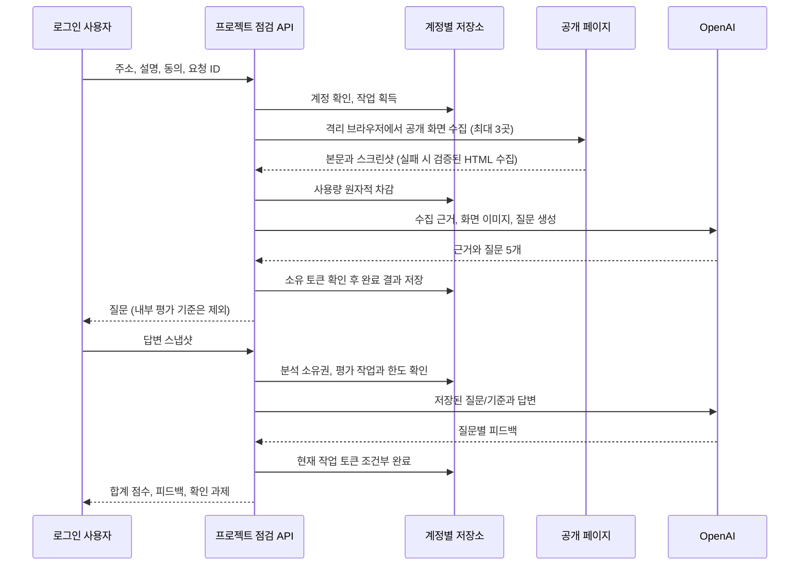

# 내 프로젝트 이해도 점검

서비스 링크를 등록하면 공개 페이지에서 확인한 기능에 맞춰 설계 질문 5개를 만들고, 사용자의 답변에 드러난 이해도를 평가한다. `/project-check`에서 시작하며 가입자만 분석과 평가를 요청할 수 있다. 기존 인증, OpenAI 키와 SQLite/PostgreSQL을 사용한다.

답변 평가 후에는 자기 프로젝트의 확인 과제를 기록하고, 원답을 보관하면서 같은 질문에 보완 답변을 추가해 평가를 비교할 수 있다. 확인 기록 저장은 AI를 호출하지 않으며 보완 답변의 재평가는 평가 한도를 사용한다. 기초 개념을 연습하고 싶다면 [공통 예제 실습과 확인 문제](project-learning.md)를 선택할 수 있다. 이 예제는 프로젝트마다 새로 생성한 실습이 아니다.

새 답변 평가는 [인용 근거 검증과 품질 평가 기준](project-assessment.md)을 따른다. 기존 저장 결과는 재채점하지 않는다.

## 질문과 평가의 범위

- 격리된 브라우저에서 자바스크립트를 실행하고 최대 3개 공개 HTTPS 페이지의 본문과 상단 스크린샷을 수집한다. 같은 출처의 공개 링크만 제한적으로 따라가며 스크롤과 접기 항목 펼치기 외에 임의 버튼 클릭, 폼 제출이나 로그인을 하지 않는다. 서비스 전체, 로그인 뒤의 화면, 소스 코드, DB와 서버 구성은 검사하지 않는다. 수집 범위와 실패 시 전환은 [공개 프로젝트 화면 수집](project-browser.md)을 따른다.
- 사용 흐름, 데이터 저장, 접근 권한, 오류 대응, 설계 선택을 하나씩 묻는다. 공개 페이지 인용, 사용자가 작성한 설명, 화면으로 확인할 수 없는 설계를 구분한다. 인용은 실제 입력의 부분 문자열인지 서버에서 검사한다.
- 브라우저 수집에 실패하면 HTML과 사이트 소개 정보로 전환한다. 여기에도 내용이 부족하면 120자 이상의 보완 설명이나 소개 페이지를 요청한다. HTML 안의 오류 문구를 실제로 표시된 오류로 단정하지 않으며, 근거가 부족한 상태에서 서비스를 읽었다고 가장하지 않는다.
- 답변당 0~4단계: 근거 없음, 기능 식별, 흐름 설명, 이유와 실패 상황, 구체적인 확인 방법과 대안 비교. 서버가 합계 100점을 계산하며 미답변은 평가 근거 없음으로 표시한다. 특정 기술이나 벤더를 정답으로 정하지 않는다.
- 평가 점수는 이 답변에서 설명한 내용의 구체성이다. 코드 실행, 제품 보안, 작성자의 전체 개발 실력이나 학습 효과를 인증하지 않는다. 실제 모델의 질문 품질과 평가 일관성은 별도 사용자 평가가 필요하다.

## 이용 한도와 비용 추정

기본 분석 모델은 `OPENAI_PROJECT_MODEL=gpt-5.6-sol`, 답변 평가 모델은 `OPENAI_PROJECT_REVIEW_MODEL=gpt-5.6-luna`다. 두 단계 모두 medium 추론을 사용하며 출력 예산에는 추론 토큰도 포함된다. 기존 코딩 문제 생성과 풀이 검토 모델 설정은 유지한다.

2026-09-18 공식 모델 페이지 기준, 100만 토큰당 [Sol](https://developers.openai.com/api/docs/models/gpt-5.6-sol)은 입력 $4, 출력 $20이며 프로모션 가격이다. [Luna](https://developers.openai.com/api/docs/models/gpt-5.6-luna)는 입력 $0.20, 출력 $1.20이다. 아래 범위는 비용 상한이 아니다.

아래 표는 스크린샷 수집을 추가하기 전 HTML 텍스트 입력을 기준으로 한 과거 설계 추정이다. 현재 경로는 최대 3개 화면의 본문과 이미지를 질문 생성에 함께 보내므로 이 표를 현재 비용 범위로 사용하면 안 된다. 이미지 토큰과 Sandbox 수집 비용은 실제 사용량에서 별도로 확인해야 한다. 아래는 실제 유료 호출 측정이 아닌, 한국어 공개 소개문과 5개 답변 길이를 가정한 설계 추정이다. 토큰화, 답변 길이와 추론량에 따라 달라진다. 캐시 할인과 세금, Vercel/DB 비용은 포함하지 않는다.

| 단계                        | 예상 입력 토큰 | 예상 출력 토큰 | 예상 AI 비용    |
| --------------------------- | -------------- | -------------- | --------------- |
| 공개 페이지 분석과 질문 5개 | 2,000~6,000    | 1,500~4,000    | $0.038~$0.104   |
| 답변 5개 평가               | 2,000~5,000    | 1,500~6,500    | $0.0022~$0.0088 |
| 프로젝트 1건 완료           | 4,000~11,000   | 3,000~10,500   | $0.0402~$0.1128 |

브라우저 수집은 페이지당 본문 10,000자와 JPEG 한 장을 최대 3곳에서 보관하며, 질문 생성 입력에 화면별 URL과 본문을 합쳐 전달한다. HTML 대체 경로는 본문과 소개를 합쳐 최대 12,000자다. 설명 2,000자, 답변 질문당 1,500자 제한은 유지한다. 위 입력 범위는 상한이 아니므로 긴 한국어 입력에서는 증가한다. 출력은 호출별 4,000/6,500 토큰으로 제한한다. 2026-09-19에 평가 근거 인용을 추가하며 평가 출력 한도를 4,200에서 6,500으로 늘렸다. 위 비용은 기존 날짜의 단가로 다시 계산한 설계 추정이며 실제 사용량 측정이 아니다. 모델이 출력 예산 안에 구조화 응답을 끝내지 못하면 오류로 처리하고 임의의 평가로 대체하지 않는다.

현재 정책은 **비로그인 분석 2회와 평가 2회, 로그인 분석 5회와 평가 12회/24시간**이다. 첫 사용 시점부터 각각 초기화한다. 최초 답변을 보관하면서 같은 질문에 최대 3번 보완 제출본을 추가할 수 있다. 보완 제출본 준비는 AI 호출과 분석 한도를 사용하지 않으며, 재평가는 평가 한도에 포함된다. 실패한 유료 호출도 평가 및 분석 횟수에 포함된다. 문제 생성은 별도로 비로그인 2회, 로그인 6회이며 한국 시간 자정에 초기화한다. 위 비용 계산은 과거 텍스트 입력 조건의 참고값으로 현재 화면 수집 비용이나 한도 전체 사용 비용을 나타내지 않는다. 비로그인은 접속망별로도 분석과 평가 각 2회/24시간을 적용한다.

이 가격만으로 2회 제한이 필수인 것은 아니다. 한 번의 질문을 끝까지 설명하는 학습 흐름과 초기 서비스 공용 예산을 고려한 보수적 시작값이다. 첫 실제 사용 데이터를 모은 뒤 성공률, 입력/출력 토큰, 95백분위 비용과 질문 완료율을 확인해 조정한다. 현재 기록은 토큰/응답 시간/성공 여부이며, 질문 완료율 대시보드를 새로 구현한 것은 아니다.

- 개인 한도 외 접속망당 분석 10회/평가 20회/24시간, 기존 AI 전체 40회/시간 및 100회/24시간을 함께 적용한다.
- 주소 읽기는 개인 5회/분, 접속망 20회/분으로 제한한다.
- 페이지 읽기 실패와 근거 부족은 AI 한도를 차감하지 않는다. AI 호출 전 한도를 원자적으로 소비하며, 호출을 시작한 뒤 실패하거나 응답이 유실돼도 환급하지 않는다. 외부 호출 비용 발생 여부를 확정할 수 없기 때문이다. 자동 유료 재시도는 없다.
- 같은 요청 ID와 같은 입력의 완료 결과는 재사용한다. 진행 중 중복 요청은 409로 알리고 같은 ID를 다른 내용으로 재사용하면 거절한다. 수동 재시도는 이전 입력을 보존한다.
- `ai_runs`에 project 작업의 실제 모델, 입력/캐시/출력 토큰, 예상 달러 비용과 지연 시간을 기록한다. URL이나 답변을 로그에 출력하지 않는다.

## 데이터와 주소 수집

DB 트랜잭션을 외부 호출 동안 유지하지 않는다. 기존 jobs의 소유 토큰과 입력 지문을 재사용하고, 결과를 같은 행에 조건부 완료하므로 늦은 응답이나 동시 완료가 다른 실행의 결과를 덮어쓰지 못한다. 완료된 프로젝트 jobs는 **영구 개인 기록**으로 취급하며 만료 시각이 지나도 삭제하지 않는다. 정리 작업을 도입할 때 완료된 project-analysis/project-review 행을 지우면 안 된다. SQLite→PostgreSQL 이관에는 이 완료 행만 포함하고, 진행 중 작업과 관련 없는 AI 작업은 복사하지 않는다.

분석 기록은 최신순으로 20개씩 불러온다. 이전 기록 더 보기와 분석 ID별 직접 링크를 지원하며, 새로고침과 브라우저 뒤로 가기에서도 선택한 기록을 유지한다. 기록을 선택하면 목록을 접어 질문과 실습에 집중할 수 있다. 질문·분석 근거·최종 답변과 평가는 계정별로 보관하며 다른 계정은 조회/삭제할 수 없다. 주소와 서비스 설명, 진행 중인 분석 요청 ID는 계정별 sessionStorage 키에 저장한다. 전송 동의는 저장하지 않고 새로고침 후 다시 확인한다. 미제출 답변과 현재 질문 위치는 계정과 분석 ID를 포함한 sessionStorage 키에 저장한다. 계정을 전환하면 이전 화면을 숨기고 새 계정 자료로 교체한다. 제출 이후 답변을 고정해 응답 유실 시 같은 내용으로 재시도한다. 점검 기록 삭제 시 관련 평가 작업도 함께 삭제한다. 학습 기록 백업 v3와 DB 전체 백업에 포함한다. 사용자 백업에는 완료된 분석·평가와 고정된 학습 문항을 포함하며 실행 중인 요청과 브라우저 미제출 초안은 제외한다. [백업 계약](workspace-backup.md)을 참고한다.

입력 주소는 HTTPS 443, 도메인 이름만 허용한다. 사용자 정보, 쿼리, fragment, IP 직접 입력과 내부 이름은 거절한다. 브라우저 경로의 네트워크 제한은 [화면 수집 문서](project-browser.md)를 따른다. 다음 제한은 HTML 대체 수집 경로에 해당한다. DNS A 레코드의 모든 주소가 공개 IPv4인지 검사한 뒤 소켓 연결에 검증한 주소를 고정한다. TLS 인증은 원래 호스트 이름으로 유지한다. IPv6 전용 사이트는 현재 지원하지 않는다. 리다이렉트는 최대 2회이며 매번 다시 검증한다. 쿠키와 인증 헤더는 보내지 않는다. 전체 수집 12초, HTML 600KB 제한, 압축 응답 거부, 스크립트/스타일/템플릿 제거를 적용한다. 페이지의 지시문은 모델 권한으로 해석하지 않으며 AI에는 브라우저나 실행 도구를 주지 않는다. 입력은 신뢰하지 않는 데이터로 분리하고, UI는 HTML을 실행하지 않고 React 텍스트로 표시한다.

## 구현과 검증 위치

- 페이지: `src/app/project-check/`, `src/components/project-check/`, `src/styles/project-check.css`
- API와 정책: `src/app/api/project-check/route.ts`, `project-check-service.ts`, `src/lib/project-check/types.ts`
- 수집과 AI: `src/lib/server/project-page.ts`, `ai-project-check.ts`
- 저장: `src/lib/server/project-check-store.ts`, 기존 `jobs`, `limits`, `ai_runs`
- 단위/SQLite: `project-check.test.ts`, `project-page.test.ts`, `project-fetch.test.ts`, `project-route.test.ts`, `ai-project-check.test.ts`
- 공유 DB 계약: `project-contract.test-helper.ts`. PostgreSQL 검사에서는 기존 격리 스키마/복수 연결을 사용한다. 로컬 TEST_DATABASE_URL이 없을 경우 미실행으로 기록한다.
- 브라우저: `e2e/project-check.spec.ts`. 가입자 질문/평가 화면의 AI 응답은 합성 fixture다. 실제 모델 품질이나 실제 서비스 수집 결과로 표현하지 않는다.
- [질문 화면](images/project-check-questions.png), [평가 화면](images/project-check-result.png). 로컬의 합성 예약 서비스 예시로 실제 UI를 캡처했다.

## 학습 기록 탐색과 계정 복구 — 2026-09-19

완료된 분석의 `(expires, id)`를 내림차순 커서로 사용한다. 완료된 작업의 `expires`는 고정된 작업 시작 기준 시각이며, 오래됐다고 완료 기록을 만료시키지 않는다. 같은 시각의 기록도 ID로 구분하고 커서가 가리키던 기록이 삭제되거나 새 분석이 추가돼도 다음 페이지가 밀리지 않는다. 생성 시각으로 재정렬하지 않아 서버 쿼리와 화면 순서를 일치시킨다. 관련 복합 인덱스는 기존 스키마 초기화에서 추가한다.

`GET /api/project-check/[id]`는 현재 로그인 계정과 화면의 계정 범위를 검사하고, 본인 기록만 반환한다. 원문 HTML 텍스트, 내부 평가 기준, 맞춤 학습의 정답 스냅샷은 반환하지 않는다. 삭제 또는 다른 계정의 링크는 동일한 404로 처리한다. 목록 조회는 `nextCursor`를 반환하며 기본 20개 응답 계약은 유지한다.

화면의 최초 조회와 포커스 복귀 조회는 이전 계정의 공통 헤더를 보내지 않고 현재 세션을 확인한다. 계정이 바뀌면 선택 링크를 비우고 계정별 컴포넌트를 교체한다. 저장과 상세 조회는 계속 명시적인 계정 범위를 요구한다. 늦은 조회 응답은 취소 여부를 검사하며, 계정별 초안은 기존 sessionStorage 키를 유지한다.

분석의 불확실한 실패는 같은 요청 ID로 재시도한다. 성공을 확인하거나 사용자가 새 프로젝트 점검을 시작하면 다음 분석에 새 ID를 발급한다. 따라서 같은 URL과 설명으로도 페이지를 다시 분석할 수 있다. 새 분석은 기존과 동일하게 한도를 사용한다. 같은 탭의 새로고침 후에도 입력과 진행 중인 요청 ID를 복원한다. 탭을 완전히 닫은 뒤의 복원은 보장하지 않는다. 주소나 설명을 수정하면 새 요청 ID를 사용한다.

## AI 요청과 입력 편의

프로젝트 설명과 각 설계 답변에서 기존 Web Speech API 음성 입력을 사용할 수 있다. 직접 입력한 내용을 유지하며 확정된 인식 결과만 길이 제한 안에서 덧붙인다. 질문 이동, 제출, 화면 이탈 시 음성 입력을 종료하고 늦은 이벤트를 무시한다. 미지원 브라우저는 직접 입력을 제공한다.

AI 요청 중에는 실제 경과 시간을 표시한다. 진행률이나 서버 처리 단계를 추정하지 않는다. 응답이 끊겼을 때 ‘저장된 분석 결과 확인’ 또는 ‘저장된 평가 결과 확인’으로 기존 상세 조회 API를 호출할 수 있다. 조회는 AI를 다시 호출하지 않으며 AI 연결이나 남은 이용 횟수와 무관하게 가능하다. 저장된 결과가 없다는 사실만으로 실행 실패를 확정하지 않는다.

생성·평가 성공 후 이용 횟수 갱신이 실패하면 결과를 유지하고 별도 안내를 표시한다. 갱신 응답은 확인된 결과를 오래된 목록으로 덮어쓰지 않는다. `e2e/project-assistance.spec.ts`는 초안 복원, 요청 ID 유지, 계정 전환, 결과 복구, 음성 이벤트 수명과 모바일 접근성을 검증한다. 음성 인식과 브라우저 테스트의 AI 응답은 모의 데이터다.

로그인 전에는 비공개 메모 서비스를 소재로 질문, 답변, 보완 피드백과 후속 실습 예시를 볼 수 있다. 설명용 예시임을 표시하며 실제 AI 응답이나 사용자 사례로 취급하지 않는다. 홈과 입력 화면에서 비로그인 분석 2회 및 로그인 후 증가하는 한도를 안내하며, 예시를 열지 않고 바로 실제 분석을 시작할 수 있다.

브라우저 수집 실패 시 HTML 대체 경로에서는, 자바스크립트로 화면을 구성하는 서비스도 `description`, `og:description`, `twitter:description` 중 40자 이상의 공개 소개 정보가 있으면 이를 근거로 분석할 수 있다. 중복 메타 태그를 합쳐 내용 길이를 부풀리지 않는다. 본문이 200자 미만이면 `limited`를 유지하고, 메타 소개로 보완한 경우 `source: metadata`를 기록해 결과 화면과 AI 입력에서 근거의 한계를 명시한다. 본문과 소개 모두 부족하면 사용자 설명 120자 이상을 요구하며 AI 한도를 차감하지 않는다. 이 HTML 대체 경로에서는 자바스크립트 실행이나 외부 하위 리소스 수집을 하지 않으며 기존 DNS 검증과 연결 제한을 유지한다. 기본 브라우저 수집 경로와 구별해야 한다. 이전 백업에는 `source`가 없어도 복원할 수 있다.

## 프로젝트별 확인 계획 — 2026-09-21

새 답변 평가에는 질문마다 목표, 테스트 준비 조건, 2–4단계의 조작과 기대 결과, 완료 근거를 요구한다. 실제 프로젝트의 저장 구조, 권한과 설계 선택에 연결하고 확인하지 않은 구현을 단정하지 않도록 지시한다. 피드백의 원문 인용 검증과 점수 계산은 기존 계약을 유지한다.

확인 과제는 오해가 기록된 항목과 이해 수준이 낮은 항목부터 표시한다. 빈 기록에 계획 양식을 넣어도 실제 결과 칸은 미작성이고 상태는 확인 예정으로 남는다. 사용자는 관찰한 결과를 직접 저장하고 기존 보완 답변 흐름으로 이어갈 수 있다. 내보내기에는 질문, 답변, 평가, 계획과 현재 입력한 기록을 포함한다. 저장하지 않은 초안도 포함되므로 다른 사람에게 공유하기 전에 내용을 확인해야 한다.

계획은 선택 필드로 저장하여 과거 평가와 백업 v3를 계속 읽는다. 새 AI 응답에는 계획을 필수로 요구하며 백업과 복원에도 보존한다. 계획은 AI의 제안이고 코드핏이 실제 프로젝트에서 실행한 결과가 아니다. report.test.ts, workspace-backup.test.ts, ai-project-check.test.ts, e2e/workbench-upgrade.spec.ts가 해당 계약을 확인한다.
