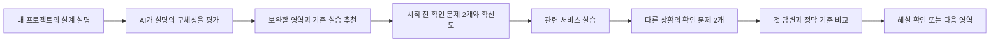
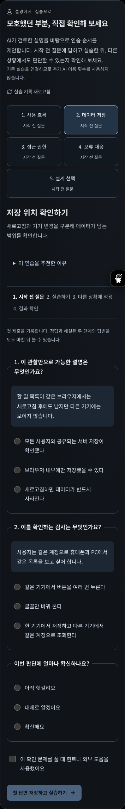
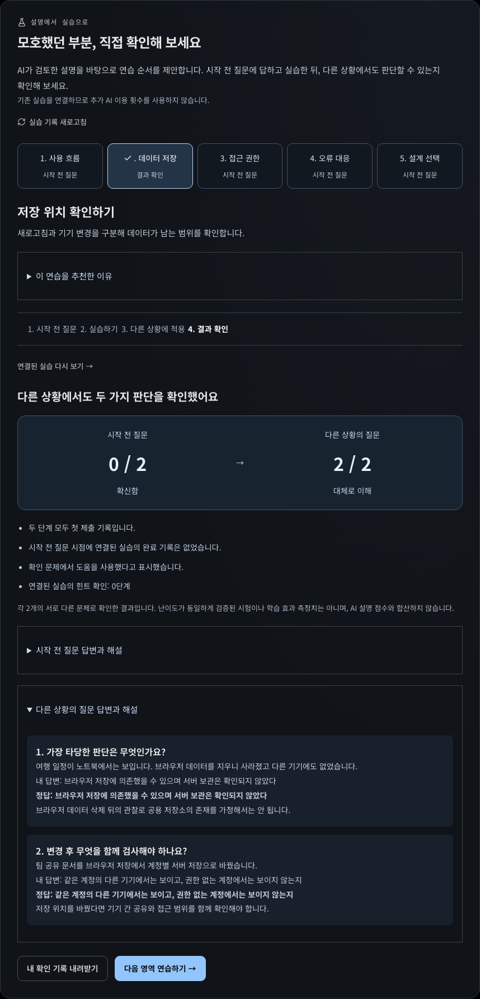
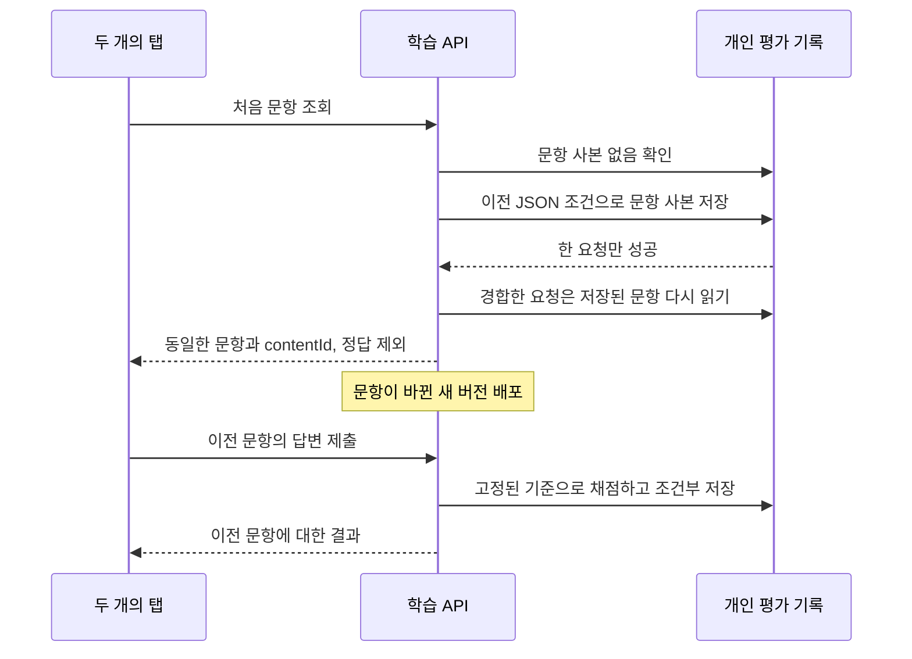

# 프로젝트 점검에서 실습과 확인까지

## 제품 목표와 이번 구현 범위

AI로 서비스를 만들었지만 동작 원리를 설명하기 어려운 사용자가, 설명에서 드러난 부족한 부분을 직접 실습하고 다른 상황에 적용하도록 연결한다. 새 AI 기능의 개수보다 **어떤 판단을 했고, 무엇을 확인했으며, 다른 상황에서도 적용했는가**를 남기는 것이 목적이다.

이 구현만으로 SOTA나 학습 효과를 입증한 것은 아니다. 이번 범위는 기존 프로젝트 질문·평가를 실제 학습 과정과 연결하고, 후속 비교 평가를 위한 근거를 보관하는 첫 단계다. 공개 HTML 분석을 소스 코드·런타임 검사로 확대하지 않는다.

### 제품 흐름

- AI 설명 점수가 낮은 영역부터 안내한다. 사용자 실력의 확정 진단이나 별도 AI 계획 에이전트가 아니다. AI의 의미 평가와 서버의 명시적인 연결 정책을 분리했다.
- 사용 흐름, 데이터 저장, 접근 권한, 오류 대응, 설계 선택의 5개 영역에 각각 기존 실습 하나와 확인 문제 4개를 연결한다. 총 20개 문항은 버전 1의 고정 저작 콘텐츠다.
- 새로운 AI 호출을 추가하지 않는다. 기존 분석·평가의 로그인 및 이용 한도를 유지하고, 그 이후 실습 연결과 확인 문제는 추가 차감 없이 이용한다.
- 각 단계의 첫 제출을 고정한다. 시작 전 정답과 해설은 다른 상황의 문제까지 답한 뒤 공개한다. 실습 전후에는 서로 다른 문항을 사용한다.
- 연결된 실습을 완료한 같은 계정의 기록을 서버가 읽고, 관찰 순서·수정·검사·전이 답변의 기존 유효성 규칙을 재검사한다. 단순한 `completed: true`만으로 후속 질문을 열지 않는다.
- 두 단계의 정답 수, 확신도, 도움 사용 자기보고, 사전 실습 여부, 실습 기록 리비전과 힌트 확인 단계를 보관한다. 이전에 실습을 끝냈다면 첫 학습 전후 비교와 구분한다.
- 결과에서 해당 영역의 개인 기록을 JSON으로 내려받는다. 이 개별 파일과 별도로, 환경 설정의 학습 백업 v3는 전체 프로젝트 학습 기록의 복원을 지원한다.

## 설계 선택

### AI 점수와 실행 가능한 검증의 경계

AI는 기존 프로젝트 답변에서 설명의 구체성을 평가한다. 추천은 그 결과와 교육 과정의 명시적인 매핑을 사용하며 추천 이유를 공개한다. 확인 문제는 서버의 정답표로 채점한다. AI 설명 점수, 서비스 실습의 규칙 검사, 확인 문제의 정답 수를 합쳐 하나의 능력 점수로 만들지 않는다.

정답표는 클라이언트 컴포넌트가 가져오지 않는다. 학습 API는 두 단계 완료 전 정답·해설·사전 정답 수를 내보내지 않으며, 기존 프로젝트 조회와 완료 재시도 응답에서도 내부 학습 상태를 제외한다. 공개 저장소의 고정 문항이므로 정답 비밀성이나 부정행위 방지 시험을 보장하지는 않는다.

### 저장과 동시 편집

학습 기록은 해당 프로젝트의 완료된 평가 행(`jobs.result.training`)에 버전·리비전과 함께 보관한다. 최대 5개 영역 × 2개 제출로 크기가 제한된다. 기존 프로젝트 삭제·백업·SQLite→PostgreSQL 이관의 수명주기를 그대로 사용한다. 별도 테이블·큐·이벤트 플랫폼을 도입하지 않았다.

서버는 소유자와 프로젝트·평가 행의 관계를 확인한 뒤 현재 결과 JSON과 리비전을 읽는다. 갱신은 `owner + kind + state + 이전 result` 조건을 가진 단일 UPDATE로 수행한다. 다른 탭이 먼저 저장하면 409를 반환한다. 서로 다른 영역의 동시 저장도 한 리비전을 공유하므로 충돌할 수 있지만, 조용히 덮어쓰지는 않는다. 제한된 크기의 문서 전체를 비교·저장하는 비용을 감수한 선택이다.

같은 단계·답변·확신도·도움 여부의 재전송은 기존 결과를 반환한다. 이미 제출한 단계에 다른 답변을 보내면 거절한다. 응답 유실 뒤 다시 보내도 첫 기록이 바뀌지 않는다. 프로젝트 삭제는 학습 상태를 포함한 같은 평가 행을 지우므로 후속 갱신이 삭제된 학습 기록을 재생성하지 못한다.

미제출 선택은 계정/프로젝트/영역/단계별 sessionStorage에 보관한다. 저장 오류와 충돌 시 선택을 유지하고 사용자가 기록을 다시 확인할 수 있다. 계정 변경 시 컴포넌트가 분리되며 서버도 workspace 헤더와 소유자를 검사한다. 네트워크 실패 중에도 저장됐다고 표시하지 않는다.

## 검증 위치

- 서버 콘텐츠와 매핑: `src/lib/server/project-learning-content.ts`
- API 공개 타입·입력 검증: `src/lib/project-learning/types.ts`
- 단계 전환·채점·조건부 저장: `src/lib/server/project-learning.ts`
- 로그인·workspace 검사: `src/lib/server/project-member.ts`
- API: `src/app/api/project-check/training/route.ts`
- 화면과 답변 보관: `src/components/project-learning/`
- SQLite/PostgreSQL 공통 계약: `src/lib/server/project-learning-contract.test-helper.ts`
- 입력·추천·API 검사: `project-learning.test.ts`, `project-learning-route.test.ts`
- UI 흐름: `e2e/project-learning.spec.ts`

## 실제 화면

아래 화면은 격리 테스트에서 합성 프로젝트의 AI 평가를 입력으로 사용한 결과다. 확인 문제의 채점과 저장은 실제 구현을 사용했다. 실제 사용자 학습 효과나 유료 AI 응답 품질을 보여주는 자료는 아니다.

## 측정과 후속 연구 계획

교육용 AI 연구에서 사용한 사전·사후 평가 구분을 참고했다. [Scientific Reports의 AI 튜터 무작위 실험](https://www.nature.com/articles/s41598-025-97652-6)은 물리학 수업의 결과이며, 코드핏의 효과를 뒷받침하는 직접 증거로 사용하지 않는다.

이번 문항은 두 개씩의 고정 선택형 문제다. 난이도 동등성, 독립 평가자의 문항 타당성, 지연 회상과 장기 전이는 아직 검증되지 않았다. 화면 실습의 기록도 사용자가 보낸 행동을 서버 규칙으로 검사하는 것이며 실제 프로젝트 동작을 관찰한 기록이 아니다. 도움 미사용은 자기보고다. 이전 실습 완료 기록이 없다고 사전 지식이나 다른 도움을 배제할 수 없다. 따라서 결과를 ‘학습 효과 증가율’, ‘개발 역량 인증’ 또는 ‘ChatGPT보다 우수’로 표시하지 않는다.

다음 단계는 새 기능을 무작정 늘리는 것이 아니라 다음 기준을 확인하는 것이다.

1. 대상 사용자 5~8명의 초기 사용성 관찰: 첫 실습 진입·완료·이탈 이유와 실제로 이해가 달라진 부분을 기록한다. 효과 검증 표본으로 일반화하지 않는다.
2. 교육 경험이 있는 독립 검토자가 문항의 모호함·정답·전이 범위를 검토하고, 개발에 사용하지 않은 추가 문항을 준비한다. 현재 버전의 정답 기준은 수정하지 않고 새 버전을 발급해야 기존 기록의 의미가 유지된다.
3. 같은 학습 시간·동일 주제에서 범용 챗봇과 코드핏의 차이를 비교한다. 사전 지식, 도움 노출, 조건 순서, 동의와 개인정보 처리, 분석 기준을 사전에 정한다. 현재 20문항을 숨겨진 독립 평가 집합이라고 부르지 않는다.
4. 더 큰 평가에서는 단순 전후 차이 외에도 새로운 과제의 독립 해결, 잘못된 확신, 시간 지연 후 유지, 실패·비용을 함께 본다. 효과 크기와 불확실성을 보고하며 유리한 사례만 선택하지 않는다.
5. 프로젝트 답변 평가 모델의 일관성은 별도 평가한다. 기존 코딩 검토 32회나 TaxOps 질문 생성 3회를 이 기능의 평가 정확도로 재사용하지 않는다.

위 근거가 쌓이기 전에는 SOTA 달성이나 TOP20 선정을 주장하지 않는다. 서비스 소개에는 현재 사용자가 실제 할 수 있는 행동만 적는다.

## 문항과 채점 기준 고정 — 2026-09-19

이전 구현은 답변과 점수만 저장하고 문항과 해설은 현재 코드에서 읽었다. 배포 후 문항을 고치면 이전 선택 번호가 다른 선택지를 가리키거나, 과거 점수와 새 해설이 함께 표시될 수 있었다. 문항 수정으로 실제 사용자에게 문제가 발생했다고 확인한 것은 아니며, 변경을 주입하는 테스트로 위험을 재현했다.

이제 첫 조회에서 5개 영역의 문항, 선택지, 정답, 해설, 실습 연결을 기존 개인 평가 기록에 보관한다. 조회 결과를 보내기 전에 조건부 저장하며, 다른 탭이 먼저 저장하면 승자의 기록을 다시 읽는다. 조회만으로 답변 리비전을 올리지는 않는다. 이후 표시와 채점은 이 문항 사본을 사용한다. 두 단계 완료 전에는 사본의 정답과 해설을 API에 내보내지 않는다.

문항 사본은 정규화한 JSON의 SHA-256 식별자를 갖는다. 구조나 해시가 맞지 않으면 409로 중단하고 기존 기록을 덮어쓰지 않는다. 해시는 내용 식별과 우발적 손상 탐지용이며 DB 쓰기 권한을 가진 공격자에 대한 위변조 방지는 아니다. 결과 내보내기에도 전체 문항 집합의 `contentId`를 넣어 어느 기준의 기록인지 구분한다. 영역 하나의 내보내기 파일만으로 전체 문항 집합의 해시를 재계산하는 용도는 아니다.

사본이 없는 기존 v1 제출 기록은 원래 문항 집합의 고정 해시와 일치할 때만 사본을 추가하며 답변과 리비전은 유지한다. 향후 원본 문항을 바꾼 상태에서 이런 기록을 발견하면 임의로 새 기준을 붙이지 않고 중단한다. 이전 문항을 보관한 명시적인 이관이 필요하다. 기록이 없던 새 프로젝트에는 현재 문항을 발급한다.

### 선택한 방법과 비용

버전 번호만 저장하는 방법은 배포본에 모든 과거 문항을 계속 보관해야 한다. 별도 문항 버전 테이블은 중복을 줄일 수 있지만 새 스키마와 이관이 필요하다. 현재 규모에서는 기존 개인 평가 JSON에 문항을 복사해 DB 구조를 유지하는 방식을 선택했다.

현재 사본은 UTF-8 직렬화 기준 프로젝트당 **10,330바이트**다. 처음 조회에 조건부 쓰기가 추가되며 이후 조회에는 사본 확인과 해시 계산이 추가된다. 문항 수가 커지면 공유된 불변 문항 테이블로 옮길 수 있다. 지금 이 저장 비용을 대규모 운영에서도 적절하다고 검증한 것은 아니다. 실습 엔진 전체나 실제 사용자의 행동을 복제한 기록도 아니다.

### 검증 위치

- 문항 사본 형식과 지문: `src/lib/server/project-curriculum.ts`
- 최초 발급, 동시 조회와 고정 기준 채점: `src/lib/server/project-learning.ts`
- 문항 변경 주입, 이전 기준 채점, 손상 보존, v1 이관: `src/lib/server/project-learning.test.ts`
- SQLite/PostgreSQL 공통 동시 최초 조회 계약: `src/lib/server/project-learning-contract.test-helper.ts`
- 결과 내보내기 식별자와 기존 학습 흐름: `e2e/project-learning.spec.ts`

관련 단위/API 테스트 19개를 실행했다. PostgreSQL 공통 테스트에도 동시 최초 조회를 추가했으나 로컬 격리 PostgreSQL이 없어 실행하지 않았다. 운영 DB를 테스트에 사용하지 않았다. 이 변경은 기록의 재현 가능성을 보완하며 학습 효과나 평가 정확도 향상을 증명하지 않는다.
