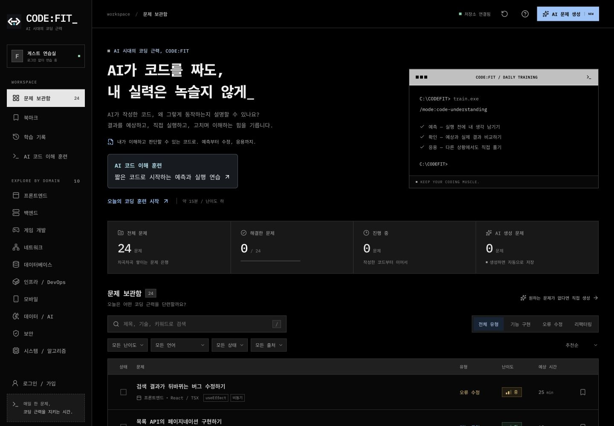
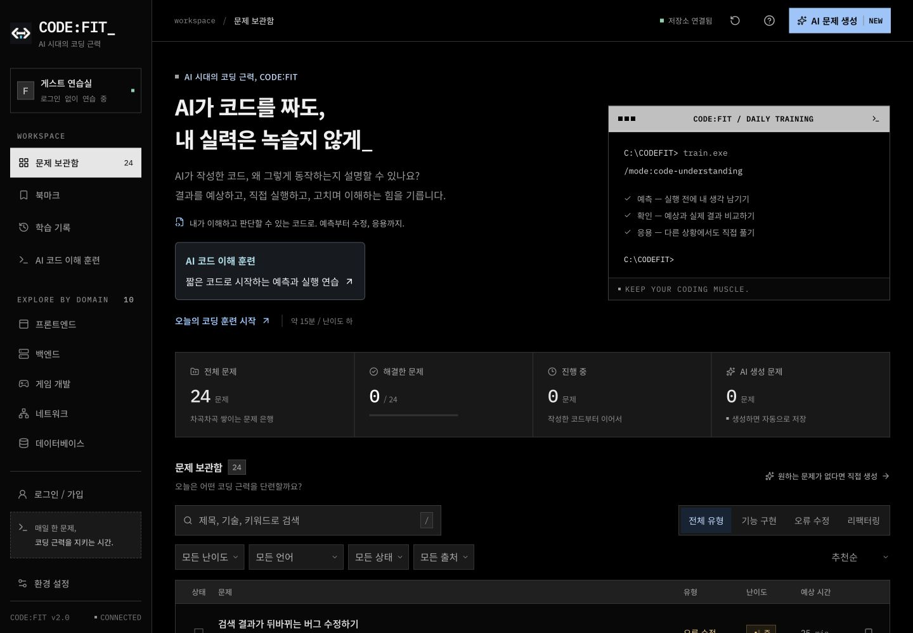
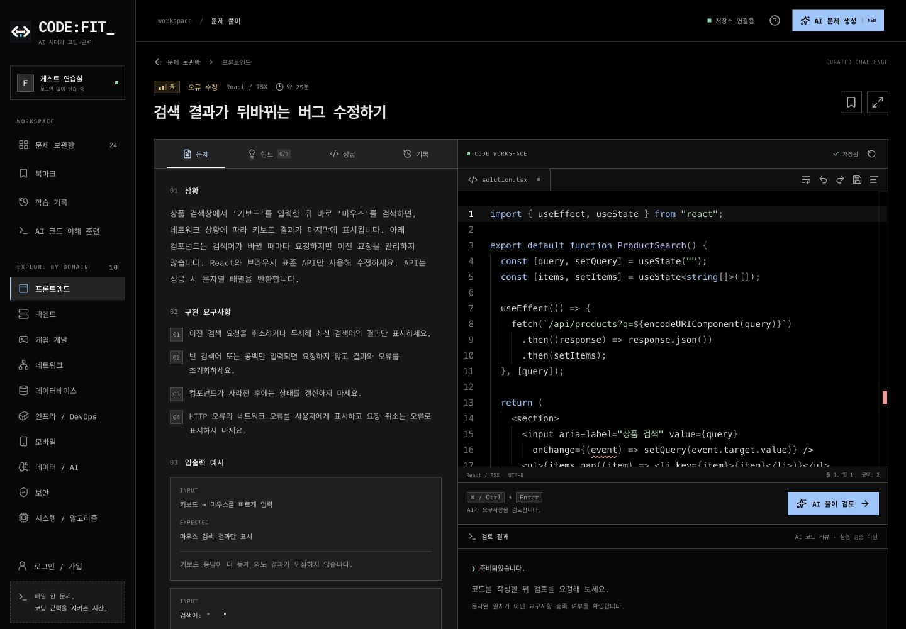
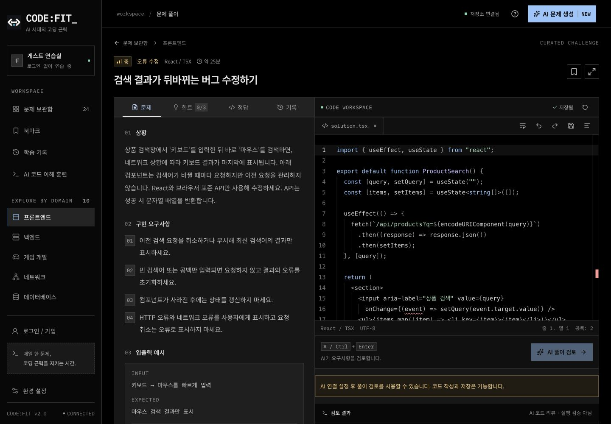

# 서비스 UI와 글자 크기 점검 — 2026-09-17

AI 코드 이해 훈련 구현 후, 기존 보관함과 설정까지 같은 읽기 기준을 적용했다. 검정 DOS 테마와 고정폭 코드 표시는 유지하고, 일반 설명에는 Noto Sans KR을 우선 적용했다. 작은 글자를 더 줄여 화면에 넣던 방식 대신 줄바꿈과 조작 영역의 배치를 조정했다.

## 크기 기준과 변경

크기는 기본 브라우저 글자 크기 16px에서 측정했다. 아래는 서비스에서 선택한 디자인 기준이며 접근성 인증 수치가 아니다.

| 역할                        | 변경 전           | 변경 후                       |
| --------------------------- | ----------------- | ----------------------------- |
| 문제 상황과 요구사항        | 12~13px           | 15px                          |
| 장문 AI 검토 안내           | 기본 13px         | 16px                          |
| 메뉴와 자료 탭              | 9~12px            | 14px                          |
| 문제 목록 제목              | 10.5~13px         | 15px, 제목 줄바꿈 허용        |
| 검색 및 선택 필터           | 9~12px            | 데스크톱 14~15px, 모바일 16px |
| 상태와 작은 보조 정보       | 일부 6~10px       | 최소 12px                     |
| 편집기와 주요 모바일 아이콘 | 23~30px 조작 영역 | 데스크톱 36px, 모바일 44px    |

`src/styles/tokens.css`에 본문, UI, 보조 정보와 입력 크기를 `rem` 토큰으로 정의했다. 브라우저 기본 문자 크기를 고정하지 않으며, Monaco의 기존 14px 기본값과 사용자 크기 설정은 유지했다. `--control-size`는 화면 폭에 따라 36/44px로 바뀐다. 기존 기능별 스타일 파일에서 크기를 수정해 별도 전역 덮어쓰기 파일을 만들지 않았다.

## 화면별 확인과 결과

1. **메인, 목록과 북마크 — 개선 후 정상.** 작은 제목과 필터를 키웠다. 모바일 선택 필터는 두 열로 배치하며 난이도 배지는 절대 위치 대신 그리드 안에 놓아 제목/유형과 겹치지 않게 했다. 320px 상단에서는 보조 경로 이름을 생략해 생성 버튼 문구를 한 줄로 유지한다. [개선 화면](images/readability-home.png), [모바일 목록](images/readability-library-mobile.png).
2. **메뉴 — 개선 후 정상.** 메뉴 글자를 화면 폭에 따라 축소하지 않는다. 긴 분야 목록만 따로 스크롤하고 로그인과 환경 설정은 하단에서 계속 접근할 수 있다. 아주 낮은 창에서는 전체 메뉴 스크롤을 허용한다. [모바일 메뉴](images/readability-menu-mobile.png).
3. **문제 풀이 — 개선 후 정상.** 문제 설명, 요구사항, 예시와 저장 상태의 크기를 높였다. 모바일 편집기 도구를 별도 줄로 배치해 각 버튼의 44px 영역을 확보했다. 기존 코드 설정, 힌트, 정답, 기록과 초안 충돌 기능을 유지했다. [개선 화면](images/readability-workspace.png).
4. **코드 이해 훈련 — 개선 후 정상.** 원본 코드, 단계 설명과 예측 이유 입력을 키우고, 한국어 제목이 어절 중간에서 나뉘는 현상을 줄였다. 같은 단계의 검토를 재시도할 때 제목으로 포커스를 다시 옮기지 않는다. [모바일 진입](images/readability-training-mobile.png).
5. **설정, 도움말과 생성 안내 — 개선 후 정상.** 안내와 입력 라벨을 키우고 닫기 버튼의 조작 영역을 확대했다. 모달의 기존 고정 헤더와 스크롤을 유지한다. 도움말 단계 번호가 줄바꿈되지 않도록 수정했다. 키보드 Escape로 닫은 뒤 사용 안내 버튼으로 돌아오는 것도 확인했다. [모바일 도움말](images/readability-help-mobile.png).
6. **로그인과 프로필 — 개선 후 정상.** 설명과 입력 크기를 통일하고 긴 계정 문자열은 줄바꿈한다. 프로필 저장은 합성 테스트 계정으로 확인했다. 로컬 OAuth가 비활성화된 상태이므로 이번 확인을 실제 제공자 로그인 검증으로 표현하지 않는다. [로그인](images/readability-login-mobile.png), [테스트 프로필](images/readability-profile-mobile.png).
7. **학습 기록 — 개선 후 정상.** 작은 안내와 날짜를 키웠다. 첫 320px 검사에서 주간 표시가 6px 넘치는 것을 발견해 7열의 유연한 그리드로 바꾸고 재검사했다. [320px 기록 화면](images/readability-history-mobile.png).
8. **검토 방식과 개인정보 안내 — 개선 후 정상.** 장문 설명의 글자 크기와 줄바꿈을 정리했다. [검토 방식](images/readability-quality-mobile.png), [개인정보 안내](images/readability-privacy-mobile.png).

## 실제 화면 비교

같은 로컬 서비스의 1440×1000 뷰포트에서 캡처했다. 화면을 실제로 열고 저장한 이미지를 확인했다. 인앱 브라우저의 전체 페이지 합성 캡처가 잘못된 경우는 제외하고 뷰포트 캡처로 대체했다. 아래 변경 전후는 가독성 비교이며 로딩 성능 비교가 아니다.

변경 전 메인:

변경 후 메인:

변경 전 풀이:

변경 후 풀이:

## 검증과 한계

- macOS 26.6.2 arm64, Node 22.21.0, Next 16.3.4 프로덕션 빌드, 시드 24개와 격리 SQLite. CPU/네트워크 감속 없음. 운영 DB 쓰기와 실제 유료 AI 호출은 0회다.
- 인앱 브라우저에서 메인, 북마크, 기록, 훈련 진입, 일반 풀이, 예측 풀이, 로그인, 검토 방식, 개인정보 안내의 9개 경로를 320/390/768/1024/1440px로 점검했다. 최종 **45개 조합 모두 페이지 가로 넘침 0px**였다. 대화상자, 로그인 계정 상태, 훈련 중간 단계의 모든 조합을 전수 확인한 결과는 아니다.
- 단위/SQLite **90개 통과**, PostgreSQL **19개 미실행**. 빌드, TypeScript, ESLint, 미사용 코드와 포맷 검사를 확인했다. 이번 수정은 DB 계약을 변경하지 않았다.
- 첫 전체 브라우저 실행은 83개 통과, WebKit 메모 재입력 검사 1개 실패였다. 같은 단계에서 예약한 제목 포커스가 다음 입력을 방해할 수 있어, 실제 단계 변경 후 DOM 반영 시점에만 포커스를 옮기도록 수정했다. 반복 검사에 처음 추가한 ‘마우스 클릭한 버튼이 포커스를 갖는다’는 가정은 WebKit에 맞지 않아 3회 실패했다. 제목으로 포커스를 빼앗지 않는지와 입력 보존을 직접 검사하도록 바꾼 뒤 **3회 모두 통과**했다. 테스트의 잘못된 기대와 제품 수정은 구분한다.
- Chromium, Firefox, WebKit의 전체 회귀 검사 **84개 통과**(4.9분, 각 28개). 이후 도움말 번호의 줄바꿈만 추가 수정하고 다시 빌드해 설정/키보드 및 모바일 검사 **6개가 모두 통과**했다(22.4초). 인앱 브라우저에서도 최종 도움말과 Escape 후 포커스 복귀를 다시 확인했다.
- axe 자동 검사와 브라우저 입력/키보드/포커스 검사를 구분한다. 실제 스크린 리더 청취, 기기별 터치, 모든 사용자 폰트 설정과 학습 효과를 검증하거나 전체 WCAG 적합성을 인증한 작업은 아니다.

원본 화면, 첫/최종 크기 측정과 발견 기록은 로컬 `artifacts/ui-readability/`에 보존한다. 실행 요약은 [검증 결과](../reports/ui-readability-validation.json)에 정리한다. 이 절은 해당 변경을 커밋하기 전에 작성한 로컬 검증 기록이며 현재 Git/배포 상태를 나타내지 않는다.
