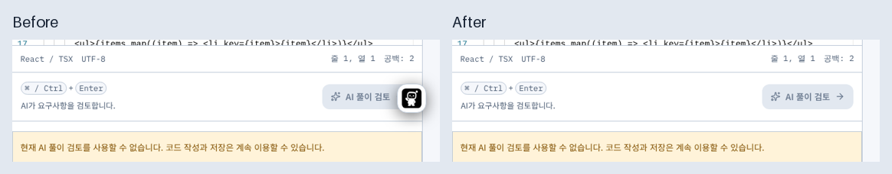
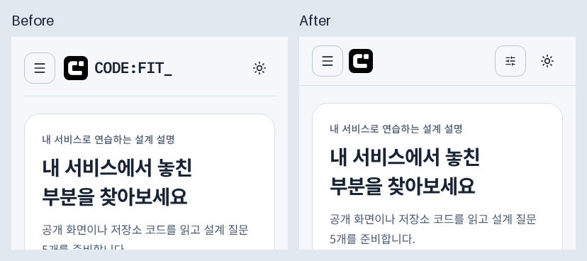
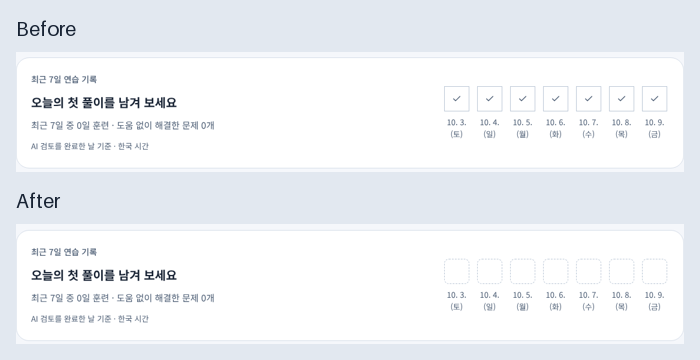
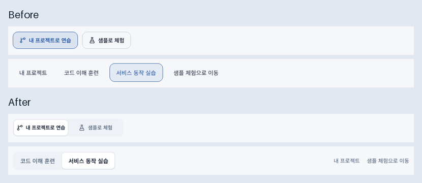

# 공통 UI 스타일

`src/components/ui/primitives.tsx`의 버튼, 카드, 탭, 입력란과 공통 모달·선택 메뉴를 사용합니다. 색, 글자 크기와 모서리는 `src/styles/tokens.css`에서 정의하고, 공통 상태와 화면별 보정은 `src/styles/terminal-system.css`에서 적용합니다. 파일명은 기존 참조를 유지합니다.

- 본문은 기본 16px, 보조 설명은 14px, 캡션은 13px입니다. 코드와 로고 외의 설명은 산세리프 글꼴을 사용합니다.
- 버튼과 선택 항목의 기본 조작 높이는 44px입니다. 카드 모서리는 22px, 버튼과 입력란은 12px입니다.
- 다크 배경과 패널은 밝기로 구분합니다. 파란색은 주요 행동과 선택, 초록색은 성공, 경고색은 확인이 필요한 상태에 사용합니다. 색과 함께 문구나 아이콘으로 상태를 표시합니다.
- 배너 이미지는 가용 너비에 비례해 표시합니다. 모바일에서는 본문 아래에 배치합니다. 장식 이미지의 가장자리만 마스크로 혼합하며 프로젝트 근거 스크린샷에는 적용하지 않습니다.
- 키보드 초점 표시와 동작 감소 설정을 유지합니다. 설명 글자는 줄바꿈을 허용하며 고정 높이로 자르지 않습니다.

## 참고한 공식 자료

- [Toss Design System의 컴포넌트 개선](https://toss.tech/article/toss-design-system): 긴 텍스트, 화면 크기, 접근성을 공통 컴포넌트에서 처리하는 방식.
- [Discord의 모양과 간격 개선](https://discord.com/blog/improving-mobile-with-squircles-styles-and-spacing): 다크 테마 대비, 형태와 여백의 일관성.
- [Apple UI Design Dos and Don’ts](https://developer.apple.com/design/tips/): 글자 가독성, 대비와 터치 영역.

## 검증

`e2e/design-refresh.spec.ts`는 홈, 프로젝트 점검, 보안 점검, 실습 목록과 상세, 코드 훈련, 로그인, 프로필, 개인정보 안내, 품질 안내, 문제 목록을 1440px와 390px에서 확인합니다. 가로 넘침과 axe 접근성 검사, 모달의 키보드 닫기를 포함합니다. AI 결과와 계정별 모든 데이터 상태를 포괄하는 검사는 아닙니다.

## 진입 화면과 모바일 메뉴

- 홈은 프로젝트 점검 배너를 먼저 보여줍니다. 타입 선택은 처음 방문한 경우에만 배너 아래에 표시하며, 기록이 없는 사용자에게 별도의 동일한 프로젝트 안내 카드를 반복하지 않습니다.
- 저장된 프로젝트가 있으면 제목과 이어하기 링크를 간결한 카드로 표시합니다. 기록 조회에 실패하면 재확인 링크를 표시합니다.
- 모바일 공개 페이지의 메뉴는 공통 모달에서 열립니다. 현재 위치를 표시하고, Escape로 닫으면 메뉴 버튼으로 초점이 돌아옵니다. 타입 변경도 메뉴 안에서 가능합니다.
- 새 프로젝트의 입력 화면에서는 비어 있는 기록 목록을 생략합니다. 이용 횟수와 분석 가능 상태는 폼 위에, 로그인 혜택은 폼 아래에 표시합니다.
- 모바일 배너는 시작 버튼을 이미지보다 먼저 보여줍니다. 프로젝트 점검의 장식 이미지는 모바일에서 생략해 입력 공간을 확보합니다.

## 화면 일관성 점검 — 2026-09-30

로컬 개발 서버(격리 SQLite, AI 키 없음)의 14개 경로를 1440×900, 390×844 라이트 테마에서 캡처해 비교했다. 공통 보정은 마지막에 불러오는 `src/styles/design-consistency.css`에 모았다.

| 발견한 문제                                                                                                                                              | 변경                                                                                                                         |
| -------------------------------------------------------------------------------------------------------------------------------------------------------- | ---------------------------------------------------------------------------------------------------------------------------- |
| 홈 기능 배너의 이미지가 모든 슬라이드에서 보이지 않음. `ThemedImage`의 `<picture>` 높이가 0px이라 절대 위치 이미지가 사라졌다.                           | 배너 이미지 영역에서 `<picture>`가 프레임 크기를 채운다.                                                                     |
| 페이지 소개 영역이 아래 테두리만 있고 양 끝이 둥글어 잘린 카드처럼 보임.                                                                                 | 전체 테두리와 패널 배경을 적용한다.                                                                                          |
| 홈·문제 풀이는 `CODE:FIT / 홈`, 나머지 작업 공간은 `작업 공간 / …` 경로와 안쪽으로 들어간 구분선을 사용. 모바일 메뉴 버튼 위치도 화면마다 좌우가 달랐다. | 모든 작업 공간 헤더가 `CODE:FIT / 페이지` 경로와 전체 너비 구분선을 쓰고, 모바일 메뉴 버튼을 왼쪽에 둔다.                    |
| 로그인·계정·개인정보 안내는 데스크톱에서 사이드바 없이 9개 링크가 두 줄로 줄바꿈됨.                                                                      | 세 경로를 데스크톱 프레임에 포함해 같은 사이드바를 사용한다.                                                                 |
| 홈 첫 방문 화면에 제목 두 개가 연달아 표시되고 프로젝트 카드와 붙어 있음. 공간 카드의 ‘이 공간으로 시작’은 행동으로 읽히지 않았다.                       | 제목을 하나로 합치고 48px 간격을 두었다. 시작 문구를 강조색과 화살표로 표시한다.                                             |
| 전체 문제 탐색의 페이지 제목과 목록 제목이 같음. `EXPLORE YOUR DOMAIN`, `25 min`, `VIEW SOLUTION` 등 영어 표기가 섞임.                                   | 목록 제목을 ‘문제 목록’으로 바꾸고 화면 문구와 대화상자 이름을 한국어로 통일했다. 로그인 카드의 터미널 장식 문구는 유지한다. |
| 내 프로젝트가 없을 때 검색창과 ‘새 프로젝트 분석’ 버튼이 빈 상태 안내의 버튼과 중복됨.                                                                   | 첫 프로젝트 전에는 검색 도구를 숨긴다.                                                                                       |
| 프로젝트 점검 폼의 ‘(선택)’이 다음 줄로 떨어지고 안내 문장 사이 간격이 44px로 벌어짐. 보안 점검 동의 체크박스가 13px였다.                                | 라벨과 같은 줄에 표시하고 안내 간격을 12px로 맞췄다. 체크박스를 20px로 키웠다.                                               |

검증: Prettier, ESLint, `tsc --noEmit`, knip 통과. 개발 서버 대상 Chromium에서 `desktop-navigation`, `navigation`, `design-refresh`, `theme-artwork`, `project-classes`, `select-login` 37개 중 30개 통과. 실패 7개(`navigation` 3개, `design-refresh`의 profile·dialogs, `select-login` 2개)는 변경 전 코드에서도 같은 오류로 실패했다. 다크 테마는 소개 카드와 배너를 화면으로만 확인했다. Firefox·WebKit, 프로덕션 빌드와 실제 운영 사이트는 이번에 확인하지 않았다.

## 표면과 조작 피드백 정리 — 2026-09-30

공통 보정은 `src/styles/design-polish.css`에 있으며 `design-consistency.css` 다음에 불러온다. 다크 테마의 선 색은 바꾸지 않았다.

| 발견한 문제                                                                                                                                                     | 변경                                                                                                                        |
| --------------------------------------------------------------------------------------------------------------------------------------------------------------- | --------------------------------------------------------------------------------------------------------------------------- |
| 라이트 테마에서 카드, 표, 버튼, 입력이 모두 같은 `#bac6d5` 선을 써 화면 전체의 테두리가 무겁고 입력칸이 구분되지 않음.                                          | 컨테이너 선(`--line`)만 `#d5dde8`로 낮추고, 버튼과 입력칸은 기존 선을 유지한다. 카드에 1px 그림자를 더한다.                 |
| 문제 유형 필터는 테두리 있는 버튼 네 개가 테두리 있는 틀 안에 들어 있어 선택 상태가 테두리 굵기 차이로만 보임.                                                  | 회색 트랙 위에서 선택한 항목만 흰 배경, 그림자, 굵은 글씨로 올라오는 분절 컨트롤로 바꾼다. 문제 생성 대화상자에도 적용된다. |
| 문제 행의 태그가 모서리 없는 고정폭 테두리 상자로 표시되고, 행마다 북마크 버튼 테두리가 반복됨. 헤더의 새로고침·도움말 버튼만 테두리가 있고 테마 버튼은 없었다. | 태그는 채운 둥근 칩으로, 북마크와 헤더 아이콘 버튼은 테두리 없이 표시하고 마우스를 올리면 배경을 채운다.                    |
| 비활성 주요 버튼이 흐린 파란색이라 로딩 중인 버튼처럼 보임.                                                                                                     | 비활성 주요 버튼을 회색 배경과 회색 글씨로 표시한다.                                                                        |
| 보안 점검과 프로젝트 점검의 펼침 카드가 브라우저 기본 삼각형을 쓰고, 카드 여백과 제목 여백이 겹쳐 제목 아래가 넓게 비었다.                                      | 기본 삼각형 대신 오른쪽 끝에 펼치면 뒤집히는 꺾쇠를 둔다. 여백을 20px 24px 하나로 합친다.                                   |
| 버튼을 누를 때 1px 아래로만 움직였다.                                                                                                                           | 누르는 동안 98%로 줄어든다. 동작 줄이기 설정에서는 움직이지 않는다.                                                         |
| 문제 수, 쪽 번호, 예상 시간 숫자의 폭이 달라 값이 바뀔 때 흔들림.                                                                                               | 고정폭 숫자(`tabular-nums`)를 쓴다.                                                                                         |

검증: Prettier 통과. 개발 서버 대상 Chromium에서 `beginner`, `security-records`, `theme`, `experience-ui`, `project-class-actions`, `control-spacing`, `design-refresh`, `terminal-system`, `interaction-refinements`, `personalized-security`, `project-check` 111개 중 94개 통과. 실패 17개 중 15개는 변경 전 코드에서도 같은 오류로 실패했다. 나머지 `theme`의 `/profile` 대비 검사 2개는 페이지 이동 중 실행 문맥이 사라지는 오류로, 변경 전 코드에서도 라이트·다크 중 하나가 번갈아 실패했다. 문제 목록, 프로젝트 점검, 보안 점검의 라이트·다크 대비 검사는 통과했다. Firefox·WebKit과 프로덕션 빌드는 확인하지 않았다.

## 가림, 상태 표시와 위치 안내 정리 — 2026-10-09

로컬 개발 서버(격리 SQLite, AI 키 없음)의 16개 경로와 작업 공간별 홈 3종을 1440×900, 390×844에서 라이트·다크 테마로 캡처해 비교했다. 여러 화면에 걸친 보정은 `src/styles/design-clarity.css`에 모았고 `design-polish.css` 다음에 불러온다. 색 팔레트와 토큰은 바꾸지 않았다.

| 발견한 문제                                                                                                                                                                                                            | 변경                                                                                                                                                                                                                                                                              |
| ---------------------------------------------------------------------------------------------------------------------------------------------------------------------------------------------------------------------- | --------------------------------------------------------------------------------------------------------------------------------------------------------------------------------------------------------------------------------------------------------------------------------- |
| 시작 가이드 버튼(88×96px)이 홈·목록·학습 기록·로그인에서 카드와 문제 행을 가렸다. 문제 풀이 화면에서는 'AI 풀이 검토' 버튼과 겹쳤다. 다크 테마에서도 첫 방문 말풍선은 밝은 배경이었다.                                 | 홈의 첫 방문 안내가 보일 때만 큰 버튼을 쓰고, 그 밖에는 48px 아이콘 버튼으로 표시한다. 휴대폰에서는 안내가 있어도 아이콘 크기다. 따로 있던 '작게 보기' 버튼은 없앴다. 문제 풀이 화면에는 가이드 버튼을 두지 않는다(사용 안내는 헤더에 있다). 말풍선은 현재 테마의 패널 색을 쓴다. |
| 프로젝트 실습(`/project-practice`)에서 사이드바가 '내 프로젝트 점검'을 현재 위치로 표시했다. 코드 이해 훈련이나 서비스 원리 배우기에서 들어온 경로와 맞지 않았다.                                                      | `mode=code`는 'AI 코드 이해 훈련', `mode=service`는 '서비스 원리 배우기'를 현재 위치로 표시한다.                                                                                                                                                                                  |
| 내 학습 기록의 최근 7일 칸이 기록 없는 날에도 체크 표시를 그려 모두 완료한 것처럼 보였다. 상단에 영문 `YOUR LEARNING LOG`가 남아 있었고, AI 학습 기록 바로가기 카드만 모서리가 4px였다.                                | 검토를 완료한 날만 초록 체크를 표시하고 나머지는 점선 빈 칸으로 둔다. 상단 문구는 '나의 연습실'로 바꾸고, 바로가기 카드는 다른 카드와 같은 22px 모서리와 12px 간격으로 맞췄다.                                                                                                    |
| 문제 목록의 미해결 표시가 모서리 없는 사각형이라 선택용 체크박스처럼 보였다.                                                                                                                                           | 해결 완료 아이콘과 같은 원형 빈 고리로 표시한다.                                                                                                                                                                                                                                  |
| 라이트 테마 로그인 화면에서 흰색 GitHub 아이콘이 보이지 않았다.                                                                                                                                                        | 라이트 테마에서는 아이콘 색을 반전한다.                                                                                                                                                                                                                                           |
| 같은 종류의 선택이 화면마다 달랐다. 코드 이해 훈련·서비스 원리 배우기의 '내 프로젝트로 연습/샘플로 체험'은 각각 테두리 친 버튼이었고, 프로젝트 실습은 연습 종류 2개와 다른 화면으로 가는 링크 2개를 한 탭 줄에 섞었다. | 둘 다 문제 유형 필터와 같은 분절 컨트롤로 바꿨다. 프로젝트 실습의 '내 프로젝트', '샘플 체험으로 이동'은 컨트롤 옆 텍스트 링크로 분리했다. 학습 화면에서 배경색과 같아 경계가 보이지 않던 맞춤 연습 카드에 패널 배경과 테두리를 적용했다.                                          |
| AI 분석을 시작할 수 없을 때 프로젝트 점검의 안내가 아이콘과 색 없이 큰 빈 카드로 보였다.                                                                                                                               | 경고 아이콘과 노란 배경의 안내 상자로 표시한다. 프로젝트 실습과 프로젝트 AI 학습의 같은 안내도 맞췄다.                                                                                                                                                                            |
| 첫 방문 홈에 페이지 제목과 카드 제목('링크 하나로 점검부터 실습까지')이 연달아 있었다. 준비되는 학습 3개가 회색 버튼 모양이라 누를 수 있는 것처럼 보였고, 입력란 아래 안내 문단이 서비스 점검실 홈과 달랐다.           | 카드 제목을 한 줄 요약으로 바꾸고, 준비되는 학습은 입력란 위의 아이콘 목록으로 옮겼다. 안내는 두 홈 모두 한 줄 요약과 '분석 범위 안내' 펼침으로 맞췄다. OpenAI로 코드 일부를 보낸다는 문장은 펼치지 않아도 보인다.                                                                |
| 휴대폰 헤더가 두 종류였다. 홈·문제 풀이는 화면 맨 위의 전체 너비 구분선, 로고 아이콘, 작업 공간 버튼을 썼다. 나머지 화면은 20px 아래에서 시작해 좌우가 들어간 구분선, 'CODE:FIT\_' 글자와 테마 버튼만 표시했다.        | 공통 헤더도 화면 맨 위에서 시작하고 구분선을 화면 끝까지 그린다. 로고 아이콘, 작업 공간 변경, 테마 버튼을 홈과 같은 순서로 표시한다.                                                                                                                                              |
| 휴대폰의 AI 실무 배우기 분야 버튼 16개가 240px 높이 상자 안에서 따로 세로 스크롤되어 줄 중간이 잘려 보였다.                                                                                                            | 한 줄 가로 스크롤로 바꿨다.                                                                                                                                                                                                                                                       |
| AI 수업의 '공식 문서로 더 알아보기'만 브라우저 기본 삼각형을 썼다. 헤더의 새로고침 버튼이 코드 초기화와 같은 되돌리기 아이콘을 썼다.                                                                                   | 다른 펼침 카드와 같은 오른쪽 꺾쇠를 쓴다. 새로고침은 순환 화살표로 바꾸고 아이콘 버튼에 마우스를 올리면 이름을 표시한다.                                                                                                                                                          |

그 밖에 로그인 설명의 고정 줄바꿈을 없애고 제목과 문단에 `text-wrap: balance`와 `pretty`를 적용했다. 휴대폰의 페이지 소개 이미지 폭을 240px에서 176px로 줄였고, 프로젝트 점검 폼의 입력란과 선택 상자 모서리·배경을 맞췄다. 코드 이해 훈련 소개에서 아래 선택지와 같은 내용의 문장을 지웠다. 로그인 카드의 터미널 장식은 이전 정리의 결정대로 유지했다.

검증: Prettier, ESLint, `npm run typecheck`, 프로덕션 빌드 통과. 프로덕션 빌드 대상 Chromium에서 `guide`, `desktop-navigation`, `theme`, `project-check`, `practice`, `design-refresh`, `experience-ui`, `theme-artwork`, `select-login`, `learner-types`, `ai-learning`, `navigation`, `control-spacing`, `terminal-system`을 실행했다. 변경 후 116개 중 97개가 통과했다. 실패 19개는 변경 전 코드의 프로덕션 빌드에서도 같은 오류로 실패했다. 바뀐 홈 제목과 문구를 기대하는 `learner-types`, `navigation`, `select-login`, `terminal-system` 11개, 휴대폰에서 숨긴 헤더 버튼을 누르는 `design-refresh` 대화상자 검사, `experience-ui` 2개, `project-check` 3개와 `practice` 2개다. `theme`의 17개 경로 라이트·다크 대비와 가로 넘침 검사는 모두 통과했다. 새로 추가한 검사는 프로젝트 실습의 사이드바 위치, 휴대폰 헤더 위치·구성, 7일 빈 칸·미해결 고리·GitHub 아이콘·문제 풀이 화면의 가이드 버튼 미표시를 확인한다. Firefox·WebKit과 실제 운영 사이트는 이번에 확인하지 않았다.
